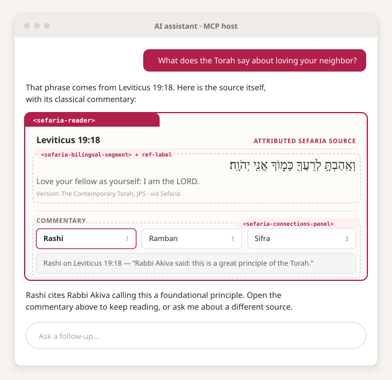
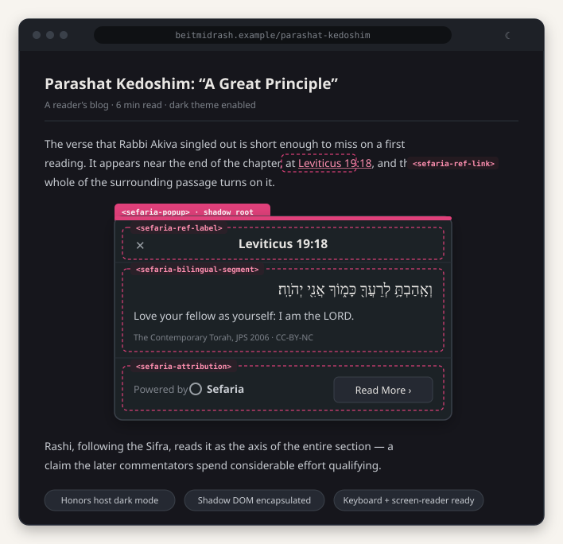

# Sefaria Web Components

> **Experimental.** This is a Microsoft Global Hackathon 2026 project, developed
> in active collaboration with Sefaria. It carries no support and no quality
> guarantee, and nothing here is stable. It is not an official Sefaria product.

The UI of Sefaria — the open-source library of Jewish texts — as framework-agnostic
Web Components anyone can build with.

## What this is

[Sefaria](https://www.sefaria.org) is the world's largest open-source database of
Jewish texts: a connected library of primary sources, translations, commentaries,
and links between them. All of it is downloadable, and all of it is reachable
through a public, CORS-enabled API that already powers dozens of independent
learning and research projects.

Getting the data has never been the hard part. Rendering it is.

Hebrew and English aligned segment by segment. Vocalization and cantillation
stripped or preserved on demand. Right-to-left layout that survives contact with
punctuation, numerals, and embedded English. Commentary shown alongside the text
rather than after it. Attribution that stays attached to every quotation. Each of
these is a small research project on its own, and today every new client rebuilds
all of them from scratch.

This repository extracts that work into a set of Web Components and supporting
libraries, so that rendering Sefaria's texts correctly becomes an import rather
than a multi-week prerequisite.

## Why it doesn't already exist

Sefaria has solved these problems more than once.

The web reader and the mobile app share essentially no interface code. They
independently implement the same reading surfaces — a text range, a scrolling
column, a connections panel — and independently solve the same underlying
typography problems beneath them. In at least one case the two implementations
have quietly diverged, and produce different output for the same input.

That duplication was never an oversight. React Native and the DOM cannot share
components, so there was no implementation that could have served both.

That constraint no longer binds. A Web Component and the Sefaria web reader both
target the DOM. For the first time, one implementation can serve the website, the
third-party ecosystem, and surfaces nobody has built yet.

<table>
<tr>
<td width="50%" align="center">

 <em>Components rendered inside an AI chat client</em>
</td>
<td width="50%" align="center">

 <em>The Linker popup, rebuilt on the same components</em>
</td>
</tr>
</table>

## Architecture

Five layers. Each depends only on the layers beneath it, and each is usable on
its own — a project that wants nothing but correct vocalization handling should
be able to take L1 and ignore everything else.

| Layer | What lives there | In scope now |
|---|---|---|
| **L0** — Headless core | `@sefaria/ref` (reference parsing), `@sefaria/client` (typed fetch and cache), `@sefaria/model` | Partly |
| **L1** — Pure transform | `@sefaria/text-transform` — vocalization, HTML sanitization, footnotes | Yes |
| **L2** — Primitives | `<sefaria-text-segment>`, `<sefaria-bilingual-segment>`, `<sefaria-ref-label>` | Yes |
| **L3** — Composites | `<sefaria-source-card>`, `<sefaria-popup>`, `<sefaria-connections-panel>`, `<sefaria-text-column>` | Partly |
| **L4** — Views and adapters | `<sefaria-reader>`, `@sefaria/reader-state`, `@sefaria/mcp-app` | No |

Nothing below L2 touches the DOM. Nothing above L0 talks to the network directly.

## Correctness comes first

The layers underneath the components are verifiable against sefaria.org itself,
which serves as a live oracle: given a reference, the site's own output is the
expected result.

This is a design commitment rather than a testing preference. A vocalization bug
or a bidirectional-layout bug renders as entirely plausible Hebrew. It looks
right. It survives visual review, and it survives review by readers who are not
looking for it specifically. The only reliable defence is a differential harness
that compares output character by character against a known-good source — so the
harness is built before the components it validates, and the pass rate is
published as a number rather than an impression.

## Demonstration surfaces

Two, both chosen because they are useful to Sefaria independently of this
project.

**An MCP App.** Sefaria already runs a public MCP server, so AI assistants can
already retrieve its texts. What the user reads today, however, is the model's
summary of Sefaria rather than Sefaria itself. Rendering the real reading surface
inside the chat client closes that gap — and a chat pane is the most demanding
place these components could run, because the viewport is narrow, the host
supplies its own theme, and data arrives as a tool payload rather than a fetch.
Components that hold up there hold up anywhere.

**The Sefaria Linker.** Sefaria publishes a script that turns citations on
third-party websites into clickable popups, currently in use on a large number of
sites. The popup it produces is unencapsulated, hardcodes its own light-mode
colours regardless of the host page, and is not reachable by keyboard. Rebuilding
it on these components fixes all three, and does so on a surface that already has
real users.

## Relationship to Sefaria

This project is developed in active collaboration with Sefaria, and is derived
from Sefaria's own open-source codebases —
[Sefaria-Project](https://github.com/Sefaria/Sefaria-Project) (web) and
[Sefaria-Mobile](https://github.com/Sefaria/Sefaria-Mobile) (mobile) — both
licensed GPL-3.0. This repository is licensed GPL-3.0 to match.

It is a Microsoft Global Hackathon *Hack for Good* project, which runs under a
signed agreement: **Sefaria owns the resulting work**, and Microsoft receives a
licence back to it. The GPL-3.0 licence therefore follows the upstream this
derives from, and the result is owned by the same organisation that owns that
upstream.

**Ownership is not endorsement.** Nothing here is an official Sefaria product,
nothing here has been adopted, reviewed, or shipped by Sefaria, and nothing here
should be taken as a commitment by Sefaria to use or support it.

All texts, translations, and commentary remain the property of their respective
rights holders; this library renders Sefaria's data and does not redistribute it.

## Status

Stub. Nothing is implemented yet.

A design document covering component APIs, the differential test harness, and the
theming token set will follow in a subsequent change.

## License

[GPL-3.0](LICENSE), following the upstream Sefaria codebases this work derives
from. See [Relationship to Sefaria](#relationship-to-sefaria) for ownership.
