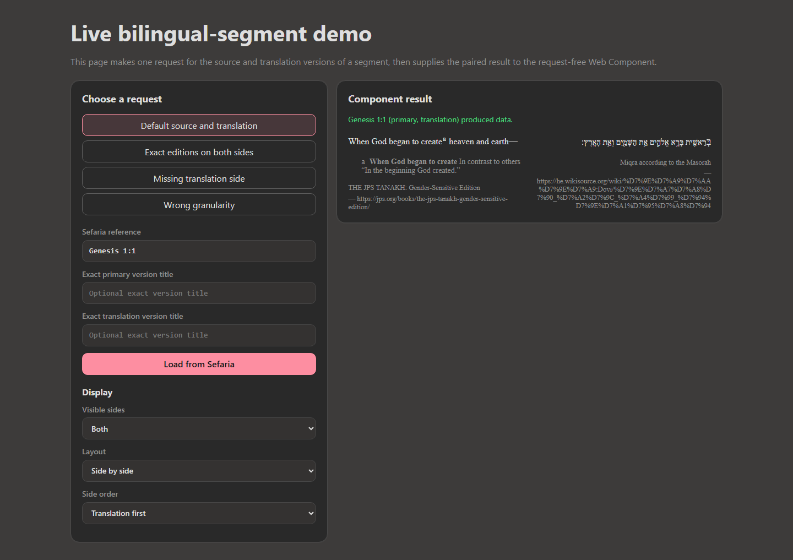
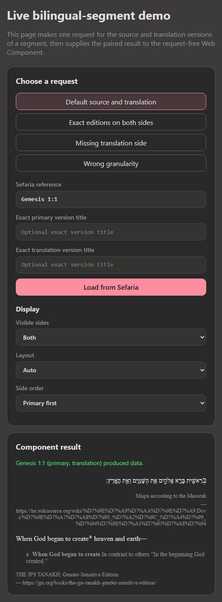

> Created/edited by GitHub Copilot; pending human review.

# Interactive Bilingual Segment Demo

_2026-09-03T16:48:27Z by Showboat 0.6.1_
<!-- showboat-id: 112d98d7-c337-4e7f-aaa2-9f2910571398 -->

This demonstration uses the dedicated browser app in `demos/bilingual-segment-live-demo`. It exercises deployed Sefaria responses through the production client and async factory, then drives the request-free `<sefaria-bilingual-segment>` element through its public presentation controls.

First, build the standalone Vite project.

```powershell
& pnpm --filter @sefaria-demo/bilingual-segment-live-demo build *> $null
if ($LASTEXITCODE -ne 0) { throw "The live demo build failed." }
[Console]::Out.Write("build=passed" + [char]10)
```

```output
build=passed
```

Next, run the Playwright capture. The first four lines prove live data, exact-edition selection, a partial result, and a projection error. The advanced lines then prove a two-track reversed layout, full-width translation-only visibility, and automatic one-track stacking at a narrow container width.

```powershell
pnpm exec tsx demos/bilingual-segment-live-demo/scripts/capture-demo.ts
```

```output
default|data|sides=primary:rtl,translation:ltr|absent=0
exact-editions|data|sides=primary:rtl,translation:ltr|absent=0
missing-translation|partial|sides=primary:rtl|absent=1
range|error|sides=-|absent=0
advanced|side-by-side|tracks=2|visible=primary,translation|first=translation
png|wide=true|theme=dark|translation-first=true
advanced|translation-only|tracks=1|visible=translation|first=translation
advanced|auto-narrow|tracks=1|visible=primary,translation|first=primary
png|narrow=true|auto-stacked=true
```

The wide dark-theme capture shows both directional tracks with the translation side deliberately placed first.

```bash {image}

```


The narrow capture keeps both sides visible while the `auto` layout responds to its container and stacks them into one track.

```bash {image}

```


