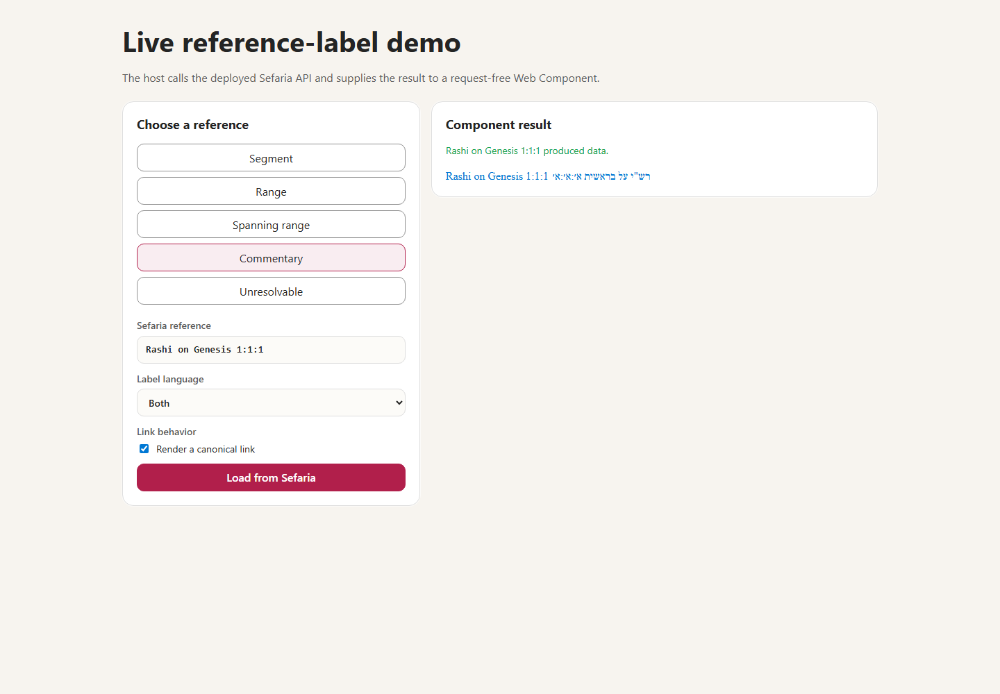

> Created/edited by GitHub Copilot; pending human review.

# Interactive Reference Label Demo

_2026-09-03T14:14:38Z by Showboat 0.6.1_
<!-- showboat-id: 22db25ef-84c0-4a2b-b811-7787cd6123de -->

This demonstration uses the declarative browser app in `demos/ref-label-live-demo`. Shared demo infrastructure creates the page, controls, presets, request lifecycle, styling, and capture environment; the reference-label configuration supplies its typed requests and presentation properties.

First, build the standalone Vite project.

```powershell
& pnpm --filter @sefaria-demo/ref-label-live-demo build *> $null
if ($LASTEXITCODE -ne 0) { throw "The live demo build failed." }
[Console]::Out.Write("build=passed" + [char]10)
```

```output
build=passed
```

Next, exercise all five presets through the deployed Sefaria API. Each preset uses the rendered page controls, production client, async factory, and request-free `<sefaria-ref-label>` element.

```powershell
pnpm exec tsx demos/ref-label-live-demo/scripts/capture-demo.ts
```

```output
segment|data|linked=true|url=https://www.sefaria.org/Genesis.1.1
range|data|linked=true|url=https://www.sefaria.org/Genesis.1.1-3
spanning|data|linked=true|url=https://www.sefaria.org/Genesis.1.31-2.2
commentary|data|linked=true|url=https://www.sefaria.org/Rashi_on_Genesis.1.1.1
empty|empty|linked=false|url=-
```

The screenshot shows the commentary preset with both canonical labels and linked rendering enabled.

```bash {image}

```


