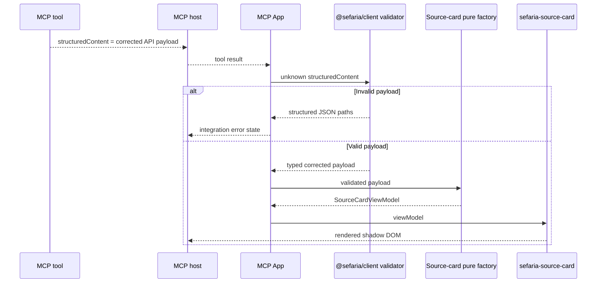
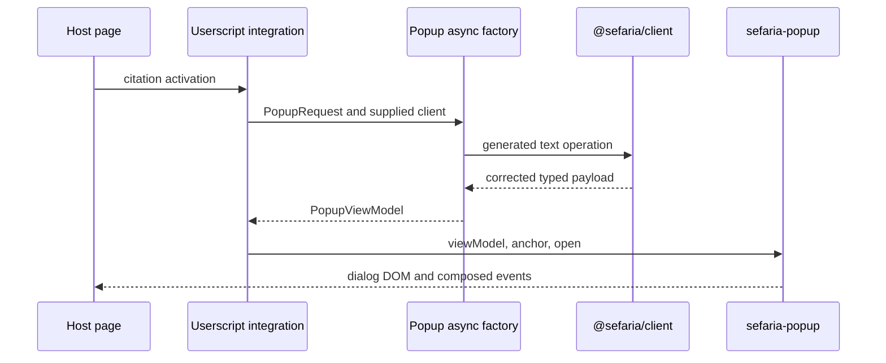

> Created/edited by GitHub Copilot; pending human review.

# Integration specification [Planned]

## Status

This specification defines the planned MCP App and Linker integration boundaries.

## Shared integration rules

Integrations consume built artifacts and public package contracts. They do not copy the Sefaria Web application, mobile application, Linker, or MCP server.

An integration can accept a reference or host input. It calls a non-DOM component factory and supplies the resulting view model to an element.

An integration must not give a reference, raw payload, client, host, or `fetch` function to an element.

Unknown JSON must pass a generated `@sefaria/client` validator before component projection. Validation failures report structured paths.

## Interaction task flow

An integration owns the task lifecycle for user-triggered data changes. It selects authoritative captured data, validated server data, or a supplied client.

If the required data is already available, the integration calls the owning pure factory. If a client request is required, it calls the async factory with cancellation.

The captured-data owner declares which targets the payload covers. The integration must not infer coverage from an empty pure-factory result.

For a component data path, the integration supplies the target component's loading and terminal view models. It does not give task state, a client, or a raw payload to the element.

If a newer action supersedes an older operation, the integration aborts the old operation when possible. It ignores an obsolete result even when cancellation cannot stop the work.

If no permitted data source exists, the integration shows its own unavailable state outside the target element. It does not construct an unsupported component state.

An integration can use `@lit/task`, a reactive controller, or an equivalent task mechanism. The component package does not require one task framework.

## MCP App purpose

The MCP App renders Sefaria source material inside an MCP Apps-compatible host. The first render uses the tool result and makes no second request.

The planned Core App renders one source card from a corrected `/api/v3/texts/{tref}` success payload.

The App is a self-contained HTML resource. The MCP server can package it without the TypeScript checkout at runtime.

## MCP payload boundary

`structuredContent` carries corrected API-shaped JSON. It does not carry a component view model.

The tool can also return a short text content item for hosts that do not render Apps.

The App validates `structuredContent` with the generated validator for the corrected operation payload. Invalid input stops before projection.

A validation failure contains structured paths that identify each invalid field. The App displays an integration error and does not refetch.

## MCP boundary sequence

The App makes zero network requests during this sequence.

## Server and client equivalence

The MCP path is server-provided mode. The tool supplies corrected API-shaped JSON, and the App validates it.

Client mode obtains the same payload type through the thin client. Both modes call `createSourceCardViewModel`.

For the same payload and deterministic inputs, both modes must produce equal view models.

Server-provided mode does not send rendered component HTML. The repository defines no HTML server-rendering or hydration contract.

## MCP resource contract

| Item          | Value                                       |
| ------------- | ------------------------------------------- |
| Build command | `pnpm --filter @sefaria-demo/mcp-app build` |
| Built file    | `demos/mcp/app/dist/mcp-app.html`           |
| Resource URI  | `ui://sefaria/source-card.html`             |
| MIME type     | `text/html;profile=mcp-app`                 |

The HTML file must not contain development-server URLs. It uses the host theme and supported host fonts with Sefaria token defaults.

## FastMCP fixture

The fixture remains small and additive. It proves the resource, tool-result, package-data, and unknown-JSON boundaries.

The planned fixture contains:

- one fixture-backed UI tool
- one `ui://` resource
- the self-contained App
- one corrected API payload fixture
- validation with the generated TypeScript validator
- in-memory integration tests
- installed-wheel package-data tests

The fixture does not contain copied Sefaria API logic, metrics, OAuth routes, Docker configuration, or unrelated tools.

A `ui://` resource is an MCP resource, not an HTTP route. MCP handles `resources/read`.

## MCP host acceptance

Core acceptance requires one named MCP Apps-compatible host.

Record:

- the host name
- the tested version
- the launch configuration
- the supported Core interaction

Standalone browser rendering does not prove host compatibility. Host limitations remain separate from component failures.

## MCP acceptance criteria

- The App builds as one HTML file.
- The fixture reads the packaged file through `resources/read`.
- Tool metadata and the resource use the same URI.
- `structuredContent` matches a corrected generated API payload.
- Unknown payload validation reports structured paths.
- The App calls the source-card pure factory.
- The element receives only `SourceCardViewModel`.
- The first render makes zero requests.
- Client and server modes produce equal view models for the same payload.
- A wheel test reads every packaged runtime artifact.

## Linker userscript purpose

The Linker userscript demonstrates a request-free popup on a third-party page. It is not a migration program for the deployed Sefaria Linker.

The integration owns citation detection, request cancellation, client creation, and factory calls. The popup element owns only rendering and interaction.

## Linker flow

The element receives no reference and makes no request.

If a newer citation replaces an older request, the integration aborts or ignores the obsolete operation. An old response must not replace the newer view model.

## Linker host safety

Development metadata must not use `<all_urls>`.

Default matches are limited to localhost and an explicit fixture host. A real site requires a deliberate metadata change.

The userscript:

- adds no global CSS
- does not replace host keyboard handlers
- does not rewrite unrelated links
- sends host-page text only through the approved Sefaria detection path
- sanitizes Sefaria HTML through the component factory
- removes obsolete popups and listeners

## Popup behavior

The popup element follows the [component contract](components.md).

The integration preserves:

- dialog role
- focus entry
- focus restoration
- Escape closure
- `aria-controls` on the trigger

The planned component also provides:

- `aria-modal`
- an accessible name
- a real close button
- a Tab and Shift+Tab focus cycle
- viewport-edge placement
- token-based themes
- shadow-root style isolation

Popup dragging is not in Core scope.

## Linker acceptance criteria

- The built file installs in Tampermonkey or a compatible engine.
- The default build runs only on approved fixture hosts.
- A detected citation calls the popup async factory when the integration selects the client path.
- The popup element receives only a view model and interaction properties.
- Host styles do not enter the popup.
- Popup styles do not enter the host page.
- Keyboard users can open, traverse, and close the popup.
- Closing restores focus.
- Rapid citation changes do not show obsolete data.
- API HTML is sanitized before it reaches the element.
- The userscript needs no deployed project-specific service.

## Integration failure rules

- Invalid unknown JSON reports structured paths.
- A documented HTTP error becomes a component-specific error view model.
- A network failure or abort rejects the async factory operation.
- An obsolete abort does not replace the current view model with an error.
- A host without a permitted data source shows integration-owned unavailable UI, not empty API content.
- Missing content becomes the owning component's partial or empty state.
- Missing build output stops staging.
- A packaged App must not reference a development server.
- Host limitations remain separate from component or payload failures.

## Completion criteria

An integration is complete when its public boundary, artifact packaging, request count, validation, host behavior, and named failure cases pass from a clean checkout.
