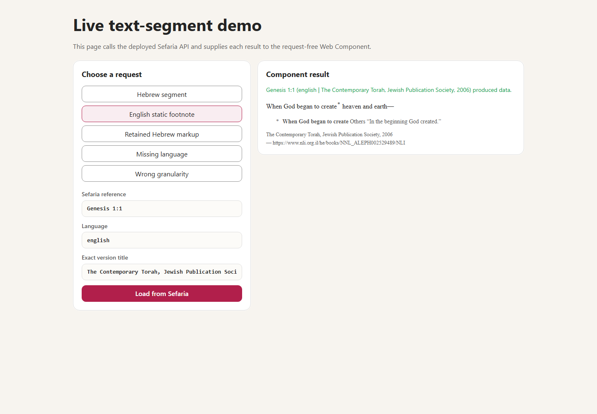

> Created/edited by GitHub Copilot; pending human review.

# Interactive Text Segment Demo

_2026-09-03T07:59:53Z by Showboat 0.6.1_
<!-- showboat-id: fcd056bc-5730-4a15-9982-fa156d47bb8f -->

This demonstration uses the dedicated browser app in `demos/text-segment-live-demo`. The page contains ordinary HTML controls and one real `<sefaria-text-segment>` result element.

First, build the standalone Vite project.

```powershell
& pnpm --filter @sefaria-demo/text-segment-live-demo build *> $null
if ($LASTEXITCODE -ne 0) { throw "The live demo build failed." }
[Console]::Out.Write("build=passed" + [char]10)

```

```output
build=passed
```

Next, start the page in Chromium and click its five preset buttons. Each click uses the page form, the production client, and the production async factory. The final screenshot shows the exact English edition with its static footnote.

```powershell
pnpm exec tsx demos/text-segment-live-demo/scripts/capture-demo.ts
```

```output
hebrew|data|direction=rtl|footnotes=0
english-footnote|data|direction=ltr|footnotes=1
hebrew-markup|data|direction=rtl|footnotes=0
missing|empty|direction=-|footnotes=0
range|error|direction=-|footnotes=0
page|form=true|presets=5|element=sefaria-text-segment|shadowRoot=open
png|generated=true|fullPage=true
```

```bash {image}

```


