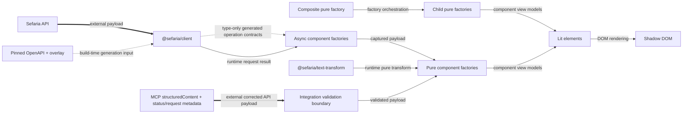

> Created/edited by GitHub Copilot with human review/feedback by avilevin.

# Design: Generated API Contracts and Request-Free Components

For a first explanation with examples, read [How the pieces fit together](guides/data-flow.md). This document is the ownership and dependency reference.

## Summary

This design defines a generated API foundation with corrections and component-owned view models. Elements render view models and never request data. The client, text-processing packages, text-segment, bilingual-segment, reference-label, source-card, popup, connections-panel, DOM-free reader session and controller, controlled reader surface, regular-website reader workspace, MCP App, and Linker vertical slices are current.

## Scope

**In scope:** the Sefaria OpenAPI supply chain, the thin public client, text processing, component factories, request-free elements, the MCP payload boundary, and the Linker demonstration.

**Out of scope:** a generalized domain-model package and offline reference parsing without a concrete consumer. Cache persistence, stale fallback, retries, request coalescing, HTML server rendering, and hydration are also out of scope.

## Core scope

Core is the stable first product boundary. It is not a delivery phase or issue plan.

Core includes the eight API operations, all three text-processing capabilities, the text primitives, the source card with its bounded text collection, the popup, the Linker demonstration, and the MCP source-card App. See [Development](development.md) for current implementation details.

The connections panel, standalone contextual reader, DOM-free reader session, stateful reader controller, controlled reader, and regular-website reader workspace are implemented outside Core. The session adds bounded semantic history and capture ownership. The controller adds supported request execution, cancellation, and subscriptions without changing the request-free element boundary. The website workspace separately demonstrates lower-level spatial pane ownership.

## Source authority

The repository specifications define intended behavior. The [pinned Sefaria OpenAPI document](https://github.com/Sefaria/Sefaria-Project/blob/1f7d0844ca6a9eddc8e48168962aacb09de75bd6/docs/openAPI.json), original endpoint implementation, upstream tests, and deployed fixtures provide evidence.

The pinned OpenAPI input plus guarded overlay is the machine-readable authority for transport payloads. Generated declarations are the field-level reference for those payloads.

Each component view model is the authority for that component's rendered data state. Elements do not reinterpret transport payloads.

If evidence conflicts with a specification, record the observation in [evidence.md](evidence.md). Then change the owning specification or its reviewed overlay before production code.

Each OpenAPI correction starts with the original Sefaria route, handler, response builder, and endpoint tests at the pinned commit. A deployed fixture confirms runtime behavior when the source permits more than one shape.

## Requirements

- The ordinary build must generate all API artifacts without network access.
- Every overlay correction must assert its expected old state at an exact JSON path.
- Public client calls must preserve generated-client and Fetch API success and failure semantics.
- Every element must accept only a component view model plus visual or interaction properties.
- Every async component factory must produce the same result as its pure factory for the captured payload.
- A composite factory that produces ten child views from one response must make one request and zero child requests.
- Unknown JSON must fail with structured paths before component projection.

## Boundary summary

| Concern | Boundary |
| --- | --- |
| Transport contracts | Pinned OpenAPI input, guarded overlay, and generated declarations |
| Client | Thin configured `@hey-api/client-fetch` capability with a configurable base URL, injectable `fetch`, and bounded per-client response cache |
| Public API data | Generated API contracts consumed directly |
| Component data | One view-model union per component |
| Element input | View models only |
| Request ownership | Async non-DOM factories own request orchestration |
| Reader history | DOM-free reader session over admitted component state |
| Server-provided data | Corrected API-shaped JSON, validation, and the same pure factory |
| Reference operations | Generated API contracts and component factories |

## Ownership

| Owner | Responsibility | Must not own |
| --- | --- | --- |
| `@sefaria/client` | Pinned OpenAPI input, checksum, guarded overlay, generated contracts, Zod schemas, TypeScript validators, thin client, and bounded per-client response cache | Rendering, component view models, persistent or shared caches, retries, coalescing, stale fallback, or component methods |
| `@sefaria/text-transform` | Pure sanitization, vocalization, and footnote operations | Requests, DOM rendering, or API contract correction |
| Non-DOM `@sefaria/components` subpaths | Component request types, view-model unions, pure factories, and async factories | Hidden global clients or DOM state |
| `@sefaria/components/reader-session` | Immutable source history, capture retention, stable identities, completion eligibility, and render projection over existing component contracts | Requests, cancellation, persistence, DOM state, or spatial pane placement |
| `@sefaria/components/reader` | Request-free projection from session state to one controlled reader rendering model | Captures, operations, requests, session mutation, or arbitrary spatial pane management |
| `@sefaria/components/reader-controller` | Stateful reader-session ownership, initial and interaction-driven execution, cancellation, stale-result suppression, and subscriber notification | DOM rendering, spatial pane policy, persistence, retries, fallback transport, or chat delivery |
| `@sefaria/components` elements | Layout, interaction, accessibility, theming, and DOM rendering | References, raw JSON, clients, hosts, fetch functions, or requests |
| Website reader demonstrations | The supported page binds the public controller; the workspace page owns lower-level session coordination, pane placement, pane pin lifetime, compact selection, and spatial descendant pruning while reusing the shared browser data source | Public arbitrary-panel contracts, duplicate semantic history, or element-owned requests |
| Integrations | Tool input, host behavior, boundary validation, and factory calls | A second domain model or duplicate rendering implementation |
| Specifications | Intended behavior and acceptance rules | Mutable issue state |
| `docs/evidence.md` | Observed source and deployed behavior | Normative product contracts |

## Package dependency diagram

Solid arrows show runtime dependencies. Dotted arrows show build-time or type-only dependencies as labeled. Labeled orchestration arrows show pure factory composition. Thick arrows show external payload boundaries.

## OpenAPI supply chain

`@sefaria/client` owns one committed upstream OpenAPI input from Sefaria commit `1f7d0844ca6a9eddc8e48168962aacb09de75bd6`. A committed checksum makes accidental input changes visible.

An explicit refresh operation can access the network. Ordinary generation reads only committed files.

The deterministic overlay records reviewed Core corrections. Each change identifies a JSON Pointer, the expected old value or absence, and the corrected value.

If an assertion fails, generation stops at that JSON path and reports the expected and actual state. The overlay never applies a best-effort correction.

The temporary corrected document generates TypeScript `paths`, `components`, operation types, Zod schemas, and runtime validators.

Checks regenerate these outputs and fail if the worktree differs. Stale generated output cannot pass the repository check.

See the [client specification](specs/client.md) for endpoint and failure contracts.

## Client boundary

The public client is a thin configured `@hey-api/client-fetch` capability. Its options include a base URL and an injectable `fetch`.

The client exposes generated GET and POST operation contracts from the corrected schema. It does not add a generalized normalized facade.

Documented HTTP failures remain typed error payloads from the generated client. Network failures and aborts preserve Fetch API rejection behavior.

The client validates every JSON response against the generated schema for its operation and status.

A contract mismatch rejects the operation with the operation identifier, response status, structured JSON paths, and original `Response` metadata.

Unknown inputs from MCP or another external boundary receive validation before component projection.

## Component boundary

Each component has a non-DOM public subpath. This subpath owns its request type, view-model union, pure projection factory, and async request factory. The pure factory converts a corrected API payload into one component view model. The async factory obtains the payload through a supplied client and passes it to the pure factory. The current subpaths are `@sefaria/components/text-segment`, `@sefaria/components/bilingual-segment`, `@sefaria/components/ref-label`, `@sefaria/components/source-card`, `@sefaria/components/popup`, and `@sefaria/components/connections-panel`.

The `@sefaria/components/reader-session` and `@sefaria/components/reader` subpaths are not endpoint-backed. The session composes existing component contracts and host-admitted corrected payload captures, so it has no client and no async factory. The reader subpath projects that session view into rendering-only state for `<sefaria-reader>`.

`@sefaria/components/reader-controller` is the DOM-free stateful convenience layer. Its browser async factory uses a supplied client, while its seed factory accepts admitted content plus an integration-owned data source. The controller privately owns one reader session, request cancellation, and subscriptions. The package-root binder connects its snapshots and actions to one persistent request-free `<sefaria-reader>`. A spatial website workspace can still use the lower-level session and shared browser data source when it needs pane placement or pinning policy outside the controller contract.

A composite can resolve a child input by payload role before projection. The child subpath owns the pure resolved-input projection, so the composite does not repeat child transformation logic.

Text segment exposes `projectTextSegmentVersion` for a selected scalar version and `projectTextSegmentValue` for one resolved recursive-text leaf. A bilingual composite can resolve primary, source, and translation roles from one payload, then project each selected `CoreV3Version`. The source card can flatten recursive text and project each leaf without repeating text transformation logic.

The source card owns the bounded text collection. Segment, flat range, chapter, spanning range, and nested non-spanning payloads use one composite contract; there is no separate text-range element or factory. Card items retain positional identity. Selectable single-section items use a component-owned metadata-backed address mapper, not arbitrary array-index reference synthesis.

Request warnings remain with the selector-owning factory or composite. A resolved-version projection cannot assign a warning for another request selector.

Raw HTML can enter the pure factory only as a field of a validated API payload. The factory uses `@sefaria/text-transform` to sanitize, extract structure from, and vocalize that field before constructing the view model. A view model can contain sanitized render-ready HTML fragments and typed text parts. It must not contain raw API HTML for the element to interpret.

An integration can provide a payload-to-component operation. This operation is a facade over the same pure factory and request-free element. It does not create a second projection path or move payload interpretation into the element.

Data state belongs in the view model. The request-free element accepts no reference, raw JSON, client, host, or fetch function. It owns only layout, theme, focus behavior, and other interaction state.

See the [component specification](specs/components.md) for the three-layer contract and composition rules.

## Interactive task ownership

An element emits a composed event when a user action requests different data. The event describes the action and target. It does not select a transport.

The host owns data-source choice. The reader controller owns cancellation and request execution for its supported stateful flow, while the reader session owns committed semantic selection, history, capture retention, and stable completion eligibility. A lower-level host can continue to coordinate the session directly when it needs spatial state outside the controller contract.

The host can use authoritative captured data, validated server-provided data, or a supplied client. The first two paths call a pure factory. The client path calls an async factory.

The captured-data owner declares which targets the payload covers. An empty pure-factory result does not prove that the payload covered the target.

The connections demo explicitly captures a generated links response and invokes the component pure factory for local paging. Only the current response is retained with exact request coverage. The reader session generalizes that explicit ownership only across its bounded retained history: captures stay outside element view models, retain exact coverage, and are released when no retained entry references them. The standalone async view-model factory remains a one-operation convenience returning only rendering data.

If the host has no permitted data source, the integration shows its unavailable state outside the target element. It must not construct an unsupported component state.

A Lit host can use `@lit/task` or a reactive controller. A non-Lit host can use `AbortController` and equivalent local state. These mechanisms do not change the component contract.

The host must not use task rendering and component view-model rendering as two state owners for one surface. The target element receives one loading or terminal view model.

## Server and client convergence

Client mode calls a component async factory with its request and a supplied thin client. The async factory passes its captured payload to the pure factory.

Server-provided mode receives corrected API-shaped JSON at an unknown boundary. The JSON must pass the generated runtime validator before the same pure factory.

Server-provided mode does not return component HTML. The architecture has no HTML server rendering or hydration contract.

## Composite request rule

A composite async factory owns its outer request. After that request, it calls child pure factories with slices of the captured payload.

It must not call child async factories. Ten child views from one composite response mean one outer request and zero child requests.

## MCP boundary

MCP `structuredContent` carries a corrected API payload. Namespaced tool-result metadata carries the exact request reference and documented response status so the App can select the generated schema and construct the component request. The metadata carries no payload fields or view model. The App validates both boundaries, calls the same pure factory as client mode for a successful payload, and renders the resulting view model.

## Failure contracts

| Boundary | Required failure |
| --- | --- |
| Pinned input | A checksum mismatch stops generation before overlay application |
| Overlay | A stale assertion reports the exact JSON path, expected state, and actual state |
| Generated output | A repository check fails when regeneration changes a committed file |
| Documented HTTP error | The client returns the generated typed error payload and response metadata |
| Network or abort failure | The client preserves the rejected Fetch API operation |
| Response contract mismatch | The client rejects with the operation, status, structured paths, and response metadata |
| External unknown JSON | Validation reports structured paths before projection |
| Missing requested content | The component factory returns its component-specific partial or empty state |
| Pure projection | The same payload and deterministic inputs produce the same view model |
| Composite projection | Child pure factories receive captured data and make no request |
| Element rendering | A request attempt is a contract violation |

## Text processing

`@sefaria/text-transform` owns pure sanitization, vocalization, footnote processing, and the HTML parsing these operations require. It does not own API shapes or component view models. Component factories must not duplicate its parser. See the [text-processing specification](specs/text-processing.md).

## Integrations

The current Linker demonstration consumes public contracts and built artifacts. It owns citation extraction, asynchronous detection, DOM linking, cancellation, stale-result suppression, and popup factory calls outside the element.

The MCP App validates its namespaced request/status metadata and corrected API-shaped JSON before projection. The Linker integration calls an async component factory outside the element.

See the [integration specification](specs/integrations.md).

## Non-goals

This repository does not replace the Sefaria reader, mobile app, Linker, or MCP server. Outside the bounded local reader session, it does not define accounts, durable reading history, sheets, search, topics, restricted content, telemetry, hosting, or publication policy.

Correct text, direction, sanitization, attribution, and accessible interaction have priority over pixel parity.

## Current tooling and future names

The client implementation has selected its generator, Zod validators, and committed artifact paths. [Development](development.md#openapi-workflow) records the current tools and workflow. These choices must continue to satisfy the offline, deterministic, and stale-output contracts.

The text-segment, bilingual-segment, reference-label, source-card, popup, and connections-panel export names are established by their vertical slices. Names for later component subpaths remain open until their implementation. The ownership and request-free element boundaries are not open.
