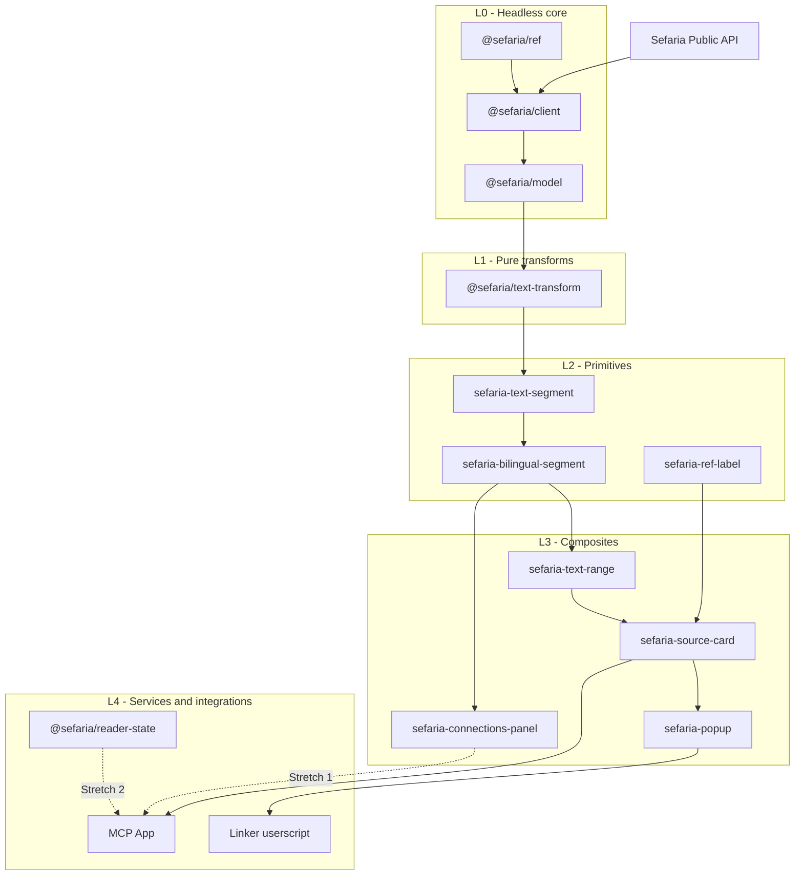

# Design

This document defines the architecture, scope, and repository structure. The
three specification documents define the detailed behavior.

## Source authority

The repository specifications define the intended project behavior.

The Sefaria web and mobile repositories are the primary sources for current
rendering behavior. Live APIs and deployed surfaces supply behavior that source
code cannot show.

Consumer projects supply supporting evidence about integration needs. They do
not override Sefaria behavior.

If the sources disagree, the evidence document records the difference. The
owning specification then states the project rule.

## Architecture

Each layer depends only on a lower layer.

The architecture has these rules:

- L0 and L1 do not use the DOM.
- Only `@sefaria/client` makes network requests.
- Components accept normalized data.
- A component can also delegate a request to an injected client.
- Services use public component and model contracts.
- External repositories receive built artifacts, not source copies.
- `@sefaria/model` owns the normalized source-card contract.

## Repository structure

| Path                      | Layer       | Responsibility                                  |
| ------------------------- | ----------- | ----------------------------------------------- |
| `packages/ref`            | L0          | Parse, normalize, compare, and split references |
| `packages/client`         | L0          | Request public Sefaria API data                 |
| `packages/model`          | L0          | Define normalized data and wire contracts       |
| `packages/text-transform` | L1          | Change text without network or DOM access       |
| `packages/components`     | L2 and L3   | Render the public Web Components                |
| `tests/compatibility`     | Cross-layer | Compare portable behavior with Sefaria behavior |
| `demos/component-lab`     | L4          | Develop components in a browser                 |
| `demos/mcp`               | L4          | Build and serve the MCP App resource            |
| `demos/linker-userscript` | L4          | Run the popup on a third-party page             |

## Scope

**Core** must work from end to end during the hackathon. Core does not mean that
the project is ready for production.

| Layer | Capability                                               | Scope     |
| ----- | -------------------------------------------------------- | --------- |
| L0    | Reference parsing, normalization, comparison, and ranges | Core      |
| L0    | Text, version, and link API client                       | Core      |
| L0    | Normalized text, version, link, and source-card models   | Core      |
| L1    | Vocalization, sanitization, and footnote transforms      | Core      |
| L2    | Text segment, bilingual segment, and reference label     | Core      |
| L3    | Text range, source card, and popup                       | Core      |
| L3    | Connections summary and commentary modes                 | Stretch 1 |
| L4    | MCP source card                                          | Core      |
| L4    | Selected connections and one commentary hop              | Stretch 1 |
| L4    | Reader state, recursive navigation, and breadcrumb       | Stretch 2 |
| L4    | Linker userscript demonstration                          | Core      |

## Correctness

Hebrew and bidirectional errors can look correct during visual review. The
compatibility harness compares pure behavior with current Sefaria behavior.

Text transforms use character and Unicode code-point differences. Components use
browser structure, accessibility, direction, focus, and responsive layout. Known
differences stay separate from pass rates.

Build the compatibility harness before the components that use its results.
Publish a numeric result for each component. If structural or visual evidence is
weaker than character comparison, state this limit.

Each specification owns its acceptance rules:

- [Headless API and data](specs/headless.md)
- [Web Components](specs/components.md)
- [Services and integrations](specs/services.md)

## Integration boundaries

The MCP App is one self-contained HTML resource. A Python package can serve the
resource without the TypeScript checkout.

The local FastMCP fixture contains representative data. It does not copy the
public Sefaria MCP server.

The Linker demonstration uses public APIs and citation detection. It does not
copy or submodule `Sefaria-Project`.

## Non-goals

This project extracts a public rendering layer. It does not replace or fork the
Sefaria reader or MCP server.

It excludes accounts, saved history, sheets, search, topics, restricted content,
open-ended virtualization, and full reader or connections-panel parity.

It makes no commitment for production support, stable APIs, hosting, npm
publication, telemetry, governance, or Linker migration.

Correct text, direction, and attribution have priority over pixel parity.
Interfaces support Hebrew and English only.

## Ownership

This project is part of Microsoft Global Hackathon Hack for Good. The signed
agreement gives ownership of the resulting work to Sefaria. Microsoft receives a
license back.

The project uses GPL-3.0 because this work derives from the GPL-3.0 Sefaria web
and mobile repositories.

The agreement means that Microsoft cannot withhold the result. Microsoft cannot
change its license or redirect it against Sefaria's choice.

Sefaria has no obligation to accept the result. Ownership does not mean that
Sefaria endorses or supports this experimental project.
