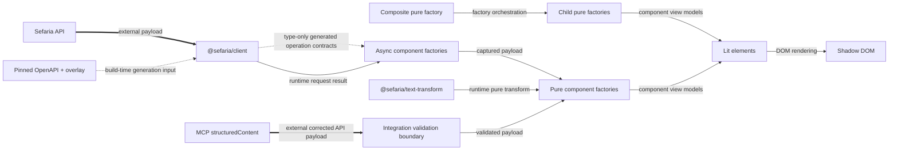

# Design: Generated API Contracts and Request-Free Components

## Summary

This design defines a generated API foundation with corrections and component-owned view models. Elements render view models and never request data. All production contracts in this document are planned until their implementation lands.

## Scope

**In scope:** the Sefaria OpenAPI supply chain, the thin public client, text processing, component factories, request-free elements, the MCP payload boundary, and the Linker demonstration.

**Out of scope:** a generalized domain-model package and offline reference parsing without a concrete consumer. Default caching, retries, request coalescing, HTML server rendering, and hydration are also out of scope.

## Core scope

Core is the stable first product boundary. It is not a delivery phase or issue plan.

Core includes the six API operations and all three text-processing capabilities. It also includes the text primitives, bounded text range, source card, popup, MCP source-card App, and Linker demonstration.

The connections panel and recursive connected reading remain outside Core. Their later implementation must obey the same request, projection, and rendering boundaries.

## Source authority

The repository specifications define intended behavior. The [pinned Sefaria OpenAPI document](https://github.com/Sefaria/Sefaria-Project/blob/1f7d0844ca6a9eddc8e48168962aacb09de75bd6/docs/openAPI.json), original endpoint implementation, upstream tests, and deployed fixtures provide evidence.

The pinned OpenAPI input plus guarded overlay is the machine-readable authority for transport payloads. Generated declarations are the field-level reference for those payloads.

Each component view model is the authority for that component's rendered data state. Elements do not reinterpret transport payloads.

If evidence conflicts with a specification, record the observation in [evidence.md](evidence.md). Then change the owning specification or its reviewed overlay before production code.

Each OpenAPI correction starts with the original Sefaria route, handler, response builder, and endpoint tests at the pinned commit. A deployed fixture confirms runtime behavior when the source permits more than one shape.

## Requirements

- The ordinary build must generate all API artifacts without network access.
- Every overlay correction must assert its expected old state at an exact JSON path.
- Public client calls must preserve generated-client and Fetch API success and failure semantics.
- Every element must accept only a component view model plus visual or interaction properties.
- Every async component factory must produce the same result as its pure factory for the captured payload.
- A composite factory that produces ten child views from one response must make one request and zero child requests.
- Unknown JSON must fail with structured paths before component projection.

## Boundary summary

| Concern | Boundary |
| --- | --- |
| Transport contracts | Pinned OpenAPI input, guarded overlay, and generated declarations |
| Client | Thin configured `@hey-api/client-fetch` capability with a configurable base URL and injectable `fetch` |
| Public API data | Generated API contracts consumed directly |
| Component data | One view-model union per component |
| Element input | View models only |
| Request ownership | Async non-DOM factories own request orchestration |
| Server-provided data | Corrected API-shaped JSON, validation, and the same pure factory |
| Reference operations | Generated API contracts and component factories |

## Ownership

| Owner | Responsibility | Must not own |
| --- | --- | --- |
| `@sefaria/client` | Pinned OpenAPI input, checksum, guarded overlay, generated contracts, Zod schemas, TypeScript validators, and thin client | Rendering, component view models, default caches, retries, coalescing, or component methods |
| `@sefaria/text-transform` | Pure sanitization, vocalization, and footnote operations | Requests, DOM rendering, or API contract correction |
| Non-DOM `@sefaria/components` subpaths | Component request types, view-model unions, pure factories, and async factories | Hidden global clients or DOM state |
| `@sefaria/components` elements | Layout, interaction, accessibility, theming, and DOM rendering | References, raw JSON, clients, hosts, fetch functions, or requests |
| Integrations | Tool input, host behavior, boundary validation, and factory calls | A second domain model or duplicate rendering implementation |
| Specifications | Intended behavior and acceptance rules | Mutable issue state |
| `docs/evidence.md` | Observed source and deployed behavior | Normative product contracts |

## Package dependency diagram

Solid arrows show runtime dependencies. Dotted arrows show build-time or type-only dependencies as labeled. Labeled orchestration arrows show pure factory composition. Thick arrows show external payload boundaries.

## OpenAPI supply chain

`@sefaria/client` owns one committed upstream OpenAPI input from Sefaria commit `1f7d0844ca6a9eddc8e48168962aacb09de75bd6`. A committed checksum makes accidental input changes visible.

An explicit refresh operation can access the network. Ordinary generation reads only committed files.

The deterministic overlay records reviewed Core corrections. Each change identifies a JSON Pointer, the expected old value or absence, and the corrected value.

If an assertion fails, generation stops at that JSON path and reports the expected and actual state. The overlay never applies a best-effort correction.

The temporary corrected document generates TypeScript `paths`, `components`, operation types, Zod schemas, and runtime validators.

Checks regenerate these outputs and fail if the worktree differs. Stale generated output cannot pass the repository check.

See the [client specification](specs/client.md) for endpoint and failure contracts.

## Client boundary

The public client is a thin configured `@hey-api/client-fetch` capability. Its options include a base URL and an injectable `fetch`.

The client exposes generated operation contracts from the corrected schema. It does not add a generalized normalized facade.

Documented HTTP failures remain typed error payloads from the generated client. Network failures and aborts preserve Fetch API rejection behavior.

The client validates every JSON response against the generated schema for its operation and status.

A contract mismatch rejects the operation with the operation identifier, response status, structured JSON paths, and original `Response` metadata.

Unknown inputs from MCP or another external boundary receive validation before component projection.

## Component boundary

Each component has a non-DOM public subpath. That subpath owns its request type, view-model union, pure projection factory, and async request factory.

The pure factory converts a corrected API payload into one component view model. The async factory requests the payload through a supplied client and calls the same pure factory.

Data state belongs in the view model. Layout, theme, focus behavior, and other interaction state remain element properties.

An element accepts no reference, raw JSON, client, host, or fetch function. An element cannot make a request.

See the [component specification](specs/components.md) for the three-layer contract and composition rules.

## Server and client convergence

Client mode calls a component async factory with its request and a supplied thin client. The async factory passes its captured payload to the pure factory.

Server-provided mode receives corrected API-shaped JSON at an unknown boundary. The JSON must pass the generated runtime validator before the same pure factory.

Server-provided mode does not return component HTML. The architecture has no HTML server rendering or hydration contract.

## Composite request rule

A composite async factory owns its outer request. After that request, it calls child pure factories with slices of the captured payload.

It must not call child async factories. Ten child views from one composite response mean one outer request and zero child requests.

## MCP boundary

MCP `structuredContent` carries a corrected API payload. The App validates the payload, calls the same pure factory as client mode, and renders the resulting view model.

## Failure contracts

| Boundary | Required failure |
| --- | --- |
| Pinned input | A checksum mismatch stops generation before overlay application |
| Overlay | A stale assertion reports the exact JSON path, expected state, and actual state |
| Generated output | A repository check fails when regeneration changes a committed file |
| Documented HTTP error | The client returns the generated typed error payload and response metadata |
| Network or abort failure | The client preserves the rejected Fetch API operation |
| Response contract mismatch | The client rejects with the operation, status, structured paths, and response metadata |
| External unknown JSON | Validation reports structured paths before projection |
| Missing requested content | The component factory returns its component-specific partial or empty state |
| Pure projection | The same payload and deterministic inputs produce the same view model |
| Composite projection | Child pure factories receive captured data and make no request |
| Element rendering | A request attempt is a contract violation |

## Text processing

`@sefaria/text-transform` remains a pure package for sanitization, vocalization, and footnote processing. Component factories use these operations before unsafe HTML reaches an element.

The package does not own API shapes or component view models. See the [text-processing specification](specs/text-processing.md).

## Integrations

The MCP App and Linker demonstration consume public contracts and built artifacts. They do not copy Sefaria applications or define alternate component data models.

The MCP App validates corrected API-shaped JSON before projection. The Linker integration calls an async component factory outside the element.

See the [integration specification](specs/integrations.md).

## Non-goals

This repository does not replace the Sefaria reader, mobile app, Linker, or MCP server. It does not define accounts, history, sheets, search, topics, restricted content, telemetry, hosting, or publication policy.

Correct text, direction, sanitization, attribution, and accessible interaction have priority over pixel parity.

## Open implementation choices

The exact generator packages, validator generator, and committed artifact paths remain implementation choices. Each choice must satisfy the offline, deterministic, and stale-output contracts.

The exact export names for component subpaths remain open until the first vertical slice. The ownership and request-free element boundaries are not open.
