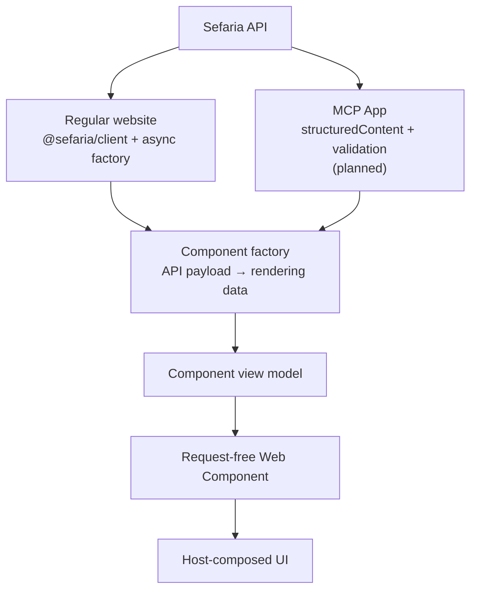

> Created/edited by GitHub Copilot; pending human review.

# How the client, view models, and Web Components fit together

[Documentation](../README.md) / How the pieces fit together

**Current:** the text-segment, bilingual-segment, reference-label, and source-card paths described here are implemented. The same pattern is intended for later components, but their names and integration examples are not current APIs.

The client gets data. A factory turns that data into something a particular component can display. The Web Component renders the result. Your application connects these steps and owns the lifetime of the request.

## The same layers in two use cases



The central layers are the same in both cases:

1. The **API** supplies transport data.
2. The **client or integration boundary** obtains and validates that data.
3. A **factory** projects the validated payload into a component-specific **view model**.
4. A request-free **Web Component** renders that view model.

The difference is where the request happens. A regular site supplies `@sefaria/client` to an async factory. In the planned MCP path, the server obtains the payload, the App validates `structuredContent`, and the App calls the same pure factory directly. Neither path sends raw API JSON to the element.

Web Components are composable because the host can arrange several request-free elements and supply each one a view model. Composite data projection happens before rendering: a composite pure factory can call child pure factories using one captured payload. One element does not reach out to fetch data or ask another element to do so; interactive elements emit events and the host decides what data to obtain next.

The planned MCP lane is shown to explain the intended boundary; its complete integration is not implemented on the documented baseline. The [design diagram](../design.md#package-dependency-diagram) provides the detailed dependency view.

## Four things that are easy to confuse

| Thing | Example | What it means |
| --- | --- | --- |
| Component request | `{ tref: "Genesis 1:1-3" }` for a source card | What the host wants to obtain and project; it goes to a factory, never to an element |
| API payload | A validated v3 text response containing versions and recursive text | What Sefaria returned; its shape follows the corrected generated API contract |
| View model | A `SourceCardViewModel` with a `state`, and a header and items when it has data | Render-ready data for one component, not another transport or generalized Sefaria model |
| Web Component | `<sefaria-source-card>` | The browser element that displays a view model and manages presentation |

A **pure factory** has the name `create...ViewModel`: it projects a payload you already have, without making requests. An **async factory** has the name `load...ViewModel`: it uses the client you supply and delegates the successful payload to the same pure factory.

## Follow one source-card request

1. **Your host** creates a client, chooses a reference and any edition selectors, and supplies a loading view model to the element.
2. **`loadSourceCardViewModel`** calls the generated v3 text operation through that client.
3. **`@sefaria/client`** validates the JSON response against the generated schema for the operation and HTTP status. A successful TypeScript type does not substitute for that runtime boundary.
4. **`createSourceCardViewModel`** resolves the requested editions, aligns text by its actual array structure, and delegates text preparation to pure child projections. `@sefaria/text-transform` sanitizes HTML, extracts footnotes, and applies vocalization.
5. **Your host** assigns the returned view model to the element's `viewModel` JavaScript property.
6. **The element** renders its Shadow DOM. Layout and side-order changes operate on the supplied model; they do not make another API call.

The [render-text guide](render-text.md#put-a-source-card-in-a-browser-app) implements this sequence with the current public exports.

## Who owns what?

| Owner | Responsibility | Not its responsibility |
| --- | --- | --- |
| `@sefaria/client` | Generated operations, API contracts, response validation, configurable API origin and `fetch` | Component methods, rendering, caching, or retry policy |
| `@sefaria/text-transform` | Pure processing of HTML and Hebrew text | Fetching, component state, or DOM rendering |
| `@sefaria/components/source-card` and other non-DOM subpaths | Component request types, view-model unions, pure and async factories | Browser elements or the host's active selection |
| `@sefaria/components` browser exports | Registered Lit elements, layout, theme, accessibility, and rendering | Fetching or interpreting raw API payloads |
| Your application or integration | Client creation, input, loading state, cancellation, stale-result handling, and assigning view models | A second copy of the factory's projection logic |

Imports from the non-DOM component subpaths can run without loading custom elements. Import the browser package only in the browser. Generated API types and view-model types describe values; importing a type does not fetch or render anything. The [design diagram](../design.md#package-dependency-diagram) distinguishes runtime, type-only, generation, and external-payload relationships.

## Already have the JSON?

Validate unknown JSON where it enters your application, then call the same pure factory. This applies to stored data, fixtures, server responses, and tool results. A prior validation in another process does not make incoming bytes trusted.

```ts
import { zGetV3TextsResponse } from "@sefaria/client/schemas";
import {
  createSourceCardViewModel,
  type SourceCardRequest,
} from "@sefaria/components/source-card";

export function projectReceivedText(
  value: unknown,
  request: SourceCardRequest,
) {
  const payload = zGetV3TextsResponse.parse(value);
  return createSourceCardViewModel(payload, request);
}
```

This example handles a v3 **success payload**, not an arbitrary HTTP response. The generated Zod schema throws a validation error with structured issue paths before projection. If you receive operation and status metadata too, use the appropriate status-specific boundary rather than assuming every JSON object is a success payload.

No client is created here and no request occurs. Supply a request whose reference and edition selection match the captured payload; the factory is not an offline reference parser or a service for finding another passage in unrelated data.

This path returns a view model, **not server-rendered component HTML**. The planned MCP integration uses this same validation-and-projection pattern, but the complete MCP workflow is [still planned](../development.md).

## A view model is not a bag of arbitrary HTML

API text may be valid JSON and still contain unsafe HTML. These are separate checks: the client validates the JSON shape; the pure component factory sanitizes text before constructing rendering data. Do not cast an API response to a view model or assign raw text to a render-ready HTML field.

The [markup guide](text-markup.md) explains what is retained, transformed, or removed. Elements receive the processed result; they are not another sanitizer or payload validator.

State also belongs in the model. A loading state means the host is waiting. An empty state means a valid payload had nothing this component could render. A bilingual `partial` state means one requested side is missing. A source card can contain partial **items** without having a top-level `partial` state. Use each component's actual union rather than inventing a common state interface.

## One response can produce many child views

A source card is a composite. A scalar segment becomes one item; ranges and nested text can become many. The factory follows the payload's structure and aligns both sides by position, retaining one-sided items instead of shifting subsequent text to fill holes.

The card makes one outer v3 request. Child pure projections make zero requests. It does not load each verse again, synthesize references from array indexes, or depend on a cache to hide duplicate calls. Attribution is shown once per selected edition at card scope, not repeated for every child.

The component contract includes the concrete ten-child, one-request case. See [composite factories](../specs/components.md#composite-factories) for the exact rule.

## Failures stay at the right boundary

| Outcome | What the host receives or does |
| --- | --- |
| Documented HTTP error | The async factory returns the component's documented HTTP-error view model |
| Valid payload but wrong shape for this component | The pure factory returns its projection-error view model |
| Valid but missing text | The factory returns the component's empty or partial representation |
| Invalid JSON contract | Validation rejects with structured paths before projection |
| Network failure or abort | The async operation rejects; the host handles it without disguising it as missing text |
| New selection while a request is pending | The host cancels or supersedes the old operation and prevents stale results replacing the new model |

Changing presentation is different from requesting new data. Changing a card's layout is local. Choosing another reference or edition is a new host task. Later interactive components must emit an event when they need different data; the host chooses the permitted data source and calls the factory.

For the full ownership contract, read [Design](../design.md). For exact component types and acceptance rules, read the [component specification](../specs/components.md). For deliberately different behavior from Sefaria's applications, read [Intentional differences](differences.md).
