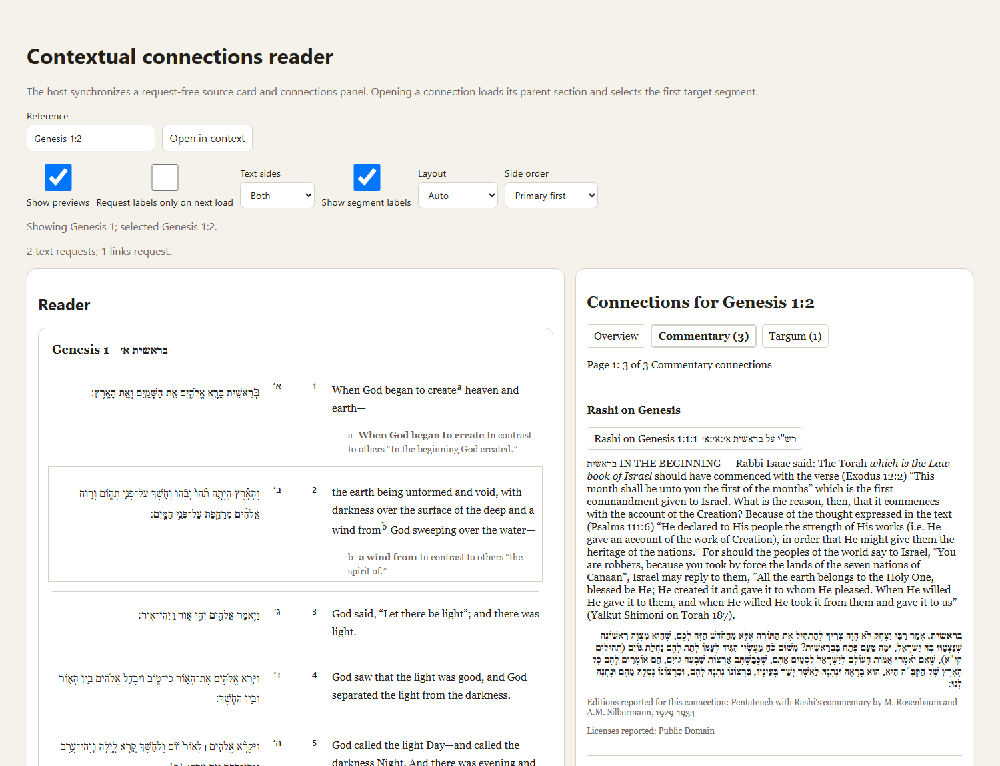
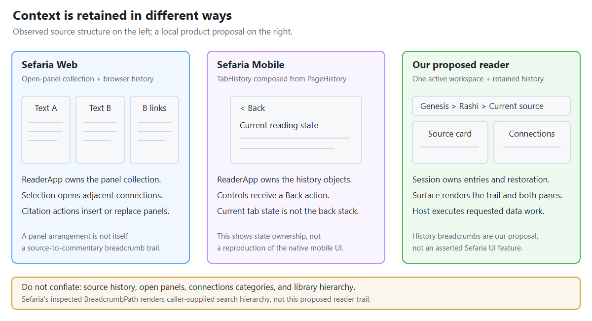
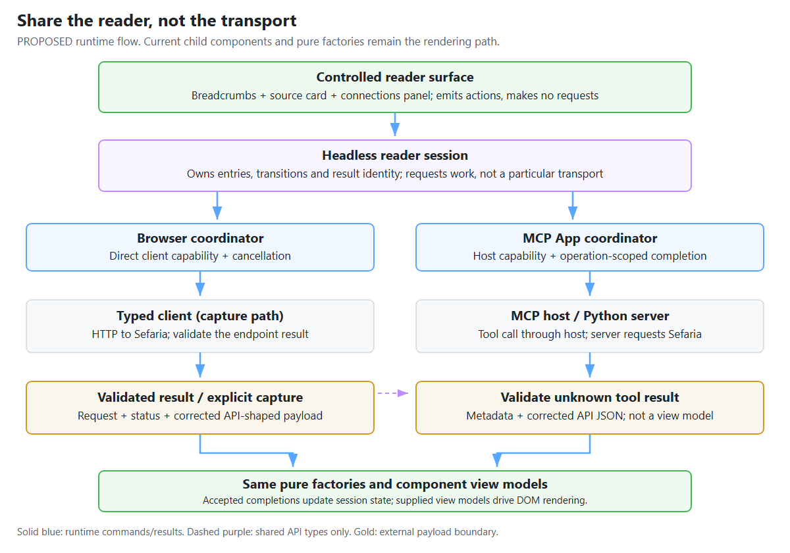
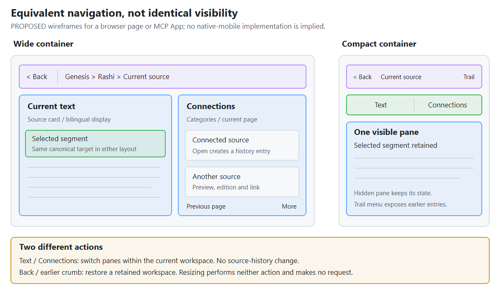

> Created/edited by GitHub Copilot with human review/feedback by avilevin.

# A reader with history: what to share, what to keep in the host

**Accepted direction:** reuse the source card and connections panel, add a headless reader session, and compose them in a controlled reader surface with Back and breadcrumbs. Share the interaction semantics and visual surface between the browser and MCP App. Keep their request execution separate.

This is an illustrated explanation, not the normative API reference. **Current baseline** refers to repository commit `e93990dad1c0d38585a55b5449424f6b8d48e927`, plus the controlled reader surface on this branch as of September 7, 2026. **Observed** describes pinned upstream source. **Planned** identifies accepted work that has not landed on the baseline. The [component](../specs/components.md) and [integration](../specs/integrations.md) specifications remain authoritative.

## The questions this answers

- Does the current demo already have a reader, or do we need another component?
- Who owns breadcrumbs, and how does that compare with Sefaria?
- What can the browser and MCP App share when requests happen differently?
- What must Back restore, including on a narrow screen?

## 1. What we have now

The browser demo is already a small reader application. Its host coordinates two reusable elements; neither element requests data. Calling it "non-stateful" was misleading: it has current state, but does not retain a navigable history.



_Current UI, captured from the merged demo using committed text and links fixtures in place of live HTTP responses. This is a screenshot of real components, not a proposed reader shell. It demonstrates rendering, not a fresh live-service or MCP acceptance result._

| Current piece | What it already owns | What it does not own |
| --- | --- | --- |
| Source card | Bounded text rendering, metadata-backed segment targets, controlled selection, focus/reveal behavior | Connections loading or reader history |
| Connections panel | Category summaries, 20-entry pages, bounded previews, action events | Target navigation, requests, or history |
| Browser demo host | Displayed section, active segment, captures, projection settings, cancellation, stale-result suppression | Back stack or breadcrumbs |
| Adaptive MCP App | Host-delivered source or links result validation, pure component projection, local connections category/page controls, explicit chat follow-up | Same-App connected-source navigation or reader history |

The [browser host](../../demos/connections-panel-live-demo/src/app.ts) opens a target, obtains its server-provided context when needed, selects the first qualified segment, and loads that segment's connections. It makes at most two text operations and one links operation for that flow. Selecting another displayed segment needs only a links operation. Category/page changes project the current capture with zero requests; preview acquisition is a separate explicit action. See the [current interaction contract](../specs/integrations.md#standalone-connections-reader-current).

The current MCP experience is still narrower than the planned integrated reader:


_Existing named-host source-card capture; provenance is recorded in [MCP host interaction](../evidence.md#mcp-host-interaction). The merged App also renders connections and sends an explicit chat follow-up, but neither behavior establishes Back or same-App host-proxied tool calls._

The missing feature is therefore **history across coordinated reader workspaces**, not another text renderer.

## 2. What Sefaria owns, and what we are not copying



_Interpretive schematic, not a screenshot or pixel-parity claim. Source observations and pinned links are in [Reader navigation ownership](../evidence.md#reader-navigation-ownership-september-6-2026)._

On Sefaria Web, `ReaderApp` owns a collection of panels and browser-history updates. Selecting text can open a connections panel adjacent to it; citation navigation can insert a text panel and replace a following connections panel. This preserves context spatially, rather than necessarily replacing one whole reader with another. `ReaderPanel` can delegate state changes to that parent.

On Sefaria Mobile, `ReaderApp` uses `TabHistory`, built from `PageHistory`, and gives Back actions to reader controls. Current state per tab is distinct from the back stack.

The inspected Web `BreadcrumbPath` is a presentation component used for search-result hierarchy: callers supply crumb data and navigation behavior. **It is not evidence of a source-to-commentary reader-history trail.** Connections category/mode navigation is another concern again.

For our bounded product, the accepted supported surface has one active text-and-connections workspace and a retained trail of earlier workspaces. A trail such as `Micah 6:8 > Rashi on Micah 6:8 > another source` is **our navigation-history feature**, not a claim that we copied Sefaria's breadcrumb semantics. A separate website demo owns an ordered spatial pane collection so it can show multiple source and connections panes at once without turning arbitrary panel management into the public package contract.

## 3. The same component can work in both hosts

The shared surface is a **controlled renderer**: it receives a reader-specific view model plus presentation/interaction properties and emits actions. It does not receive raw API payloads, request objects, a client, or the session's complete capture store.



_Proposed runtime paths, showing the browser capture-and-project variant. An existing async factory already performs its pure projection internally; it does not need projection a second time. Blue arrows carry commands or results; purple dashed arrows describe type-only contracts. The Sefaria payload is an external JSON boundary. Diagram source: [editable HTML/SVG](../images/reader-navigation.html)._

| Owner | Responsibility | Explicit exclusion |
| --- | --- | --- |
| Headless session | Current entry, immutable history transitions, stable entry IDs, breadcrumb data, which completed result belongs to which navigation | DOM, MCP SDK, HTTP, hidden retries |
| Reader controller | Executes source and connections work, manages cancellation and operation identity, validates effective requests, owns one private session, publishes immutable snapshots | Spatial pane placement, persistence, retries, chat delivery |
| Controlled reader surface | Navigation bar, pane layout, accessible controls, presentation state supplied by the host, composed action events | Fetching or interpreting API payloads |
| Existing child elements | Render their existing component view models and emit their existing events | Knowledge of the reader session |

"Headless" means usable without a DOM element. The immutable session lives at `@sefaria/components/reader-session`; the supported stateful coordinator lives at `@sefaria/components/reader-controller`. The current `@sefaria/components/reader` projection and `<sefaria-reader>` element remain a request-free visual composition.

### Browser execution

An ordinary website can initialize and bind the supported controller directly:

```ts
const controller = await loadReaderController(
  { tref: "Micah 6:8" },
  createSefariaClient(),
);
const unbind = bindReaderController(element, controller);

// During host teardown:
unbind();
controller.dispose();
```

The controller uses the client for source and connections requests, retains admitted captures in its private session, and supplies rendering snapshots to the request-free element. A host can keep its own markup or use the lower-level session and `createSefariaReaderDataSource` when it needs spatial pane policy.

The standalone page can eventually integrate reader navigation with its URL and browser Back, but that should be an explicit host feature. The session should not write global browser history itself.

### MCP execution

The initial render remains unchanged: the server's tool result supplies corrected API JSON; the App validates it and calls the pure factory. There is no duplicate first-render text request.

For a later interaction needing data, the planned integrated App coordinator must call a server tool through the MCP host. The exact installed SDK capability and named-host permission path remain a qualification gate rather than an assumed `callServerTool` API. The server requests Sefaria, and the App validates the returned operation/status/request metadata and payload before pure projection. It does **not** call the browser async factory against Sefaria as a fallback.

The [MCP Apps architecture](https://apps.extensions.modelcontextprotocol.io/api/classes/app.App.html) describes host-proxied tool calls; the [overview](https://modelcontextprotocol.io/extensions/apps/overview) distinguishes those calls from sending messages or updating model context. Clicking a connection need not ask the language model to invent the next step. Host tool availability and permissions still apply.

The current `get_links_between_texts` tool preserves the corrected array payload inside the specified MCP object envelope. Request identity and documented status remain available for the existing validation-and-projection boundary. The current selected-connection action deliberately sends a chat follow-up; integrated same-App navigation is separate planned work and must not claim success from that composer path.

Back, breadcrumbs, and category/page changes covered by retained captures stay local to the App. A host that denies a needed tool call gets an integration-owned unavailable/error presentation, not a hidden direct request. Browser Back must not be used to navigate the surrounding chat.

**The host mediates data access, not every local interaction.** A conversation's tool-call sequence is also not the reader's breadcrumb stack. A new unsolicited tool result needs a declared reset/replace policy; it must not automatically become a child navigation merely because it arrived later.

## 4. Breadcrumbs need one semantic owner and one visual owner

The session owns the ordered entries and the meaning of returning to one. The reader surface owns their accessible display. Selecting a crumb emits an entry ID, not a reference to parse and reload.

**Example:** start at a Micah 6:8 workspace, open a connected Rashi source, then open another source from there. Each entry preserves both the text pane and its related connections state. Two visits to the same reference can be different entries, so reference strings are not history IDs.

| Action | Proposed history effect |
| --- | --- |
| Select a different segment in the current section | Update current entry and replace its connections state |
| Change category, page, preview visibility, or display settings | Update current entry; do not add a crumb |
| Open a connected source | Establish a new entry when its contextual reader can be committed |
| Back | Return to the previous retained entry |
| Select an earlier crumb | Return to it and discard later entries; Forward is not part of this contract |
| Switch Text/Connections pane or resize | Change presentation, not the source-history path |

During navigation, pending execution remains separate from the last committed workspace. If contextual text fails, no successful destination entry is created. If text commits but connections fail, retain the destination text and its explicit connections failure. These rules extend the current demo's independent pane behavior rather than forcing both requests into a single all-or-nothing result.

### Restore usable state, not just the visible page

Consider `Micah 6:8 connections page 2 -> Rashi -> Back -> page 3`. Restoring the page-2 `ConnectionsViewModel` can redraw page 2, but it cannot project page 3: the current view model contains only one page.

The accepted session retains the validated links capture with its request/status/coverage alongside each retained entry. Captures, requests, projections, and view models remain distinguishable. The surface receives only rendering data. This is explicit session retention, not a default client cache.

An entry also needs the selected segment/position, actual edition choices and request inputs, content-language and display settings, category/page, pane failures, and any stable focus/scroll target needed for restoration. Prefer supplied labels and stable targets to reference parsing or saved DOM nodes.

Back must invalidate pending work. For example: open Rashi, return to Micah 6:8 while Rashi's links are pending, then receive that late result. It must not replace the restored Micah connections.

There is no public snapshot format in this delivery. Retention defaults to 20 entries including current and 20 MiB of aggregate unique corrected payload JSON measured as UTF-8 bytes. The session visibly marks an evicted history boundary, never silently removes current or pinned data, and rejects an admission transactionally when permitted eviction cannot make it fit. In-memory history and durable cross-reload persistence remain separate promises.

## 5. Wide and narrow layouts share the same reading state



_The illustration predates the implementation but shows the current responsive contract. The compact view is mobile web or a narrow MCP App, not a native-mobile screenshot._

On a wide surface, show the trail above text and connections side by side. On a narrow surface, show one pane with an explicit Text/Connections switch and a compact Back/current-location control. An accessible trail menu can expose earlier entries without requiring hover.

Switching panes does not pop source history. Expanding the host does not fetch data or reset the selected segment. The source card's bilingual layout remains a separate setting from the reader's two-pane layout.

Use the actual embedding width, not an assumption that desktop means wide. MCP display modes are negotiated with the host, so fullscreen should improve presentation rather than be required for navigation. Focus, scroll placement, and container measurements remain UI concerns; the session retains stable restoration targets.

Native mobile could reuse DOM-free navigation semantics, but the current Lit elements and HTML-bearing view models do not become native widgets automatically. This design promises neither a native renderer nor exact Sefaria-Mobile parity.

## 6. Which abstraction is worth building?

| Option | Cost and benefit | Fit |
| --- | --- | --- |
| Duplicate the demo coordinator in each host | Fast initially; selection, errors, and Back can drift | Useful only while learning the MCP interaction boundary |
| Shared session, host-specific UI | Reuses history without imposing visual structure; duplicates navigation presentation | A valid escape hatch |
| Shared session plus controlled reader surface | Reuses history and breadcrumb/pane UX; adapters remain host-specific | **Recommended target** |
| Autonomous reader element with its own transport | Easy-looking embed API; mixes data access, application policy, and rendering | Conflicts with current ownership rules |

The shared reader surface earns its place by owning navigation presentation and responsive composition, not by being a convenient place to put requests. The existing demo was a useful first host, not a failed component design.

## 7. Accepted boundaries and remaining qualification

The component specification now settles push/update rules, stable identities, retained-history limits, pending connections, capture accounting, pinning, and explicit rejection. Durable persistence, Forward, browser URL integration, native mobile rendering, and a public arbitrary-panel manager are deferred.

For the MCP connections work, preserve these seams: explicit component actions; host-mediated data access; corrected payloads with request/status identity; shared pure projection; and operation-scoped completion that cannot overwrite a newer navigation. Do not make the server own visual history or return a reader view model as `structuredContent`.

The session foundation proves page-2/Back/page-3 reprojection, late completion rejection, bounded admission, shared capture accounting, interrupted pending connections, and pinned-entry behavior without I/O. The controlled surface now renders paired and single-pane workspaces, history bounds, explicit unavailable states, responsive pane selection, and host-scoped actions without requests. The website workspace and integrated MCP reader remain later slices. Their acceptance still includes a denied MCP tool call, target-text success with links failure, and wide-to-narrow resizing without requests through the actual browser and named-host paths.
