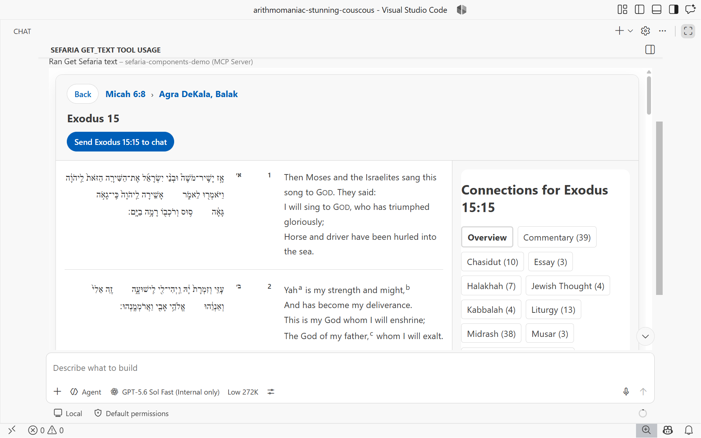
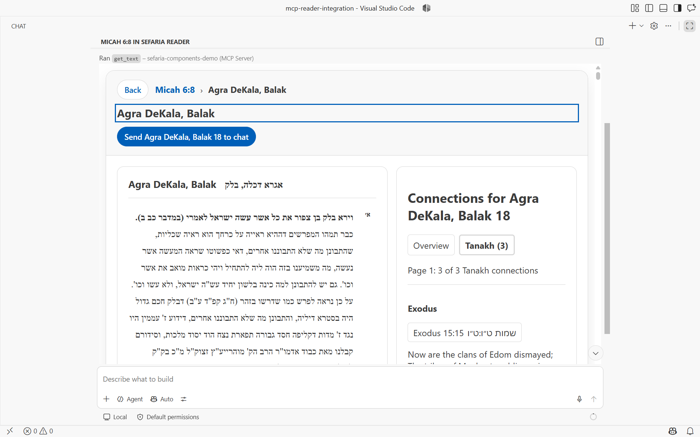
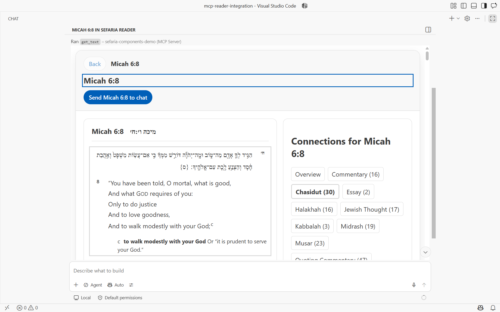

> Created/edited by GitHub Copilot with human review/feedback by avilevin.

# MCP App demonstration

## Status

The stateful MCP reader is implemented and has completed an automated host walkthrough in authenticated, isolated VS Code `1.136.1` with bundled Copilot Chat `0.64.1`. One initial `get_text` result creates the reader; the same App then loads connections, follows two connection hops, retains a three-level breadcrumb hierarchy, restores middle and root ancestors locally, and exports the deepest selected reference to chat.


## Try the reader in VS Code

The interactive launcher opens the repository in the same isolated VS Code profile and presentation layout used by the accepted walkthrough. It enters fullscreen, maximizes Chat, selects only the `sefaria-components-demo` tool group, and leaves the composer empty. It does not type or submit a prompt and does not call a tool.

Install the workspace and Python fixture once:

```powershell
pnpm install
pnpm install:python
```

Prepare the isolated profile the first time:

```powershell
pnpm setup:mcp:vscode
```

If prompted, sign in to GitHub Copilot in the window that opens and approve the `sefaria-components-demo` server, then close that window. The isolated profile retains the authentication for later demo sessions.

Open a ready-to-run demo window:

```powershell
pnpm demo:mcp:vscode
```

VS Code opens the fullscreen capture layout with maximized Copilot Chat, the Sefaria demo tools selected, and no message entered. The terminal command remains active until you close that demo window. Enter your own request or use `/sefaria-mcp-reader` when you want to load and run the Micah 6:8 request from `.github/prompts/sefaria-mcp-reader.prompt.md`. Until then, no chat request or MCP tool call is made. After the reader appears, use its Connections, paging, source navigation, breadcrumbs, and Send to chat controls to explore the integration yourself.

## Reader interaction

The model calls `get_text` once. The Python server fetches one corrected Sefaria v3 texts payload and returns plain text for every host plus `structuredContent` and the App resource for MCP Apps hosts. The App validates the result, admits reader source content, creates one reader controller with zero initial requests, and binds one persistent request-free `<sefaria-reader>`.


The controller then calls bare `get_links_between_texts` through the host's `serverTools` capability. Source and connections remain in the same App frame. Category switching and paging reproject retained links locally. Selecting a connection performs bounded source qualification through bare `get_text`, loads that target's connections, and appends one reader history entry.



Breadcrumb activation is local retained-history projection. The walkthrough restores the middle entry and then the Micah 6:8 root without creating another chat turn.





## Chat export

Send to chat is an explicit action separate from reader data transport. It sends one fixed `ui/message` request containing the exact current selected reference. The App rejects stale exports, suppresses concurrent sends, and does not retry unconfirmed delivery.


The verified walkthrough result is [machine-readable](images/mcp-app-vscode-walkthrough.json). Its other stage captures include the [initial reader](images/mcp-app-vscode.png), [connections](images/mcp-app-vscode-connections.png), [alternate category](images/mcp-app-vscode-category.png), [second page](images/mcp-app-vscode-page-2.png), and [first connected source](images/mcp-app-vscode-connected-source.png).

## Invalid payload

Invalid corrected API-shaped JSON stops before component projection. The integration-owned error state lists structured JSON paths and does not make a fallback request.


## Documented HTTP error

A validated documented 400 or 404 payload becomes `SourceCardHttpErrorViewModel`. It is not mislabeled as an unknown-boundary validation failure.


## Host theme

The App applies MCP host theme variables and maps them to the public `--sefaria-*` tokens consumed by the request-free reader and its child elements. The host's secondary background maps to `--sefaria-surface-muted` without changing the primary surface.


