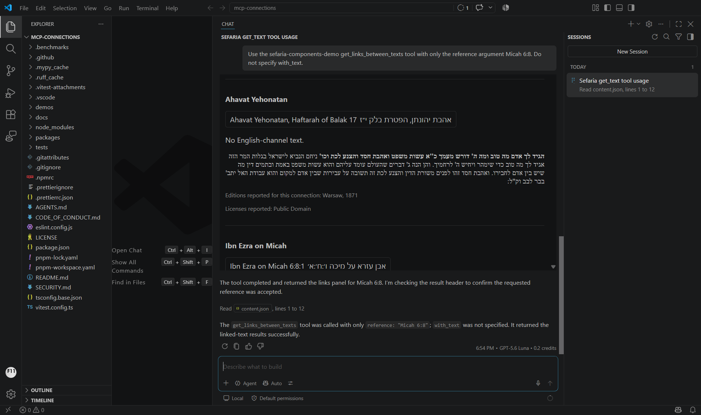
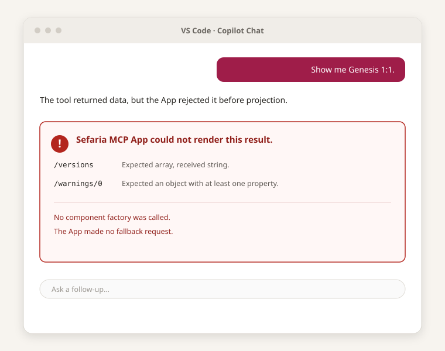

> Created/edited by GitHub Copilot with human review/feedback by avilevin.

# MCP App demonstration

## Status

The source-card and connections MCP App is implemented and has completed an automated host walkthrough in authenticated, isolated VS Code `1.136.1` with bundled Copilot Chat `0.64.1`. The walkthrough covers the bilingual source card, adaptive connection previews, category switching, paging, selected-source retrieval, metadata-only rendering, and explicit preview loading. Each follow-up action uses `ui/message` to fill the real VS Code composer, which the harness then submits.

## Core interaction

The model calls `get_text` once. The Python server fetches one corrected Sefaria v3 texts payload and returns plain text for every host plus `structuredContent` and the App resource for MCP Apps hosts. The App validates the result, calls `createSourceCardViewModel`, and gives only the resulting view model to `<sefaria-source-card>`. The App makes zero requests.

## Connections interaction

The model calls `get_links_between_texts` once. Omitted `with_text` resolves to previews for an Apps-capable client and metadata only otherwise; explicit `"0"` or `"1"` always wins. The server returns the unchanged corrected links payload inside the required MCP object envelope. The App validates it, calls `createConnectionsViewModel`, and gives only that view model to `<sefaria-connections-panel>`.

Category switching and paging reproject the retained payload without another request. Selecting a connection asks the host to deliver a fixed `get_text` follow-up. Load previews asks for the same reference with explicit `with_text="1"`. The App attempts `ui/message` after explicit activation even when the host omits capability advertisement; rejection or an unconfirmed transport leaves the panel usable and exposes the exact selectable request.

The verified walkthrough result is [machine-readable](images/mcp-app-vscode-walkthrough.json). Its stage captures include the [alternate category](images/mcp-app-vscode-category.png), [second page](images/mcp-app-vscode-page-2.png), [selected-source composer](images/mcp-app-vscode-connected-source-composer.png), [selected source card](images/mcp-app-vscode-connected-source.png), [metadata-only panel](images/mcp-app-vscode-metadata-only.png), [Load previews composer](images/mcp-app-vscode-load-previews-composer.png), and [loaded previews](images/mcp-app-vscode-loaded-previews.png).

## Invalid payload

Invalid corrected API-shaped JSON stops before component projection. The integration-owned error state lists structured JSON paths and does not make a fallback request.

## Documented HTTP error

A validated documented 400 or 404 payload becomes `SourceCardHttpErrorViewModel`. It is not mislabeled as an unknown-boundary validation failure.

## Host theme

The App applies MCP host theme variables and maps them to the public `--sefaria-*` tokens consumed by the request-free element. The host's secondary background maps to `--sefaria-surface-muted` for the source card's attribution panel without changing the card's primary surface or unrelated component behavior.

