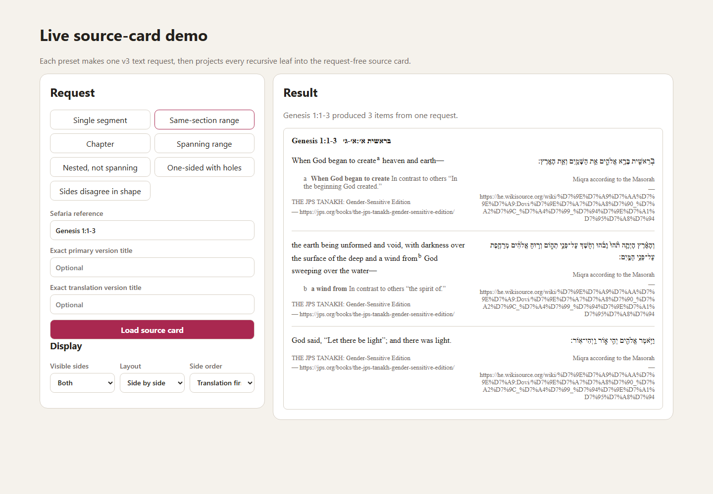
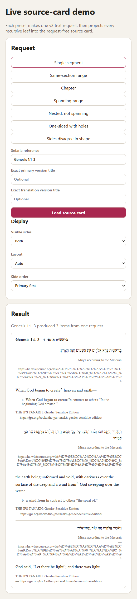

> Created/edited by GitHub Copilot; pending human review.

# Interactive Source Card Demo

_2026-09-04T13:21:38Z by Showboat 0.6.1_
<!-- showboat-id: 10bdb40a-635a-47a6-a164-ab133951db09 -->

This demonstration uses the dedicated browser app in `demos/source-card-live-demo`. It exercises segment, range, spanning, nested non-spanning, one-sided, and shape-disagreement responses through the production client and async factory, then renders the request-free `<sefaria-source-card>` element.

Run the Playwright capture after building the live-demo workspace. Every preset reports exactly one text request. The item counts demonstrate that a segment is a singleton collection, recursive non-spanning text is flattened from its shape, empty holes are skipped, and one-sided paths remain partial instead of being dropped.

```powershell
pnpm exec tsx demos/source-card-live-demo/scripts/capture-demo.ts
```

```output
segment|data|items=1|partial=0|requests=1
range|data|items=3|partial=0|requests=1
spanning|data|items=3|partial=0|requests=1
nested|data|items=34|partial=0|requests=1
one-sided|data|items=5|partial=5|requests=1
shape-union|data|items=43|partial=7|requests=1
advanced|wide|items=3|tracks=2|first=translation
png|wide=true|translation-first=true
advanced|narrow|items=3|tracks=1|first=primary
png|narrow=true|auto-stacked=true
```

The wide capture renders a three-item range in two tracks with the translation side first.

```bash {image}

```


The narrow capture keeps the same three items while automatic layout stacks each pair into one track.

```bash {image}

```


