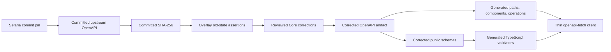

# Client specification [Planned]

## Status

This specification defines the planned `@sefaria/client` contract.

## Responsibility

`@sefaria/client` owns the complete public API transport boundary:

- the commit-pinned upstream OpenAPI input
- the checksum for that input
- the reviewed deterministic Core overlay
- the corrected OpenAPI artifact
- generated TypeScript `paths`, `components`, and operation types
- generated corrected public schemas and TypeScript runtime validators
- a thin `openapi-fetch` client with a configurable base URL and injectable `fetch`

The package does not own component view models, normalized domain models, rendering, default caching, retries, request coalescing, or component-specific methods.

## Source authority

The upstream input is [`docs/openAPI.json` at Sefaria commit `1f7d0844ca6a9eddc8e48168962aacb09de75bd6`](https://github.com/Sefaria/Sefaria-Project/blob/1f7d0844ca6a9eddc8e48168962aacb09de75bd6/docs/openAPI.json).

The committed corrected OpenAPI artifact is authoritative for transport payloads. Generated declarations are the field-level public reference.

This specification defines correction policy and client behavior. [Evidence](../evidence.md) records upstream and deployed observations.

## Core operations

Core generation and contract checks cover these operations:

| Method | Path | Purpose |
| --- | --- | --- |
| `GET` | `/api/v3/texts/{tref}` | Requested text versions and nested text content |
| `GET` | `/api/texts/versions/{index}` | Available versions for an index |
| `GET` | `/api/ref/{tref}` | Canonical reference information |
| `GET` | `/api/v2/index/{title}` | Index and schema metadata |
| `GET` | `/api/shape/{title}` | Nested text shape |
| `GET` | `/api/links/{tref}` | Related links |

Other generated operations can remain available. Core review and compatibility requirements apply to the listed operations first.

## OpenAPI supply chain



The supply chain has two modes:

| Mode | Network access | Result |
| --- | --- | --- |
| Explicit refresh | Allowed | Updates the pinned input and checksum for a chosen commit |
| Ordinary build and check | Forbidden | Applies the overlay and regenerates outputs from committed files |

## Pin and checksum contract

The pin records the complete Sefaria commit SHA. The committed input must match the OpenAPI file from that commit.

The checksum covers the committed upstream OpenAPI bytes before overlay application. A checksum mismatch stops generation.

The refresh operation must require an explicit commit. It must not follow a mutable branch or tag.

A refresh produces a reviewable diff for the pin, checksum, upstream input, corrected artifact, and generated outputs.

## Overlay contract

The overlay is deterministic and local. It contains only reviewed corrections for the public contract.

Every mutating correction must include:

- an exact JSON Pointer
- the expected old value, or an explicit expected absence
- the corrected value, or an explicit removal
- a short reason tied to evidence

The overlay applies corrections in a stable order. It must not read the network, current time, environment-specific data, or generated output.

If an old-state assertion fails, the operation stops at that JSON Pointer. The error reports the path, expected state, and actual state.

Example failure:

```text
OpenAPI overlay mismatch at /components/schemas/ShapeJSON/properties/Book
expected: property named "Book"
actual: property is absent
```

The tool must not skip the correction or search for a similar path.

## Reviewed Core corrections

The initial overlay corrects these known problems from the pinned document:

| JSON area | Upstream problem | Corrected contract |
| --- | --- | --- |
| `/paths/~1api~1texts~1versions~1{index}/get/responses/200/content` | The response uses `VersionJSON` as the media-type key | The response uses `application/json` and the version-array schema |
| `/components/schemas/v3AvailableVersionsTextJson` | The available-version schema does not produce a useful public contract | The schema exposes the reviewed available-version fields |
| Core success schemas | Required fields are incomplete | Required lists match fields that deployed Core payloads always supply |
| `/components/schemas/v3TextVersionsJSON/properties/text` | The text schema does not express all dynamic nesting | The schema supports recursive string and array nesting used by Core text results |
| Core response maps | Error responses are sparse | Documented error statuses use typed error payload schemas where evidence supports them |
| `/components/schemas/ShapeJSON` | Property names and `required` names use inconsistent casing | Property and required names use the deployed lower-case shape |

The overlay must state each concrete field correction. This table does not replace the overlay diff.

The overlay must not normalize API names for style. It changes only incorrect, vague, or incomplete transport contracts.

## Corrected artifact

The corrected OpenAPI document is a generated committed artifact. It is the only OpenAPI input for TypeScript and runtime-schema generation.

The artifact must be byte-stable for the same pinned input, checksum, overlay, and generator versions.

The artifact retains upstream descriptions and operations unless a reviewed correction changes them.

## Generated TypeScript contracts

Generation publishes the corrected `paths`, `components`, and operation types. Public consumers use these contracts directly.

The package must not copy complete generated interfaces into handwritten source files or specifications. Generated declarations remain the field-level reference.

Generated operation types preserve path parameters, query parameters, request bodies, success payloads, documented error payloads, and response status distinctions.

Unknown or incomplete upstream fields can remain optional. The overlay adds requirements only when evidence supports them.

## Public schemas and runtime validators

The package publishes language-neutral JSON Schema artifacts for corrected public schemas. Non-TypeScript consumers validate unknown payloads with these artifacts.

The package also publishes TypeScript runtime validators generated from the same corrected schemas. These validators protect MCP, server, fixture, stored-data, and user-input boundaries.

A validation failure reports one or more structured paths. Each entry identifies the failing JSON path, expected contract, and actual value category.

Invalid unknown JSON must not reach a component projection factory.

Trusted values returned through the typed client do not receive duplicate runtime validation by default. A caller can validate them when its boundary is not trusted.

## Thin client

The public client wraps `openapi-fetch` without a generalized facade.

The planned creation contract has this shape:

```ts
const client = createSefariaClient({
  baseUrl: "https://www.sefaria.org",
  fetch,
});
```

The exact export name remains an implementation choice. The returned client exposes generated OpenAPI operations rather than `getText`, `getSourceCard`, or other handwritten domain methods.

The default base URL is `https://www.sefaria.org`. Tests and non-browser hosts can supply another base URL and `fetch`.

The package has no default cache. It does not retry, coalesce requests, or convert one operation into another operation.

If a consumer later needs those policies, the consumer must supply a concrete requirement and own the policy outside the thin transport client.

## Success and failure semantics

The client preserves `openapi-fetch` and Fetch API semantics:

| Outcome | Client result |
| --- | --- |
| Documented success status | Generated typed success payload and `Response` metadata |
| Documented HTTP error status | Generated typed error payload and `Response` metadata |
| Undocumented HTTP status | Runtime follows `response.ok`. Generated types do not promise a documented payload for that status |
| Network failure | Rejected operation from `fetch` |
| Abort | Rejected operation with the original abort semantics |
| Invalid unknown JSON at an explicit validation boundary | Structured validation failure before projection |

The client must not catch a network or abort failure and return an HTTP-style success object.

The client must not turn missing requested content into a transport error when the API returned a valid success payload. The owning component factory decides its partial or empty state.

## Test contract

Focused tests must cover:

- the pinned checksum
- overlay success for every correction
- overlay failure after each expected old value changes
- exact mismatch paths
- deterministic corrected output
- deterministic generated declarations and validators
- stale generated-output detection
- all Core operation types
- documented HTTP error payloads
- network rejection and abort behavior
- configurable base URL and injectable `fetch`
- validation paths for malformed unknown JSON

Fixtures must record their source commit or deployed capture date. Mutable live responses cannot be the only test oracle.

## Completion criteria

`@sefaria/client` is complete for Core when:

- the repository contains the pinned input and checksum
- ordinary generation uses no network
- the overlay fails on every stale assertion
- the corrected artifact covers all Core operations
- generated output is current
- public validators report structured paths
- the thin client preserves success, HTTP error, network, and abort semantics
- no generalized model facade, default cache, retry, coalescing, or component method exists
- `pnpm check` detects stale artifacts and passes from a clean checkout
