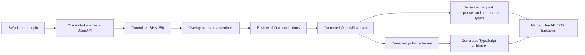

# Client specification

## Status

This specification defines the implemented `@sefaria/client` contract.

## Responsibility

`@sefaria/client` owns the complete public API transport boundary:

- the commit-pinned upstream OpenAPI input
- the checksum for that input
- the reviewed deterministic Core overlay
- the corrected OpenAPI artifact
- generated TypeScript request, response, component, and operation types
- generated corrected public schemas and TypeScript runtime validators
- six named SDK functions generated by `@hey-api/openapi-ts` with `@hey-api/client-fetch` as an external runtime dependency
- a configurable generated fetch client with an injectable `fetch`

The package does not own component view models, normalized domain models, rendering, default caching, retries, request coalescing, or component-specific methods.

## Source authority

The upstream input is [`docs/openAPI.json` at Sefaria commit `1f7d0844ca6a9eddc8e48168962aacb09de75bd6`](https://github.com/Sefaria/Sefaria-Project/blob/1f7d0844ca6a9eddc8e48168962aacb09de75bd6/docs/openAPI.json).

The committed corrected OpenAPI artifact is authoritative for transport payloads. Generated declarations are the field-level public reference.

This specification defines correction policy and client behavior. [Evidence](../evidence.md) records upstream and deployed observations.

Before each correction, inspect these sources at the pinned commit:

1. The route declaration.
2. The endpoint handler.
3. The response builder or serializer.
4. The upstream endpoint tests.
5. A deployed fixture when data or configuration can change the response shape.

One deployed response is not sufficient correction evidence. The correction record links to the pinned implementation and states each conditional field or response variant.

## Core operations

Core generation and contract checks cover these operations:

| Method | Path | Purpose |
| --- | --- | --- |
| `GET` | `/api/v3/texts/{tref}` | Requested text versions and nested text content |
| `GET` | `/api/texts/versions/{tref}` | Available versions for a reference |
| `GET` | `/api/ref/{tref}` | Canonical reference information |
| `GET` | `/api/v2/index/{title}` | Index and schema metadata |
| `GET` | `/api/shape/{title}` | Nested text shape |
| `GET` | `/api/links/{tref}` | Related links |

No non-Core operation is generated or exported.

## OpenAPI supply chain



The supply chain has two modes:

| Mode | Network access | Result |
| --- | --- | --- |
| Explicit refresh | Allowed | Updates the pinned input and checksum for a chosen commit |
| Ordinary build and check | Forbidden | Applies the overlay and regenerates outputs from committed files |

## Pin and checksum contract

The pin records the complete Sefaria commit SHA. The committed input must match the OpenAPI file from that commit.

The checksum covers the committed upstream OpenAPI bytes before overlay application. A checksum mismatch stops generation.

The refresh operation must require an explicit commit. It must not follow a mutable branch or tag.

A refresh produces a reviewable diff for the pin, checksum, upstream input, corrected artifact, and generated outputs.

## Overlay contract

The overlay is deterministic and local. It contains only reviewed corrections for the public contract.

Every mutating correction must include:

- an Overlay action with an exact JSONPath target
- the expected old value, or an explicit expected absence
- the corrected value, or an explicit removal
- a short reason tied to evidence
- commit-pinned links to the route, handler, response builder, and upstream tests
- the deployed fixture name and capture date when runtime data affects the shape

The overlay applies corrections in a stable order. It must not read the network, current time, environment-specific data, or generated output.

If a sidecar precondition fails, generation stops before overlay application. The error reports the JSONPath target, expected state, and actual state.

Example failure:

```text
OpenAPI precondition mismatch for shape-contract at $.components.schemas.ShapeJSON
expected: SHA-256 <reviewed value>
actual: <current value>
```

The tool must not skip the correction or search for a similar path.

## Reviewed Core corrections

The initial overlay corrects these known problems from the pinned document:

| JSON area | Upstream problem | Corrected contract |
| --- | --- | --- |
| `/paths/~1api~1texts~1versions~1{index}` | The documented parameter says index, but the route and handler accept a reference | The corrected path parameter is `tref` and uses the reference input contract |
| `/paths/~1api~1texts~1versions~1{index}/get/responses/200/content` | The response uses `VersionJSON` as the media-type key, real metadata can contain null source or status values, and invalid references return an HTTP 200 error object | The response uses `application/json`; `versionSource` and `status` permit observed null values; the response is a version array or `CoreErrorResponse` |
| `/components/schemas/v3AvailableVersionsTextJson` | The available-version schema does not produce a useful public contract | The schema exposes the reviewed available-version fields |
| `/api/v3/texts/{tref}` parameters and responses | The document models one `version` string and omits handler branches for parse errors, missing text, invalid formats, adapter errors, warnings, and conditional fields | The request permits repeated version selectors and the response map matches the 200, 400, and 404 handler branches |
| `/components/schemas/v3TextVersionsJSON/properties/text` | The text schema does not express nullable dynamic nesting | The schema uses an explicitly typed nullable OpenAPI 3.0 branch for recursive string, array, and null values |
| `/api/ref/{tref}` description and responses | The description promises `first_available_section_ref` for every node type; expected parse failures return HTTP 200 with `is_ref: false`; success fields depend on node type and depth | The description records conditional navigation, the `SheetNode` exception, and `first_subref`/`last_subref`; the corrected response union and conditional schemas follow `RefView` |
| `/api/v2/index/{title}` response | Content-count and related-topic parameters add conditional fields, while invalid titles return an HTTP 200 error object | The corrected operation records each query parameter and a success-or-error response union |
| `/api/shape/{title}` parameters, response, and examples | The document exposes a boolean wire value and deprecated no-op depth parameter, models one object with inconsistent casing, and supplies bare-object examples | The corrected request uses `"0"`/`"1"` for dependents and omits depth; the response is a list of leaf or collapsed lower-case records or the observed error shape; both success examples use valid array roots |
| `/api/links/{tref}` parameter and response | The repeatable category filter is modeled as one string; text and version fields omit merged, missing, and spanning variants; essay `displayedText` is not a string; invalid references can return an HTTP 200 error object | The category parameter is an exploded string array; the response is a link array or `CoreErrorResponse`; list items model nullable variants, bilingual displayed text, and sheet links; the 400 branch remains documented |

The overlay must state each concrete field correction. This table does not replace the overlay diff.

The overlay must not normalize API names for style. It changes only incorrect, vague, or incomplete transport contracts.

## Corrected artifact

The corrected OpenAPI document is a generated committed artifact. It is the only OpenAPI input for TypeScript and runtime-schema generation.

The artifact must be byte-stable for the same pinned input, checksum, overlay, and generator versions.

The artifact retains upstream descriptions and operations unless a reviewed correction changes them.

## Generated TypeScript contracts

Generation publishes request, response, component, and operation types. Public consumers use these contracts directly.

The package must not copy complete generated interfaces into handwritten source files or specifications. Generated declarations remain the field-level reference.

Generated operation types preserve path parameters, query parameters, request bodies, success payloads, documented error payloads, and response status distinctions.

Unknown or incomplete upstream fields can remain optional. The overlay adds requirements only when evidence supports them.

## Public schemas and runtime validators

The package publishes language-neutral JSON Schema artifacts for corrected public schemas. Non-TypeScript consumers validate unknown payloads with these artifacts.

The package also publishes TypeScript runtime validators generated from the same corrected schemas.

The generation step uses a deterministic Zod object resolver for every retained `additionalProperties: false` schema. It also converts the explicitly typed OpenAPI 3.0 null-only branches to `z.null()` and applies the `minProperties: 1` warning-record correction because Hey API 0.99 does not emit those constraints correctly.

A validation failure reports one or more structured paths. Each entry identifies the failing JSON path, expected contract, and actual value category.

The public client validates every JSON response against the schema for its operation and status. This validation applies to documented success and error responses.

A response mismatch rejects the client operation. The error includes the operation identifier, response status, structured JSON paths, and original `Response` metadata.

Unknown JSON from MCP, a server, a fixture, stored data, or user input also requires validation before component projection.

## Generated client

The public client exports `getV3Texts`, `getTextVersions`, `getRef`, `getIndexV2`, `getShape`, and `getLinks` from generated SDK output. It does not add handwritten endpoint request functions or a generalized facade.

The creation contract has this shape:

```ts
const client = createSefariaClient({
  baseUrl: "https://www.sefaria.org",
  fetch,
});

const result = await getV3Texts({
  client,
  path: { tref: "Genesis 1:1" },
});
```

Each named SDK function accepts the generated client in its options. The package also exports generated operation types, Zod schemas, response validators, the corrected Core OpenAPI document, and portable response JSON Schemas.

The default base URL is `https://www.sefaria.org`. Tests and non-browser hosts can supply another base URL and `fetch`.

The package has no default cache. It does not retry, coalesce requests, or convert one operation into another operation.

If a consumer later needs those policies, the consumer must supply a concrete requirement and own the policy outside the thin transport client.

## Success and failure semantics

The client preserves generated Hey API and Fetch API semantics:

| Outcome | Client result |
| --- | --- |
| Documented success status | Generated typed success payload and `Response` metadata |
| Documented HTTP error status | Generated typed error payload and `Response` metadata |
| Undocumented HTTP status | Rejected contract mismatch because no generated schema covers the status |
| Network failure | Rejected operation from `fetch` |
| Abort | Rejected operation with the original abort semantics |
| Response body stream failure | Rejected operation with the original stream error |
| Invalid JSON response | Rejected contract mismatch with operation, status, paths, and `Response` metadata |
| Invalid external JSON | Structured validation failure before projection |

The client must not catch a network or abort failure and return an HTTP-style success object.

The client must not turn missing requested content into a transport error when the API returned a valid success payload. The owning component factory decides its partial or empty state.

Runtime validation detects contract mismatches. A mismatch does not change the schema automatically. Source review and recorded evidence must precede an overlay correction.

## Test contract

Focused tests must cover:

- the pinned checksum
- overlay success for every correction
- overlay failure after each expected old value changes
- exact mismatch paths
- deterministic corrected output
- deterministic generated declarations and validators
- stale generated-output detection
- all Core operation types
- documented HTTP error payloads
- validation of every JSON success and error response
- contract mismatch errors with operation, status, paths, and response metadata
- undocumented status rejection
- network rejection and abort behavior
- configurable base URL and injectable `fetch`
- validation paths for malformed unknown JSON

Fixtures must record their source commit or deployed capture date. Mutable live responses cannot be the only test oracle.

Each corrected Core schema must pass fixtures derived from the original handler, response builder, and upstream endpoint tests.

Reduced deployed captures preserve the nullable version metadata, HTTP 200 error unions, simple shape array, Targum link, and conditional Sheet reference branches that drove Core corrections. Their exact sources, capture dates, and reductions are recorded in `packages/client/test/fixtures/manifest.json`.

## Completion criteria

`@sefaria/client` is complete for Core when:

- the repository contains the pinned input and checksum
- ordinary generation uses no network
- the overlay fails on every stale assertion
- the corrected artifact covers all Core operations
- generated output is current
- public validators report structured paths
- every JSON response passes runtime validation or rejects with a structured contract mismatch
- the generated client preserves success, HTTP error, network, and abort semantics
- no generalized model facade, default cache, retry, coalescing, or component method exists
- `pnpm check` detects stale artifacts and passes from a clean checkout
