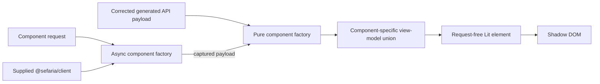
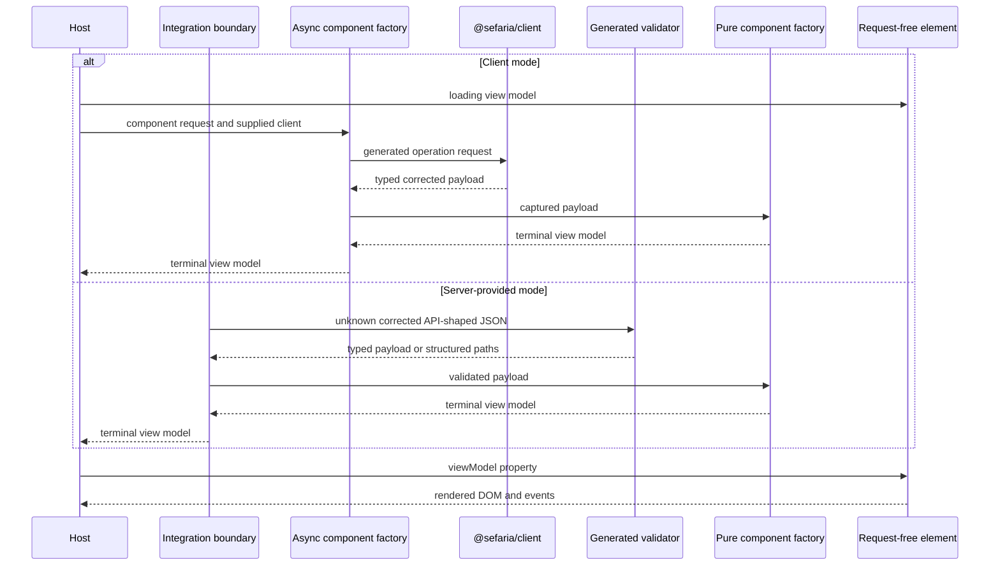
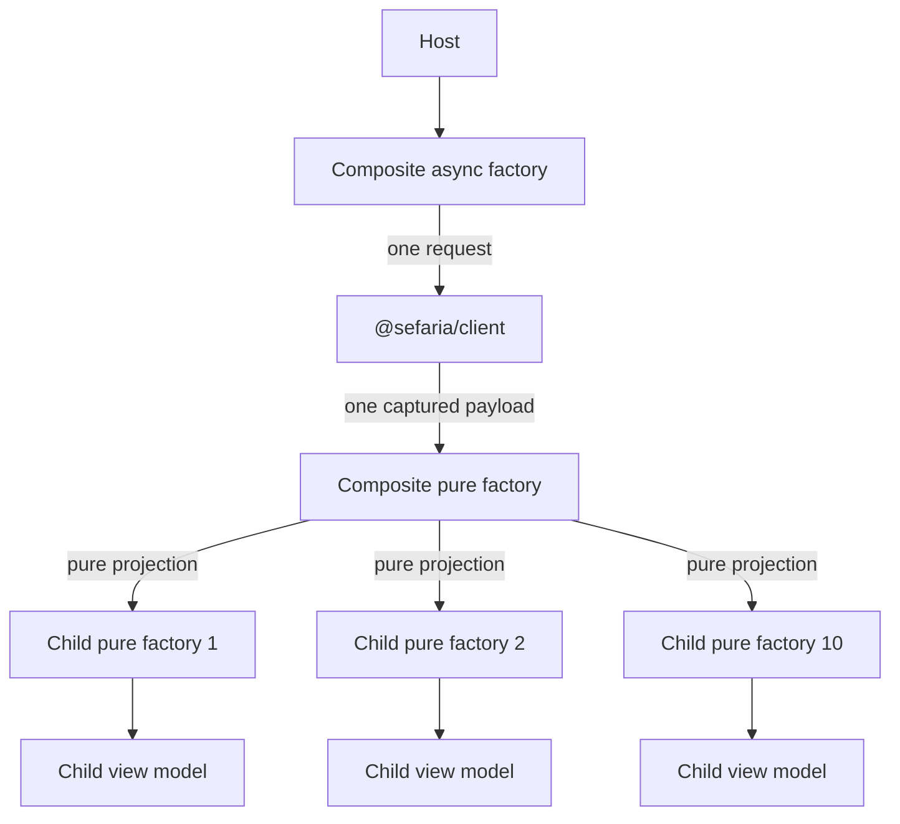

> Created/edited by GitHub Copilot; pending human review.

# Component specification

## Status

The text-segment, bilingual-segment, and reference-label vertical slices are current. The remaining component surfaces are planned.

## Boundary

Each component projects a corrected generated API payload through a pure factory into a component-specific view model, which a request-free Lit element renders.



The API payload is authoritative for transport fields, and the view model is authoritative for rendered data. Raw HTML can enter only the pure factory as a validated payload field; the factory applies the required `@sefaria/text-transform` operations before placing sanitized HTML fragments or typed text parts in the view model. The element does not read, validate, or project an API payload.

A convenience API can accept a payload and return or configure a component, but it must delegate to the same pure factory and then supply its result to the request-free element.

## Component subpath contract

Every component has a non-DOM `@sefaria/components` subpath. The subpath owns:

- one component request type
- one component-specific view-model union
- a deterministic pure API-payload-to-view-model factory
- an async request-and-client factory
- component-specific construction for the states that component supports

The package does not define a generalized normalized client result or shared domain model.

Planned names follow this pattern:

| Component | Request | View model | Pure factory | Async factory |
| --- | --- | --- | --- | --- |
| Text segment | `TextSegmentRequest` | `TextSegmentViewModel` | `createTextSegmentViewModel`; `projectTextSegmentVersion` after role resolution | `loadTextSegmentViewModel` |
| Bilingual segment | `BilingualSegmentRequest` | `BilingualSegmentViewModel` | `createBilingualSegmentViewModel` | `loadBilingualSegmentViewModel` |
| Reference label | `RefLabelRequest` | `RefLabelViewModel` | `createRefLabelViewModel` | `loadRefLabelViewModel` |
| Text range | `TextRangeRequest` | `TextRangeViewModel` | `createTextRangeViewModel` | `loadTextRangeViewModel` |
| Source card | `SourceCardRequest` | `SourceCardViewModel` | `createSourceCardViewModel` | `loadSourceCardViewModel` |
| Popup | `PopupRequest` | `PopupViewModel` | `createPopupViewModel` | `loadPopupViewModel` |
| Connections panel | `ConnectionsPanelRequest` | `ConnectionsPanelViewModel` | `createConnectionsPanelViewModel` | `loadConnectionsPanelViewModel` |

The text-segment and reference-label names are current. The remaining names are planned and can be refined by their first implementation slice without changing ownership or request boundaries.

## View-model states

Each component defines its own discriminated union. The union uses these state classes where they apply:

| State | Meaning |
| --- | --- |
| `loading` | A host started the component request and has no terminal payload |
| `data` | The factory produced renderable component data |
| `partial` | The payload is valid, but one requested component-specific part is absent |
| `empty` | The payload is valid, but it contains no renderable content for this component |
| `error` | The component factory classified a documented request or projection failure |

The common state names do not create a generalized data interface. Each component owns its fields, messages, recovery actions, and attribution data.

Missing requested content is not always an error. A bilingual component can return a partial state when one language is absent.

A source card can return an empty state when the API supplies no renderable version. The factory must not invent missing text.

## Component request types

A component request contains only information needed to obtain and project that component's data. It can include a reference, endpoint parameters, version selection, language selection, or bounded paging.

Layout, theme, open state, focus behavior, and host placement do not belong in a request.

Non-DOM factories consume the request type. It is never an element property.

## Pure factories

A pure factory accepts a corrected API payload and deterministic component inputs. It returns a component view model.

A composite can resolve a child input by payload role before projection. In this case, the child subpath can expose a pure projection that accepts the resolved input without repeating selection.

The factory:

- makes no request
- reads no global client or cache
- uses no DOM state
- uses `@sefaria/text-transform` for required text processing
- applies HTML vocalization through the transform package rather than parsing HTML independently
- preserves available attribution needed by the component
- returns a component-specific partial or empty state for missing requested content
- calls child pure factories for child views

The same input must produce the same view model.

If a component contract rejects an invalid request, both factories reject it before projection. The async factory must reject before it makes a request.

## Async factories

An async factory accepts a component request and a supplied `@sefaria/client`. It performs the smallest operation set needed for that component.

For a successful captured payload, its terminal view model must equal the pure factory result for that payload and the same deterministic inputs.

The host sets a component-specific loading view model before it awaits the async factory.

An async factory returns its component error view model for a documented HTTP error payload. It must not return a transport error object.

A network failure or abort rejects the async factory operation. An abort used to cancel obsolete work remains an abort.

An async factory owns one operation. It does not own the active selection, loading state, task history, available data sources, retries, or stale-result suppression.

The host owns the task lifecycle. A Lit host can use `@lit/task`, a reactive controller, or an equivalent local mechanism. This choice is not part of the public component contract.

## Client and server convergence



Both modes call the same pure factory. Server-provided mode does not send component HTML and has no hydration step.

## Composite factories

A composite async factory makes one outer request when one endpoint payload contains all required child data. It then calls child pure factories.



Child pure factories must not call a client. The composite factory must not call child async factories.

The request-count acceptance example is exact: ten child views from one composite response mean one outer request and zero child requests.

## Element contract

Every public element:

- uses an open shadow root
- accepts one component-specific view model
- accepts only visual or interaction properties in addition to that view model
- emits composed events for host actions
- renders the loading, data, partial, empty, and error states that its view model supports
- preserves available attribution
- supports keyboard operation
- uses `--sefaria-*` custom properties
- emits no global style

No element accepts:

- a Sefaria reference
- raw JSON
- a generated API payload
- a client
- a base URL or host
- a `fetch` function
- request parameters

No element interprets raw API HTML. Sanitized render-ready HTML fragments are view-model data rather than transport payloads.

An element must not call `fetch`, `@sefaria/client`, or an async component factory.

## Data and interaction state

Data state belongs in the view model. This includes text, labels, attribution, missing-content details, loading messages, empty messages, and error details.

Visual and interaction state remains on the element. This includes layout, expanded state, selection, focus, popup placement, and whether a dialog is open.

If an interaction changes requested data, the element emits an event. The host calls a factory and supplies a new view model.

## Interaction-triggered data [Planned]

An interactive element emits a semantic composed event. The event identifies the user action and its target. It does not contain a client or raw payload.

The host selects one explicit data path:

| Available host input | Host action | Request count |
| --- | --- | --- |
| The captured corrected payload is authoritative for the target data | Call the owning pure factory | Zero |
| Validated server-provided data contains the target data | Call the owning pure factory | Zero |
| A supplied client can retrieve the target data | Supply a loading view model, then call the owning async factory with cancellation | One operation-specific request |
| No permitted data source exists | The integration shows its unavailable state outside the target element | Zero |

The host must not hide a fallback request behind the element or pure factory. The host must not treat missing capability as empty API content.

The captured-payload owner must declare that the payload covers the requested target. The host must not use an empty factory result to infer payload coverage.

If a newer interaction supersedes an older operation, the host aborts the older operation when possible. The host must ignore an obsolete result in all cases.

The originating element usually keeps its current data. For a component data path, the host supplies loading and terminal view models to the target component.

If no data source exists, the integration owns the unavailable presentation. It does not construct an unsupported component view-model state.

Task lifecycle state and component view-model state must not compete for the same rendering surface. The host can use task state for execution, but the target element renders only its supplied view model.

## Component surfaces

| Element | Status | Primary payload source | View-model responsibility | Element properties |
| --- | --- | --- | --- | --- |
| `<sefaria-text-segment>` | Current | `/api/v3/texts/{tref}` payload or parent payload slice | Safe text, direction, language, attribution, and static footnote data | None in the current contract |
| `<sefaria-bilingual-segment>` | Current | `/api/v3/texts/{tref}` payload or parent payload slice | Primary and translation sides, absent-side state, and attribution | `contentLanguage`, `layout`, and `sideOrder` |
| `<sefaria-ref-label>` | Current | `/api/ref/{tref}` payload or parent payload slice | Canonical English and Hebrew labels, URL forms, owning index, node type, and unresolvable-reference state | `labelLanguage` and `linked` |
| `<sefaria-text-range>` | Planned | `/api/v3/texts/{tref}` payload | Bounded segment view models and range-level partial state | Layout, numbering, selection, and highlights |
| `<sefaria-source-card>` | Planned | `/api/v3/texts/{tref}` payload | Reference header, bounded text view, attribution, and missing-content state | Layout and host actions |
| `<sefaria-popup>` | Planned | Source-card payload or parent payload | Popup content view model and recoverable error state | Anchor, open state, placement, and focus behavior |
| `<sefaria-connections-panel>` | Planned | `/api/links/{tref}` payload | Category and link view models with bounded paging | Selected category and expanded state |

The `/api/texts/versions/{index}`, `/api/v2/index/{title}`, and `/api/shape/{title}` operations can support component requests that need those payloads. A component must not request them without a concrete need.

All listed elements except `<sefaria-connections-panel>` are Core. The connections panel remains outside Core.

## Text segment contract [Current]

The first text-segment implementation accepts a segment reference plus either a language-family name or a language-family name and exact version title. It maps that selection to one v3 `version` query value and requests `return_format=default`.

The current request does not support `source`, `translation`, `primary`, `all`, `fill_in_missing_segments`, or alternate return formats. Add one of these inputs only when a concrete consumer requires its behavior.

Both text-segment factories reject a blank or reserved selector with `TypeError`. The async factory rejects before it makes a request.

The pure factory matches `languageFamilyName` case-insensitively and matches `versionTitle` exactly when the request supplies one. No matching version produces `empty`. `null`, empty, or transformed non-renderable text also produces `empty`.

`projectTextSegmentVersion` accepts one already-selected `CoreV3Version`. It does not select by language, title, array position, `isPrimary`, or `isSource`.

`createTextSegmentViewModel` owns language-family selection and delegates the selected version to `projectTextSegmentVersion`. This keeps one owner for sanitization, vocalization, footnote extraction, direction, language, and attribution projection.

Payload warnings describe missing request selectors. `createTextSegmentViewModel` preserves them because it owns one selector. `projectTextSegmentVersion` does not assign request warnings to an existing selected version.

Role-based composites resolve a primary, source, or translation version from the captured payload. They call `projectTextSegmentVersion` for each resolved side and do not call the request-based text-segment factory.

If a requested role has no selected version, the composite owns that missing-side state and its matching warning. It does not call `projectTextSegmentVersion` for the missing side.

Text segment has no `partial` state. More than one matching version or an array-valued selected text produces a projection `error`; the factory does not choose a version or child segment silently.

String text passes through `sanitize`, full-mark HTML vocalization, and `extractFootnotes` before entering the view model. The data view model preserves the payload-provided `language`, `actualLanguage`, `direction`, `versionTitle`, and `versionSource`. The source remains text in this contract and is not converted into an unvalidated link.

`<sefaria-text-segment>` renders static footnote markers and available note bodies. Interactive footnote activation and word selection remain outside the current contract because no consumer defines their action or event payload.

The element supports mixed scripts, punctuation, and long unbroken text without inferring direction from language. Poetry- and paragraph-specific presentation remain outside the current contract until an exact behavior is defined.

## Reference label contract [Current]

The reference-label request contains only the `tref` path input for `GET /api/ref/{tref}`. Both factories reject a blank reference with `TypeError`; the async factory rejects before making a request.

The pure factory accepts a validated `CoreRefResponse`, the request, and an optional deterministic `siteOrigin`. A successful result preserves the API's `normalized`, `hebrew`, `url_ref`, `index_title`, and `node_type` fields as `normalized`, `hebrew`, `urlRef`, `indexTitle`, and `nodeType`. It also produces an absolute `url` from `urlRef` and an HTTP(S) site origin that defaults to `https://www.sefaria.org`.

Sefaria's `url_ref` is a canonical Sefaria path form, not a fully encoded URL path. The factory preserves valid `%XX` escapes and valid path characters, percent-encodes characters such as `#` and non-ASCII code points, and does not double-encode the `%3F` produced by Sefaria. A non-HTTP(S) site origin is invalid and causes `TypeError`.

The HTTP 200 `{ "is_ref": false }` branch produces an `empty` view model containing the requested reference and a message. The documented HTTP 404 payload produces an `error` view model. Network failures, aborts, malformed runtime payloads, and undocumented statuses reject rather than becoming view-model states.

The `hebrew` field is always present in a successful corrected payload. The upstream implementation falls back to the English normal form when no Hebrew title exists, so the current view model does not claim that equality between `hebrew` and `normalized` proves that Hebrew is unavailable.

`<sefaria-ref-label>` accepts only its view model, `labelLanguage`, and `linked`. `labelLanguage` is `english`, `hebrew`, or `both`; the default is `english`. English and Hebrew labels render in separate `lang` and `dir` boundaries, without script detection. When `linked` is true, the element renders a keyboard-operable anchor whose target is the view model's absolute `url` and whose accessible name is its visible label. The element does not accept or construct a site origin.

Range labels, navigation references, and a display form based on raw `urlRef` remain outside the current view model until a concrete consumer requires them.

## Bilingual segment contract [Current]

### Two sides are roles

The two sides are the primary version and the translation version. They are not fixed Hebrew and English families.

`BilingualSegmentRequest` carries a segment reference and an optional exact version title for each side. It serializes to one request with two reserved selectors:

```
GET /api/v3/texts/{tref}?version=primary&version=translation&return_format=default
```

An optional exact edition serializes as `primary|versionTitle` or `translation|versionTitle`. Both factories reject a blank reference or a blank version title with `TypeError`, and the async factory rejects before it makes a request.

The current request does not support `source`, `all`, `fill_in_missing_segments`, alternate return formats, a third side, or per-side version pickers. Add one of these inputs only when a concrete consumer requires its behavior.

### Role resolution

`createBilingualSegmentViewModel` resolves each side from the payload rather than from array order, because a v3 request cannot guarantee response order for its version parameters.

The primary side is the single version whose `isPrimary` is `true`. The translation side is the single remaining version whose `isSource` is `false`.

A version that fills neither role is dropped. More than one candidate for either role is a projection error; the composite does not choose a version silently.

A side with no resolved version is absent. The composite owns that absent-side state and does not call `projectTextSegmentVersion` for it.

### Warning attribution

Payload warnings describe missing request selectors, and each warning key is the selector it describes. The composite attributes a warning to the side whose serialized selector matches that key.

A key match must replace `_` with a space in the requested version title before comparison. The API applies that substitution when it parses a piped `version` parameter, so a requested `primary|The_Title` returns the warning key `primary|The Title`. A side with no matching key uses a component-authored message.

### States

| Situation | State |
| --- | --- |
| Both sides resolve to renderable text | `data` |
| Exactly one side resolves, and the other is absent or projects empty | `partial`, naming the absent side |
| Neither side resolves | `empty` |
| A resolved side returns a projection error | `error` |
| A documented HTTP failure occurs | `error` |

A `partial` state carries the present side's child view model. The composite must not substitute one side for the other.

### Layout and visible sides

Visible sides and layout are separate element properties, because a host chooses them independently.

| Property          | Values                               | Default         |
| ----------------- | ------------------------------------ | --------------- |
| `contentLanguage` | `primary`, `translation`, `both`     | `both`          |
| `layout`          | `auto`, `stacked`, `side-by-side`    | `auto`          |
| `sideOrder`       | `primary-first`, `translation-first` | `primary-first` |

`auto` selects a stacked or side-by-side layout from container inline size through a CSS container query. The element performs no measurement and holds no resize state.

`sideOrder` chooses which side comes first in a side-by-side layout. It names roles rather than directions, so it stays correct when the primary side is left-to-right.

Side-by-side layout must preserve paired alignment without assuming equal text lengths. Both sides share a block start, and the pair grows to the taller side.

The component does not need to copy Sefaria Web's private layout mechanism or pixel geometry.

Browser tests cover unequal side lengths, one missing side, each visible-side and layout combination, narrow containers, and live container resizing in both directions.

## Text and attribution

Direction comes from version or corrected API data. A factory must not infer direction from a language code.

Text that can contain markup passes through `@sefaria/text-transform` before the view model reaches an element.

A component that renders text also renders its available attribution. Core components have no attribution-suppression property.

## Theming

Components contain no color values outside token defaults.

The minimum token set is:

```css
--sefaria-surface
--sefaria-fg
--sefaria-fg-muted
--sefaria-border
--sefaria-accent
--sefaria-link
--sefaria-category-color
--sefaria-font-scale
--sefaria-font-hebrew
--sefaria-font-english
```

A host overrides tokens on a container. Custom properties inherit through shadow roots.

The element inherits `color-scheme` from the host. It does not replace the host selection with an operating-system preference.

## Accessibility

Core interaction works with a keyboard.

Required behavior includes:

- real buttons for close and footnote actions when those actions exist
- visible focus
- Tab and Shift+Tab cycling in modal popups
- Escape closes a popup
- focus entry and restoration
- a dialog name, role, and `aria-modal`
- composed events for shadow-root consumers
- direction from view-model data
- status and error announcements

An element must not suppress Tab without moving focus.

## Browser and factory checks

Factory tests must cover:

- deterministic pure results
- async and pure equivalence for a captured payload
- component-specific partial and empty states
- documented HTTP error mapping
- network and abort rejection
- exact request counts
- one outer request and zero child requests for composites

Browser tests must cover:

- request-free elements
- browser structure
- accessible names and roles
- direction and language
- focus and keyboard behavior for interactive elements
- responsive containers
- event composition
- token inheritance
- each view-model state

A request-free test must fail if an element calls `fetch`, imports the client at runtime, or calls an async factory.

## Completion criteria

A planned component is complete when:

- the package implements its request, view model, pure factory, async factory, and element
- the async result equals the pure result for captured successful payloads
- each named missing-content case has a partial or empty result
- composite request-count tests pass
- the element accepts no request input and makes no request
- text is safe before it reaches the element
- direction and attribution come from the view model
- applicable keyboard and browser checks pass
- a clean checkout passes `pnpm check`
