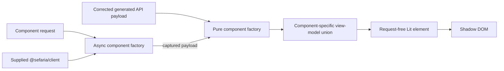
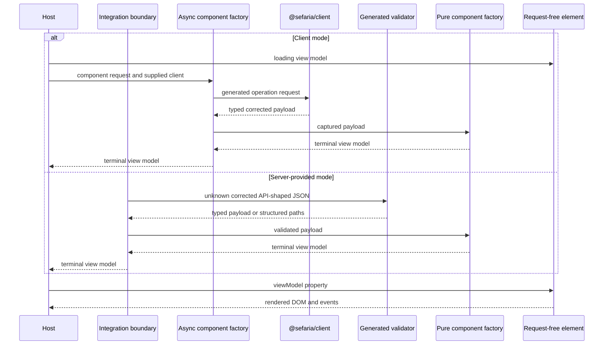
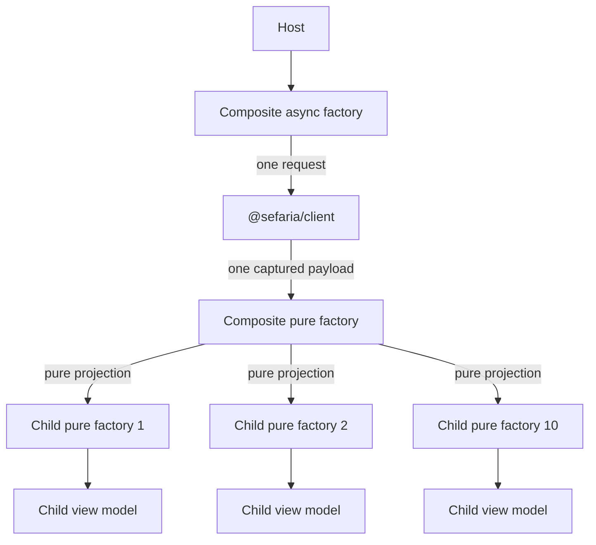

> Created/edited by GitHub Copilot; pending human review.

# Component specification [Planned]

## Status

This specification defines the planned component architecture.

## Boundary

Each component projects a corrected generated API payload through a pure factory into a component-specific view model, which a request-free Lit element renders.



The API payload is authoritative for transport fields, and the view model is authoritative for rendered data. Raw HTML can enter only the pure factory as a validated payload field; the factory applies the required `@sefaria/text-transform` operations before placing sanitized HTML fragments or typed text parts in the view model. The element does not read, validate, or project an API payload.

A convenience API can accept a payload and return or configure a component, but it must delegate to the same pure factory and then supply its result to the request-free element.

## Component subpath contract

Every component has a non-DOM `@sefaria/components` subpath. The subpath owns:

- one component request type
- one component-specific view-model union
- a deterministic pure API-payload-to-view-model factory
- an async request-and-client factory
- component-specific loading, empty, partial, and error construction

The package does not define a generalized normalized client result or shared domain model.

Planned names follow this pattern:

| Component | Request | View model | Pure factory | Async factory |
| --- | --- | --- | --- | --- |
| Text segment | `TextSegmentRequest` | `TextSegmentViewModel` | `createTextSegmentViewModel` | `loadTextSegmentViewModel` |
| Bilingual segment | `BilingualSegmentRequest` | `BilingualSegmentViewModel` | `createBilingualSegmentViewModel` | `loadBilingualSegmentViewModel` |
| Reference label | `RefLabelRequest` | `RefLabelViewModel` | `createRefLabelViewModel` | `loadRefLabelViewModel` |
| Text range | `TextRangeRequest` | `TextRangeViewModel` | `createTextRangeViewModel` | `loadTextRangeViewModel` |
| Source card | `SourceCardRequest` | `SourceCardViewModel` | `createSourceCardViewModel` | `loadSourceCardViewModel` |
| Popup | `PopupRequest` | `PopupViewModel` | `createPopupViewModel` | `loadPopupViewModel` |
| Connections panel | `ConnectionsPanelRequest` | `ConnectionsPanelViewModel` | `createConnectionsPanelViewModel` | `loadConnectionsPanelViewModel` |

These names are planned. The first implementation slice can refine them without changing ownership or request boundaries.

## View-model states

Each component defines its own discriminated union. The union uses these state classes where they apply:

| State | Meaning |
| --- | --- |
| `loading` | A host started the component request and has no terminal payload |
| `data` | The factory produced renderable component data |
| `partial` | The payload is valid, but one requested component-specific part is absent |
| `empty` | The payload is valid, but it contains no renderable content for this component |
| `error` | The component factory classified a documented request or projection failure |

The common state names do not create a generalized data interface. Each component owns its fields, messages, recovery actions, and attribution data.

Missing requested content is not always an error. A bilingual component can return a partial state when one language is absent.

A source card can return an empty state when the API supplies no renderable version. The factory must not invent missing text.

### Core fixture state decisions [Planned]

The Core fixture catalog defines exact test-only examples for the first component implementations. The catalog does not export production component types.

| Component | Required fixture states | Exact missing-content decision |
| --- | --- | --- |
| Text segment | `loading`, `data`, `empty`, `error` | A valid payload with no renderable requested version is `empty` |
| Reference label | `loading`, `data`, `empty`, `error` | A valid HTTP 200 `{ "is_ref": false }` payload is `empty`, not `error` |
| Bilingual segment | `loading`, `data`, `partial`, `empty`, `error` | One requested language present is `partial`; no requested language present is `empty` |
| Text range | `loading`, `data`, `partial`, `empty`, `error` | Renderable children with a requested language absent are `partial`; no renderable requested children are `empty` |

Loading is a host-supplied render state. A successful pure projection can produce `data`, `partial`, or `empty`.

A documented HTTP error can produce an `error` view model through the async factory. A network error, abort, invalid external payload, or internal fault remains a rejected operation and does not produce a view model.

Each fixture-local view-model type names its production owner issue. The owning implementation replaces that fixture-local type with the production component type without changing the fixture literals.

## Component request types

A component request contains only information needed to obtain and project that component's data. It can include a reference, endpoint parameters, version selection, language selection, or bounded paging.

Layout, theme, open state, focus behavior, and host placement do not belong in a request.

Non-DOM factories consume the request type. It is never an element property.

The first Core fixtures project request fields from the generated operation contracts. V3 text fixtures use only `path` and applicable `query` fields. Reference-label fixtures use only `path`.

The generated SDK `url` and `body` envelope fields are not component request fields. An absent optional query is omitted rather than assigned `undefined`.

## Pure factories

A pure factory accepts a corrected API payload and deterministic component inputs. It returns a component view model.

The factory:

- makes no request
- reads no global client or cache
- uses no DOM state
- uses `@sefaria/text-transform` for required text processing
- applies HTML vocalization through the transform package rather than parsing HTML independently
- preserves available attribution needed by the component
- returns a component-specific partial or empty state for missing requested content
- calls child pure factories for child views

The same input must produce the same view model.

## Async factories

An async factory accepts a component request and a supplied `@sefaria/client`. It performs the smallest operation set needed for that component.

For a successful captured payload, its terminal view model must equal the pure factory result for that payload and the same deterministic inputs.

The host sets a component-specific loading view model before it awaits the async factory.

An async factory returns its component error view model for a documented HTTP error payload. It must not return a transport error object.

A network failure or abort rejects the async factory operation. An abort used to cancel obsolete work remains an abort.

## Client and server convergence



Both modes call the same pure factory. Server-provided mode does not send component HTML and has no hydration step.

## Composite factories

A composite async factory makes one outer request when one endpoint payload contains all required child data. It then calls child pure factories.



Child pure factories must not call a client. The composite factory must not call child async factories.

The request-count acceptance example is exact: ten child views from one composite response mean one outer request and zero child requests.

## Element contract

Every public element:

- uses an open shadow root
- accepts one component-specific view model
- accepts only visual or interaction properties in addition to that view model
- emits composed events for host actions
- renders loading, data, partial, empty, and error states that its view model supports
- preserves available attribution
- supports keyboard operation
- uses `--sefaria-*` custom properties
- emits no global style

No element accepts:

- a Sefaria reference
- raw JSON
- a generated API payload
- a client
- a base URL or host
- a `fetch` function
- request parameters

No element interprets raw API HTML. Sanitized render-ready HTML fragments are view-model data rather than transport payloads.

An element must not call `fetch`, `@sefaria/client`, or an async component factory.

## Data and interaction state

Data state belongs in the view model. This includes text, labels, attribution, missing-content details, loading messages, empty messages, and error details.

Visual and interaction state remains on the element. This includes layout, expanded state, selection, focus, popup placement, and whether a dialog is open.

Direction is data state. Browser fixtures vary direction through the supplied view model, not through an element property.

If an interaction changes requested data, the element emits an event. The host calls a factory and supplies a new view model.

## Planned component surfaces

| Element | Primary payload source | View-model responsibility | Element properties |
| --- | --- | --- | --- |
| `<sefaria-text-segment>` | `/api/v3/texts/{tref}` payload or parent payload slice | Safe text, direction, language, attribution, and footnote data | Footnote display and word-selection interaction |
| `<sefaria-bilingual-segment>` | `/api/v3/texts/{tref}` payload or parent payload slice | Source and translation sides, missing-side state, and attribution | `layout` and primary-side presentation |
| `<sefaria-ref-label>` | `/api/ref/{tref}` payload or parent payload slice | Human label, Hebrew label, canonical URL, and unavailable-label state | Link behavior and display form |
| `<sefaria-text-range>` | `/api/v3/texts/{tref}` payload | Bounded segment view models and range-level partial state | Layout, numbering, selection, and highlights |
| `<sefaria-source-card>` | `/api/v3/texts/{tref}` payload | Reference header, bounded text view, attribution, and missing-content state | Layout and host actions |
| `<sefaria-popup>` | Source-card payload or parent payload | Popup content view model and recoverable error state | Anchor, open state, placement, and focus behavior |
| `<sefaria-connections-panel>` | `/api/links/{tref}` payload | Category and link view models with bounded paging | Selected category and expanded state |

The `/api/texts/versions/{index}`, `/api/v2/index/{title}`, and `/api/shape/{title}` operations can support component requests that need those payloads. A component must not request them without a concrete need.

All listed elements except `<sefaria-connections-panel>` are Core. The connections panel remains outside Core.

## Bilingual alignment

`<sefaria-bilingual-segment>` supports `auto`, `stacked`, `side-by-side`, `hebrew-only`, and `english-only` layouts.

`auto` selects a stacked or side-by-side layout from container width. Side-by-side layout must preserve paired segment alignment without assuming equal text lengths.

The component does not need to copy Sefaria Web's private layout mechanism or pixel geometry.

Browser tests cover unequal Hebrew and English lengths, one missing side, narrow containers, and live container resizing.

## Text and attribution

Direction comes from version or corrected API data. A factory must not infer direction from a language code.

Text that can contain markup passes through `@sefaria/text-transform` before the view model reaches an element.

A component that renders text also renders its available attribution. Core components have no attribution-suppression property.

## Theming

Components contain no color values outside token defaults.

The minimum token set is:

```css
--sefaria-surface
--sefaria-fg
--sefaria-fg-muted
--sefaria-border
--sefaria-accent
--sefaria-link
--sefaria-category-color
--sefaria-font-scale
--sefaria-font-hebrew
--sefaria-font-english
```

A host overrides tokens on a container. Custom properties inherit through shadow roots.

The element inherits `color-scheme` from the host. It does not replace the host selection with an operating-system preference.

## Accessibility

Core interaction works with a keyboard.

Required behavior includes:

- real buttons for close and footnote actions
- visible focus
- Tab and Shift+Tab cycling in modal popups
- Escape closes a popup
- focus entry and restoration
- a dialog name, role, and `aria-modal`
- composed events for shadow-root consumers
- direction from view-model data
- status and error announcements

An element must not suppress Tab without moving focus.

## Browser and factory checks

Factory tests must cover:

- deterministic pure results
- async and pure equivalence for a captured payload
- component-specific partial and empty states
- documented HTTP error mapping
- network and abort rejection
- exact request counts
- one outer request and zero child requests for composites

Browser tests must cover:

- request-free elements
- browser structure
- accessible names and roles
- direction and language
- focus and keyboard behavior
- responsive containers
- event composition
- token inheritance
- each view-model state

A request-free test must fail if an element calls `fetch`, imports the client at runtime, or calls an async factory.

## Completion criteria

A planned component is complete when:

- the package implements its request, view model, pure factory, async factory, and element
- the async result equals the pure result for captured successful payloads
- each named missing-content case has a partial or empty result
- composite request-count tests pass
- the element accepts no request input and makes no request
- text is safe before it reaches the element
- direction and attribution come from the view model
- keyboard and browser checks pass
- a clean checkout passes `pnpm check`
