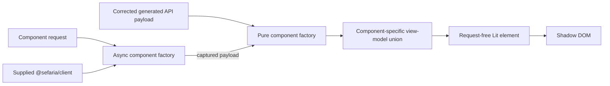
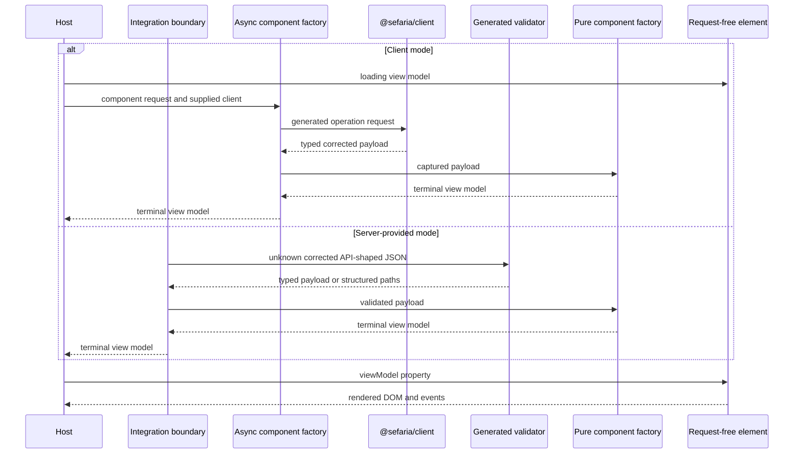
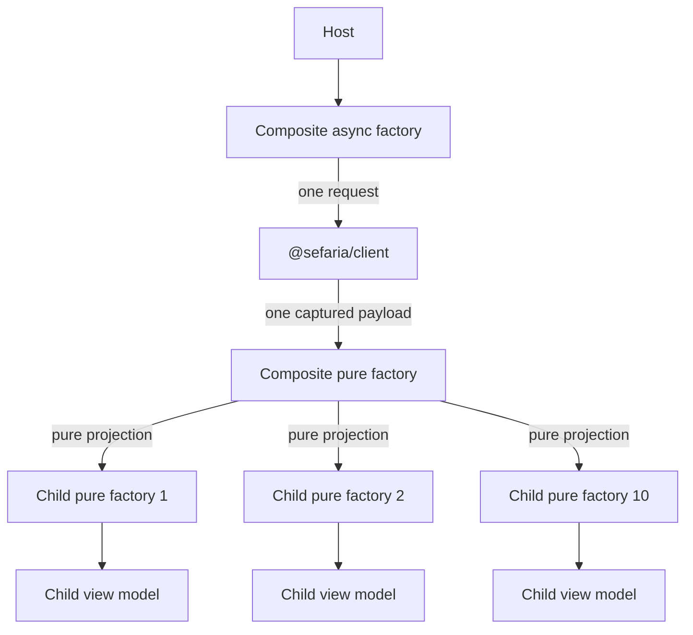

> Created/edited by GitHub Copilot with human review/feedback by avilevin.

# Component specification

## Status

The text-segment, bilingual-segment, reference-label, source-card, popup, connections-panel, DOM-free reader-session, and controlled reader vertical slices are current.

## Boundary

Each component projects a corrected generated API payload through a pure factory into a component-specific view model, which a request-free Lit element renders.



The API payload is authoritative for transport fields, and the view model is authoritative for rendered data. Raw HTML can enter only the pure factory as a validated payload field; the factory applies the required `@sefaria/text-transform` operations before placing sanitized HTML fragments or typed text parts in the view model. The element does not read, validate, or project an API payload.

A convenience API can accept a payload and return or configure a component, but it must delegate to the same pure factory and then supply its result to the request-free element.

## Component subpath contract

Every endpoint-backed component has a non-DOM `@sefaria/components` subpath. The subpath owns:

- one component request type
- one component-specific view-model union
- a deterministic pure API-payload-to-view-model factory
- an async request-and-client factory
- component-specific construction for the states that component supports

The package does not define a generalized normalized client result or shared domain model.

A non-requesting composition or session subpath can combine existing component requests, view models, and host-admitted corrected payload captures. It does not invent an endpoint-backed request type or async factory. It remains deterministic, DOM-free, and independent of clients, caches, promises, abort controllers, and global state.

Planned names follow this pattern:

| Component | Request | View model | Pure factory | Async factory |
| --- | --- | --- | --- | --- |
| Text segment | `TextSegmentRequest` | `TextSegmentViewModel` | `createTextSegmentViewModel`; `projectTextSegmentVersion` after role resolution; `projectTextSegmentValue` for a resolved leaf | `loadTextSegmentViewModel` |
| Bilingual segment | `BilingualSegmentRequest` | `BilingualSegmentViewModel` | `createBilingualSegmentViewModel` | `loadBilingualSegmentViewModel` |
| Reference label | `RefLabelRequest` | `RefLabelViewModel` | `createRefLabelViewModel` | `loadRefLabelViewModel` |
| Source card | `SourceCardRequest` | `SourceCardViewModel` | `createSourceCardViewModel` | `loadSourceCardViewModel` |
| Popup | `PopupRequest` | `PopupViewModel` | `createPopupViewModel` | `loadPopupViewModel` |
| Connections panel | `ConnectionsPanelRequest` | `ConnectionsPanelViewModel` | `createConnectionsPanelViewModel` | `loadConnectionsPanelViewModel` |

The listed component names are current.

## Reader session [Current]

`@sefaria/components/reader-session` is a DOM-free immutable navigation session over existing source-card and connections-panel contracts. It is not an element, generalized domain model, request facade, cache, or persistence format. Integrations own clients, requests, external validation, cancellation, and physical operation execution.

The session owns semantic source history, stable entry and operation identities, selected source position, display settings, retained corrected payload captures, completion eligibility, and bounded admission. It exposes render-ready source-card and connections-panel view models but never exposes raw captures through its rendering projection.

An initial session accepts exactly one source-only, connections-only, or source-plus-connections seed. A links-only seed does not imply a text request. Repeated equal references create distinct entry identities.

Source navigation begins against an identified retained entry and pushes history only after the host supplies committed contextual source content. A source completion is rejected when its operation is missing, stale, duplicated, or its origin was removed. Selection, display, connections category, and connections page changes update the identified current entry rather than push history.

Back removes the current entry because Forward is not part of this contract. Activating an earlier breadcrumb removes every later entry. These transitions reject while an entry that would be removed is explicitly pinned by a live consumer. A consumer must release those pins before pruning its spatial panes.

Connections work begins against an identified entry. Starting a source-history transition does not perform or cancel that work, but committing a child source interrupts pending connections on the origin entry and makes their later completions ineligible. An interrupted slot is explicit and does not restore as perpetual loading or automatically refetch.

Every admitted capture has immutable object identity and records its method, path, documented status, effective component request, and exact coverage. Source capture coverage is one v3 text request. Connections capture coverage identifies the reference and whether connected text was included. Equal JSON in separately created captures remains separately owned; one capture reused by multiple retained entries is counted once.

Default limits are 20 retained entries including current and 20 MiB of aggregate uniquely retained corrected payload JSON measured as UTF-8 bytes. The byte limit measures the immutable corrected payloads only, not total JavaScript heap use. Existing endpoint payload limits remain independent.

Admission sizes a capture once. It evicts the oldest inactive unpinned history entries until both limits fit, marks the truncated-history boundary in the session projection, and releases captures no longer reachable from retained entries. It never silently evicts the current entry or a pinned entry. If permitted eviction cannot make an admission fit, the transition rejects atomically without changing committed entries or evicting history.

A retained successful links capture remains authoritative for covered local category and page projection. Reprojection calls the existing connections pure factory and performs zero I/O. Missing capture coverage, invalid projection input, and an unavailable or interrupted slot reject explicitly rather than requesting data.

The reader session does not expose a public serialized snapshot schema. Durable persistence, Forward, browser URL history, native mobile integration, retries, request coalescing, stale fallback, and arbitrary public panel management are outside this contract.

## Controlled reader [Current]

`@sefaria/components/reader` is a DOM-free projection from `ReaderSessionView` to the rendering-only `ReaderViewModel`. The projection includes stable entry identity, breadcrumb labels, history bounds, source-card state, connections-panel state, presentation settings, and an exact selected target when one exists. It excludes requests, captures, operation identities, pin counts, retained-byte diagnostics, clients, and session mutation.

`<sefaria-reader>` is a controlled request-free element. It renders one current source-and-connections workspace by composing `<sefaria-source-card>` and `<sefaria-connections-panel>`. It never performs a request, calls an async factory, mutates the reader session, or treats a reference string as a history identity.

The element emits Back, breadcrumb activation, source selection, connections category/page/preview actions, connection selection, compact-pane selection, and explicit chat-export actions. Every action includes the current entry ID so the host can reject stale work. Child actions are stopped and re-emitted once under reader-specific event names.

On a wide container, source and connections render side by side. At a container width of 44rem or less, one pane is visible and the controlled `activePane` property selects it. A source-only or connections-only model selects the available pane for presentation. Pane changes and resize do not change semantic history or request data.

The history trail uses real buttons for retained ancestors and `aria-current="page"` for the current entry. Back is disabled when no retained predecessor exists. A truncated history boundary is visible. Initial render and pane-only changes do not move focus; after `currentEntryId` changes, the current heading receives focus and is revealed.

An explicit chat-export control appears only when the host enables it and the model contains an exact selected target. Activating it emits an action; the element has no chat SDK dependency and does not claim delivery.

## Reader controller [Current]

`@sefaria/components/reader-controller` is the stateful DOM-free convenience layer for consumers that want to provide an initial reader position and let the supported reader abstraction coordinate subsequent navigation. It privately owns one immutable `ReaderSession`, request cancellation, stale-result suppression, source and connections operation execution, retained captures, local connections reprojection, and subscriber notification. It exposes immutable controller snapshots rather than the mutable session API. It does not own spatial multi-pane placement, durable persistence, retries, request coalescing, fallback transport, or chat delivery.

`loadReaderController(request, client)` is the ordinary website async factory. It uses the same source-card selectors and connections request semantics as the endpoint-backed component factories, resolves server-provided source context without parsing references, selects the exact returned row when available, admits the corrected source and links payload captures into the session, and returns one ready controller. Each navigation performs at most two text requests and one links request. A required contextual request must succeed before source commitment; there is no target-only fallback. A source transport, documented source error, empty/non-addressable source, qualification failure, or initialization abort rejects initialization. A links transport failure preserves the committed source and returns a controller whose current connections state is explicitly failed. A documented links 400 remains component content.

`createReaderController(seed, dataSource)` performs no request. It accepts already admitted reader content and a data source for later source and connections operations. A source seed must be renderable and addressable under the same rules as later source navigation.

Controller actions require the originating entry identity. Back, breadcrumb activation, source selection, connection selection, connections category/page changes, preview replacement, and presentation changes update the internal session and notify subscribers. Superseding actions abort physical work, cancel the active session operation before replacement begins, and make obsolete completions ineligible even when the data source ignores the signal. Category and page changes covered by a retained links capture perform zero I/O. A preview request performs zero I/O when the capture already includes text; otherwise it performs one text-inclusive links request and replaces the capture while retaining the current projection.

The controller normalizes each effective request once and supplies equal request and projection values to both the reader-session operation and data source. A mismatched returned content request is an explicit terminal controller error, not a perpetual loading state. Snapshots contain the projected `ReaderViewModel` plus one task-state discriminator. Connections terminal outcomes remain in the reader view rather than being duplicated as controller task errors.

`bindReaderController(element, controller)` is the DOM adapter. It immediately supplies `controller.snapshot.reader` to one persistent `<sefaria-reader>`, forwards all reader events except chat export to controller actions, and keeps compact pane selection as presentation state. Chat export remains an independent host action. The binding does not move requests, captures, or session mutation into the element. Unbinding removes listeners and subscription; disposing the controller aborts active work.

## View-model states

Each component defines its own discriminated union. The union uses these state classes where they apply:

| State | Meaning |
| --- | --- |
| `loading` | A host started the component request and has no terminal payload |
| `data` | The factory produced renderable component data |
| `partial` | The payload is valid, but one requested component-specific part is absent |
| `empty` | The payload is valid, but it contains no renderable content for this component |
| `error` | The component factory classified a documented request or projection failure |

The common state names do not create a generalized data interface. Each component owns its fields, messages, recovery actions, and any attribution data assigned to that rendering surface.

Missing requested content is not always an error. A bilingual component can return a partial state when one language is absent.

A source card can return an empty state when the API supplies no renderable version. The factory must not invent missing text.

## Component request types

A component request contains only information needed to obtain and project that component's data. It can include a reference, endpoint parameters, version selection, language selection, or bounded paging.

Layout, theme, open state, focus behavior, and host placement do not belong in a request.

Non-DOM factories consume the request type. It is never an element property.

## Pure factories

A pure factory accepts a corrected API payload and deterministic component inputs. It returns a component view model.

A composite can resolve a child input by payload role before projection. In this case, the child subpath can expose a pure projection that accepts the resolved input without repeating selection.

The factory:

- makes no request
- reads no global client or cache
- uses no DOM state
- uses `@sefaria/text-transform` for required text processing
- applies HTML vocalization through the transform package rather than parsing HTML independently
- preserves available attribution when the component owns its display
- returns a component-specific partial or empty state for missing requested content
- calls child pure factories for child views

The same input must produce the same view model.

If a component contract rejects an invalid request, both factories reject it before projection. The async factory must reject before it makes a request.

## Async factories

An async factory accepts a component request and a supplied `@sefaria/client`. It performs the smallest operation set needed for that component.

For a successful captured payload, its terminal view model must equal the pure factory result for that payload and the same deterministic inputs.

The host sets a component-specific loading view model before it awaits the async factory.

An async factory returns its component error view model for a documented HTTP error payload. It must not return a transport error object.

A network failure or abort rejects the async factory operation. An abort used to cancel obsolete work remains an abort.

An async factory owns one operation. It does not own the active selection, loading state, task history, available data sources, retries, or stale-result suppression.

The host owns the task lifecycle. A Lit host can use `@lit/task`, a reactive controller, or an equivalent local mechanism. This choice is not part of the public component contract.

## Client and server convergence



Both modes call the same pure factory. Server-provided mode does not send component HTML and has no hydration step.

## Composite factories

A composite async factory makes one outer request when one endpoint payload contains all required child data. It then calls child pure factories.



Child pure factories must not call a client. The composite factory must not call child async factories.

The request-count acceptance example is exact: ten child views from one composite response mean one outer request and zero child requests.

## Element contract

Every public element:

- uses an open shadow root
- accepts one component-specific view model
- accepts only visual or interaction properties in addition to that view model
- emits composed events for host actions
- renders the loading, data, partial, empty, and error states that its view model supports
- preserves the data assigned to its rendering surface
- supports keyboard operation
- uses `--sefaria-*` custom properties
- emits no global style

No element accepts:

- a Sefaria reference
- raw JSON
- a generated API payload
- a client
- a base URL or host
- a `fetch` function
- request parameters

No element interprets raw API HTML. Sanitized render-ready HTML fragments are view-model data rather than transport payloads.

An element must not call `fetch`, `@sefaria/client`, or an async component factory.

## Data and interaction state

Data state belongs in the view model. This includes text, labels, component-owned attribution, missing-content details, loading messages, empty messages, and error details.

Visual and interaction state remains on the element. This includes layout, expanded state, selection, focus, popup placement, and whether a dialog is open.

If an interaction changes requested data, the element emits an event. The host calls a factory and supplies a new view model.

## Interaction-triggered data [Planned]

An interactive element emits a semantic composed event. The event identifies the user action and its target. It does not contain a client or raw payload.

The host selects one explicit data path:

| Available host input | Host action | Request count |
| --- | --- | --- |
| The captured corrected payload is authoritative for the target data | Call the owning pure factory | Zero |
| Validated server-provided data contains the target data | Call the owning pure factory | Zero |
| A supplied client can retrieve the target data | Supply a loading view model, then call the owning async factory with cancellation | One operation-specific request |
| No permitted data source exists | The integration shows its unavailable state outside the target element | Zero |

The host must not hide a fallback request behind the element or pure factory. The host must not treat missing capability as empty API content.

The captured-payload owner must declare that the payload covers the requested target. The host must not use an empty factory result to infer payload coverage.

If a newer interaction supersedes an older operation, the host aborts the older operation when possible. The host must ignore an obsolete result in all cases.

The originating element usually keeps its current data. For a component data path, the host supplies loading and terminal view models to the target component.

If no data source exists, the integration owns the unavailable presentation. It does not construct an unsupported component view-model state.

Task lifecycle state and component view-model state must not compete for the same rendering surface. The host can use task state for execution, but the target element renders only its supplied view model.

## Component surfaces

| Element | Status | Primary payload source | View-model responsibility | Element properties |
| --- | --- | --- | --- | --- |
| `<sefaria-text-segment>` | Current | `/api/v3/texts/{tref}` payload or parent payload slice | Safe text, direction, language, and static footnote data | None in the current contract |
| `<sefaria-bilingual-segment>` | Current | `/api/v3/texts/{tref}` payload or parent payload slice | Primary and translation sides and absent-side state | `contentLanguage`, `layout`, and `sideOrder` |
| `<sefaria-ref-label>` | Current | `/api/ref/{tref}` payload or parent payload slice | Canonical English and Hebrew labels, URL forms, owning index, node type, and unresolvable-reference state | `labelLanguage` and `linked` |
| `<sefaria-source-card>` | Current | `/api/v3/texts/{tref}` payload | Payload-derived reference header, ordered bilingual pairs, attribution, addressability, and missing-content state | `referenceLabel`, `contentLanguage`, `layout`, `sideOrder`, `hideAttributions`, `showAddressLabels`, `selectable`, and `selectedPosition` |
| `<sefaria-popup>` | Current | Source-card payload or parent payload | Bounded source-card preview and recoverable error state | Anchor, open state, placement, and focus behavior |
| `<sefaria-connections-panel>` | Current | `/api/links/{tref}` payload | Category and link view models with bounded paging | Selected category and preview visibility |

The `/api/texts/versions/{index}`, `/api/v2/index/{title}`, and `/api/shape/{title}` operations can support component requests that need those payloads. A component must not request them without a concrete need.

All listed elements except `<sefaria-connections-panel>` are Core. The connections panel remains outside Core.

## Text segment contract [Current]

The first text-segment implementation accepts a segment reference plus either a language-family name or a language-family name and exact version title. It maps that selection to one v3 `version` query value and requests `return_format=default`.

The current request does not support `source`, `translation`, `primary`, `all`, `fill_in_missing_segments`, or alternate return formats. Add one of these inputs only when a concrete consumer requires its behavior.

Both text-segment factories reject a blank or reserved selector with `TypeError`. The async factory rejects before it makes a request.

The pure factory matches `languageFamilyName` case-insensitively and matches `versionTitle` exactly when the request supplies one. No matching version produces `empty`. `null`, empty, or transformed non-renderable text also produces `empty`.

`projectTextSegmentVersion` accepts one already-selected `CoreV3Version`. It does not select by language, title, array position, `isPrimary`, or `isSource`.

`projectTextSegmentValue` accepts one already-selected `CoreV3Version` plus one resolved string or null leaf. It owns the same sanitization, vocalization, footnote extraction, direction, and language projection as `projectTextSegmentVersion`. A composite that flattens recursive text calls this leaf projection rather than constructing text-segment data itself.

`createTextSegmentViewModel` owns language-family selection and delegates the selected version to `projectTextSegmentVersion`. This keeps one owner for sanitization, vocalization, footnote extraction, direction, and language projection.

Payload warnings describe missing request selectors. `createTextSegmentViewModel` preserves them because it owns one selector. `projectTextSegmentVersion` does not assign request warnings to an existing selected version.

Role-based composites resolve a primary, source, or translation version from the captured payload. They call `projectTextSegmentVersion` for each resolved side and do not call the request-based text-segment factory.

If a requested role has no selected version, the composite owns that missing-side state and its matching warning. It does not call `projectTextSegmentVersion` for the missing side.

Text segment has no `partial` state. More than one matching version or an array-valued selected text produces a projection `error`; the factory does not choose a version or child segment silently.

String text passes through `sanitize`, full-mark HTML vocalization, and `extractFootnotes` before entering the view model. The data view model preserves the payload-provided `language`, `actualLanguage`, and `direction`.

`<sefaria-text-segment>` renders static footnote markers and available note bodies. Interactive footnote activation and word selection remain outside the current contract because no consumer defines their action or event payload.

The element supports mixed scripts, punctuation, and long unbroken text without inferring direction from language. Poetry- and paragraph-specific presentation remain outside the current contract until an exact behavior is defined.

Text-segment and bilingual-segment view models do not carry or render edition attribution. Attribution describes the selected text editions for a containing source card rather than an individual repeated leaf. A host that needs attributed bilingual text uses a source card.

## Reference label contract [Current]

The reference-label request contains only the `tref` path input for `GET /api/ref/{tref}`. Both factories reject a blank reference with `TypeError`; the async factory rejects before making a request.

The pure factory accepts a validated `CoreRefResponse`, the request, and an optional deterministic `siteOrigin`. A successful result preserves the API's `normalized`, `hebrew`, `url_ref`, `index_title`, and `node_type` fields as `normalized`, `hebrew`, `urlRef`, `indexTitle`, and `nodeType`. It also produces an absolute `url` from `urlRef` and an HTTP(S) site origin that defaults to `https://www.sefaria.org`.

Sefaria's `url_ref` is a canonical Sefaria path form, not a fully encoded URL path. The factory preserves valid `%XX` escapes and valid path characters, percent-encodes characters such as `#` and non-ASCII code points, and does not double-encode the `%3F` produced by Sefaria. A non-HTTP(S) site origin is invalid and causes `TypeError`.

The HTTP 200 `{ "is_ref": false }` branch produces an `empty` view model containing the requested reference and a message. The documented HTTP 404 payload produces an `error` view model. Network failures, aborts, malformed runtime payloads, and undocumented statuses reject rather than becoming view-model states.

The `hebrew` field is always present in a successful corrected payload. The upstream implementation falls back to the English normal form when no Hebrew title exists, so the current view model does not claim that equality between `hebrew` and `normalized` proves that Hebrew is unavailable.

`<sefaria-ref-label>` accepts only its view model, `labelLanguage`, and `linked`. `labelLanguage` is `english`, `hebrew`, or `both`; the default is `english`. English and Hebrew labels render in separate `lang` and `dir` boundaries, without script detection. When `linked` is true, the element renders a keyboard-operable anchor whose target is the view model's absolute `url` and whose accessible name is its visible label. The element does not accept or construct a site origin.

Range labels, navigation references, and a display form based on raw `urlRef` remain outside the current view model until a concrete consumer requires them.

## Bilingual segment contract [Current]

### Two sides are roles

The two sides are the primary version and the translation version. They are not fixed Hebrew and English families.

`BilingualSegmentRequest` carries a segment reference and an optional exact version title for each side. It serializes to one request with two reserved selectors:

```
GET /api/v3/texts/{tref}?version=primary&version=translation&return_format=default
```

An optional exact edition serializes as `primary|versionTitle` or `translation|versionTitle`. Both factories reject a blank reference or a blank version title with `TypeError`, and the async factory rejects before it makes a request.

The current request does not support `source`, `all`, `fill_in_missing_segments`, alternate return formats, a third side, or per-side version pickers. Add one of these inputs only when a concrete consumer requires its behavior.

### Role resolution

`createBilingualSegmentViewModel` resolves each side from the payload rather than from array order, because a v3 request cannot guarantee response order for its version parameters.

An exact side selector first claims the version whose normalized `versionTitle` matches and whose role predicate is satisfied. Title matching replaces `_` with a space, as the API does when it parses the selector. A claimed exact version is excluded from the opposite side's bare-selector fallback.

For a bare selector, the primary side is the single remaining version whose `isPrimary` is `true`. The translation side is the single remaining version whose `isSource` is `false`, excluding the resolved primary side.

A version that fills neither selector is dropped. More than one candidate for either side after exact-selector claims and opposite-side exclusion is a projection error; the composite does not choose a version silently. `isPrimary` is not assumed to be unique across the complete payload.

A side with no resolved version is absent. The composite owns that absent-side state and does not call `projectTextSegmentVersion` for it.

### Warning attribution

Payload warnings describe missing request selectors, and each warning key is the selector it describes. The composite attributes a warning to the side whose serialized selector matches that key.

A key match must replace `_` with a space in the requested version title before comparison. The API applies that substitution when it parses a piped `version` parameter, so a requested `primary|The_Title` returns the warning key `primary|The Title`. A side with no matching key uses a component-authored message.

### States

| Situation | State |
| --- | --- |
| Both sides resolve to renderable text | `data` |
| Exactly one side resolves, and the other is absent or projects empty | `partial`, naming the absent side |
| Neither side resolves | `empty` |
| A resolved side returns a projection error | `error` |
| A documented HTTP failure occurs | `error` |

A `partial` state carries the present side's child view model. The composite must not substitute one side for the other.

### Layout and visible sides

Visible sides and layout are separate element properties, because a host chooses them independently.

| Property          | Values                               | Default         |
| ----------------- | ------------------------------------ | --------------- |
| `contentLanguage` | `primary`, `translation`, `both`     | `both`          |
| `layout`          | `auto`, `stacked`, `side-by-side`    | `auto`          |
| `sideOrder`       | `primary-first`, `translation-first` | `primary-first` |

`auto` selects a stacked or side-by-side layout from container inline size through a CSS container query. The element performs no measurement and holds no resize state.

`sideOrder` chooses which role comes first in a side-by-side layout, including when one or both roles are absent. It names roles rather than directions, so it stays correct when the primary side is left-to-right.

Side-by-side layout must preserve paired alignment without assuming equal text lengths. Both sides share a block start, and the pair grows to the taller side.

A single visible role uses the full available inline size rather than retaining an empty second track.

The component does not need to copy Sefaria Web's private layout mechanism or pixel geometry.

Browser tests cover unequal side lengths, one missing side, each visible-side and layout combination, narrow containers, and live container resizing in both directions.

## Source card contract [Current]

### Request and composition

`SourceCardRequest` carries a reference and an optional exact version title for the primary and translation sides. It serializes to the same single v3 texts request as the bilingual segment. Both factories reject a blank reference or blank version title with `TypeError`, and the async factory rejects before it makes a request.

The async factory owns exactly one outer request. The pure factory resolves both roles from the captured payload, projects every leaf through `projectTextSegmentValue`, and makes no request. It does not call a child async factory.

A source card is the collection boundary for every supported text granularity. A segment is a card with one item. Flat ranges, chapters, spanning ranges, and nested non-spanning references use the same request, factory, view model, and element. There is no separate text-range component contract.

### Recursive text and positional identity

The recursive `CoreV3TextValue` shape is authoritative. The factory walks arrays depth-first and records each string or null leaf by its zero-based position path. It does not use `isSpanning` to decide whether text is nested.

The primary and translation sides are aligned by the union of their leaf position paths. A path present on only one side produces a partial bilingual pair naming the absent role. An empty inner array contributes no item. A scalar on one side and an array at the same path on the other side is a projection error; the factory does not flatten through the disagreement or silently discard either side.

Each card item carries positional identity and a ref-free `BilingualPairViewModel`. The addressability capability below adds narrowly derived item targets and short address labels without changing positional identity. The payload's `spanningRefs` does not establish arbitrary nested leaf addresses. Offline parsing of arbitrary reference strings remains outside the architecture.

### View model and states

The data state carries a payload-derived header, one attribution entry for each resolved edition, and an ordered item array. The empty state carries the same header and attribution collection. A resolved edition remains attributed when its selected text has no renderable leaf, because the attribution identifies the edition selected for the card rather than an individual rendered item. The header preserves `ref`, `heRef`, `indexTitle`, `heIndexTitle`, `primary_category`, and `categories` from the corrected payload. Each attribution entry preserves its role, `versionTitle`, and `versionSource`. The factory separately exposes `versionSourceUrl` only when `versionSource` is an absolute HTTP(S) URL. The factory does not construct a `RefLabelViewModel`, because the v3 texts payload does not contain the reference endpoint's `url_ref` and `node_type` fields.

| Situation | State |
| --- | --- |
| At least one position contains renderable text on either side | `data` with ordered items |
| No position contains renderable text | `empty`, carrying the attributed absent-role messages |
| A leaf projection fails or the sides disagree structurally | `error` with `errorKind: "projection"` |
| A documented HTTP failure occurs | `error` with `errorKind: "http"` |

The card has no card-level `partial` state. A one-sided work is `data` whose items are partial bilingual pairs. Network and abort failures reject rather than becoming view-model states.

### Element and rendering

`<sefaria-source-card>` accepts only its view model, an optional host-supplied `RefLabelViewModel`, and the `contentLanguage`, `layout`, `sideOrder`, `hideAttributions`, `showAddressLabels`, `selectable`, and `selectedPosition` presentation and interaction properties. `hideAttributions` defaults to false and changes rendering only; it does not remove attribution from the view model. The element performs no request. When `referenceLabel` is absent, it renders the payload-derived header without a link. Supplying `referenceLabel` renders the existing reference-label component and does not change request ownership.

The source card and `<sefaria-bilingual-segment>` use one shared pair renderer for side markup, ordering, absent-side slots, and layout CSS. The bilingual element is a thin public wrapper for one pair. The card renders its keyed item collection inside one shadow root, then renders the visible editions' attribution once outside that repeated collection. Three items from the same two editions therefore render two attribution entries, not six.

The factory projects every leaf returned by the payload. It performs a single depth-first traversal plus keyed position alignment rather than imposing an artificial item cap. Tests use a realistic large payload to prove exact item count and linear work, and browser tests prove keyed DOM reuse across view-model updates.

Structural chapter/parashah headings, aliyah markers, pagination, virtualization, and continuous paragraph layout remain outside the current contract. The compact address label below is a selection affordance, not a general structural-heading system.

### Addressability and selection [Current]

The pure source-card factory owns addressability. An available capability supplies the server's `sectionRef`, the first requested segment, and supported item targets. Each supported item also carries the short final-address label established by the same metadata, such as `2` for `Genesis 1:2`; the element does not parse the canonical ref to rediscover it. The capability supports scalar segments and flat single-section collections whose final address type is `Integer` or one of the pinned integer-derived address types (`Year`, `Aliyah`, `Perek`, `Pasuk`, `Mishnah`, `Volume`, `Siman`, `Halakhah`, `Seif`, `SeifKatan`, or `Section`). It preserves section prefixes, including Talmud and commentary names. A section starts at its leaf offset plus one; a same-section range starts at its normalized final `sections` address without adding the offset again. Depth-one items use a space delimiter. Empty or omitted text never renumbers subsequent positions.

For a spanning payload, the factory exposes only a `context-required` capability containing the first nonempty server-provided `spanningRefs` entry. It does not derive leaf targets from the nested payload or parse the range string. A host can request that bounded first span and apply the same qualified mapper to establish the first canonical segment. A spanning payload without a server-provided first context, arbitrary nested non-spanning content, and other unsupported address shapes retain their text rendering with an explicit unavailable capability.

Malformed consumed offset metadata also preserves text rendering and reports structured JSON paths on the unavailable capability rather than becoming a guessed zero offset or a card-level failure. Missing offsets mean zero only where the pinned server's absent-offset semantics permit it. The first target is determined before empty text is removed; it is not replaced by the first nonempty row.

Selection is opt-in through `selectable` and a controlled `selectedPosition` property. When `showAddressLabels` is true, each visible text side receives its own compact real button: a Hebrew numeral in the Hebrew-side sans-serif font beside the primary side and an Arabic numeral in the English-side sans-serif font beside the translation side. The shared pair layout keeps those labels beside their corresponding text whether the pair is stacked or side by side. When `showAddressLabels` is false, neither numeral is visible; a visually hidden control preserves keyboard selection.

Every selection control exposes the complete canonical ref through its accessible name, exposes `aria-pressed`, and emits `sefaria-source-select` with `{ position, ref }`, bubbling across shadow roots. Hebrew labels use conventional geresh/gershayim forms, including the special 15 and 16 forms. Label visibility changes only presentation; the canonical ref and event payload remain unchanged. An ordinary pointer click elsewhere in the selectable row emits the same event unless it originated from embedded interactive content or the user has a non-collapsed text selection. The rich bilingual content is not wrapped in a button, and embedded links retain their own action. Updating properties never emits the event. The element's request-free `revealSelection()` scrolls and focuses a selected control for host-driven contextual navigation. Existing nonselectable use remains unchanged.

## Connections panel contract [Current]

`@sefaria/components/connections-panel` owns the request, pure and async factories, and view-model union. The async factory performs one `getLinks` operation with explicit `with_text` and `with_sheet_links=0`; its pure projection is identical for the captured response. It never loads a connection's text separately. Loading, data, empty, API errors returned with HTTP 200, HTTP 400 errors, and projection failures are distinct. Network, abort, and JSON validation failures reject.

The request separates the reference and text-inclusion choice from local category/page projection. All text-link categories have summaries and detail pages; sheets are excluded. Category IDs retain the API's exact values, with Commentary first and the remaining categories in deterministic name order. Entries group by `index_title`, then sort by `anchorVerse`, `commentaryNum`, `sourceRef`, and `_id`. Collective titles and source reference labels come from the payload; missing translated category or rich reference metadata is not invented.

Counts use unique link IDs, not expanded anchor count. Identical duplicate records collapse; conflicting duplicates are projection errors. Different IDs remain different connections even when their targets match. Pages contain 20 entries. More and Previous replace the current page rather than accumulating an unbounded list. An out-of-range page is explicit and can return to page one. Only the active page receives preview projection. Category changes reset the page; a new target resets category and page.

Previews default to visible and carry connected text across recursive leaves, not just the first leaf. Each legacy `he`/`text` channel is bounded to 3,500 rendered grapheme clusters through the pure text-preview operation. These channels are not falsely relabeled as v3 primary/translation roles. Available, absent, partially available, and not-requested text remain distinguishable. Preserve reported edition/license metadata without asserting fragment-level attribution that the payload does not establish.

The element receives only its view model and interaction/presentation properties. It emits `sefaria-connections-category-change`, `sefaria-connections-page-change`, `sefaria-connection-select`, and `sefaria-connections-preview-request` events. Preview visibility is independent of data acquisition. A metadata-only view cannot automatically fetch previews; the preview-request event lets the host explicitly replace the active capture with preview data. See the integration specification for ownership of the active captured payload and zero-request local paging.

## Text and attribution

Direction comes from version or corrected API data. A factory must not infer direction from a language code.

Text that can contain markup passes through `@sefaria/text-transform` before the view model reaches an element.

Edition attribution belongs to the source-card container. Text-segment and bilingual-segment elements do not render it. By default, the source card renders each visible resolved edition once; a host can set `hideAttributions` when its surface intentionally omits edition details. The Linker popup keeps attribution visible so the embedded preview identifies its source editions. When `versionSourceUrl` is present, the edition title is the link and the raw URL is not repeated. A non-URL or unsafe `versionSource` remains inert text.

## Theming

Components contain no color values outside token defaults.

The minimum token set is:

```css
--sefaria-surface
--sefaria-surface-muted
--sefaria-fg
--sefaria-fg-muted
--sefaria-border
--sefaria-border-strong
--sefaria-accent
--sefaria-accent-soft
--sefaria-danger
--sefaria-link
--sefaria-category-color
--sefaria-shadow
--sefaria-font-scale
--sefaria-font-hebrew
--sefaria-font-english
```

A host overrides tokens on a container. Custom properties inherit through shadow roots.

The element inherits `color-scheme` from the host. It does not replace the host selection with an operating-system preference.

## Accessibility

Core interaction works with a keyboard.

Required behavior includes:

- real buttons for close and footnote actions when those actions exist
- visible focus
- Tab and Shift+Tab cycling in modal popups
- Escape closes a popup
- focus entry and restoration
- a dialog name, role, and `aria-modal`
- composed events for shadow-root consumers
- direction from view-model data
- status and error announcements

An element must not suppress Tab without moving focus.

## Browser and factory checks

Factory tests must cover:

- deterministic pure results
- async and pure equivalence for a captured payload
- component-specific partial and empty states
- documented HTTP error mapping
- network and abort rejection
- exact request counts
- one outer request and zero child requests for composites

Browser tests must cover:

- request-free elements
- browser structure
- accessible names and roles
- direction and language
- focus and keyboard behavior for interactive elements
- responsive containers
- event composition
- token inheritance
- each view-model state

A request-free test must fail if an element calls `fetch`, imports the client at runtime, or calls an async factory.

## Completion criteria

A planned endpoint-backed component is complete when:

- the package implements its request, view model, pure factory, async factory, and element
- the async result equals the pure result for captured successful payloads
- each named missing-content case has a partial or empty result
- composite request-count tests pass
- the element accepts no request input and makes no request
- text is safe before it reaches the element
- direction and any component-owned attribution come from the view model
- applicable keyboard and browser checks pass
- a clean checkout passes `pnpm check`

A planned non-requesting composition or session is complete when its owning specification defines its state and failure transitions, its public subpath is DOM-free, it performs no I/O, and deterministic tests prove its admission, identity, history, completion, and projection contracts.
