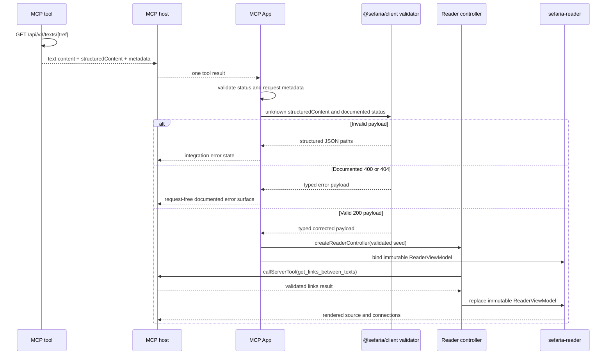
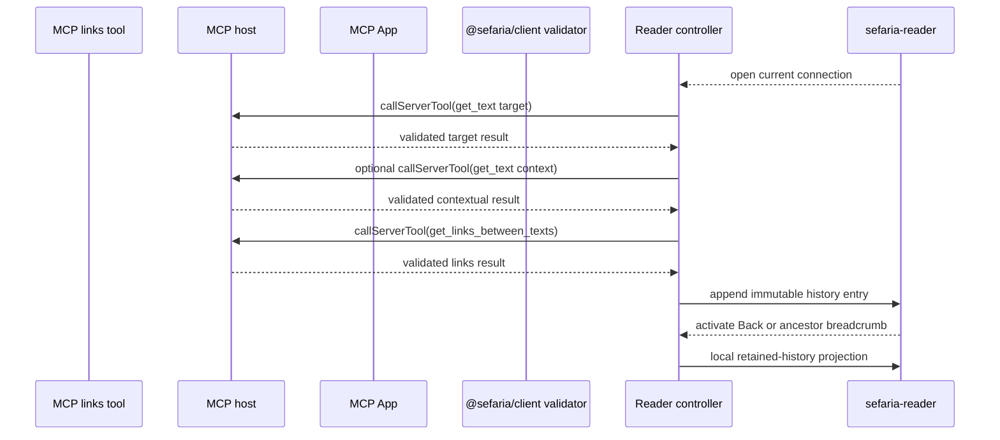
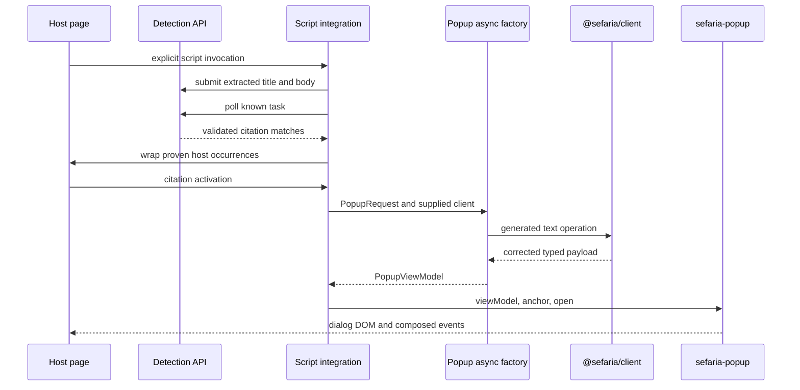

> Created/edited by GitHub Copilot with human review/feedback by Avi Levin.

# Integration specification

## Status

The standalone connections reader, multi-pane website reader workspace, stateful MCP reader, adaptive connections tool and rendering, authenticated VS Code reader walkthrough, and Linker integration are current. MCP reader data operations use host-proxied server-tool calls. A successful App `ui/message` response applies only to the reader's separate explicit chat-export action and means the host accepted that message for enqueueing or composer placement.

## Shared integration rules

Integrations consume built artifacts and public package contracts. They do not copy the Sefaria Web application, mobile application, Linker, or MCP server.

An integration can accept a reference or host input. It calls a non-DOM component factory and supplies the resulting view model to an element.

An integration must not give a reference, raw payload, client, host, or `fetch` function to an element.

Unknown JSON must pass a generated `@sefaria/client` validator before component projection. Validation failures report structured paths.

## Public showcase deck [Current]

The GitHub Pages showcase is a static Reveal.js host for project explanation, live browser demonstrations, and captured named-host evidence. It owns presentation state, reference inputs, client creation, cancellation, stale-result suppression, and assignment of factory results to persistent request-free elements.

The deck defines a minimum supported top-level CSS viewport and blocks presentation below either required dimension with an explicit larger-window message. Resizing back into the supported range preserves the active slide, screenshot position, and mounted demonstrations. Wheel gestures navigate the deck in both directions except inside deliberately scrollable code, output, component, and iframe surfaces. The MCP screenshot gallery participates in that sequence: wheel navigation traverses its finite recorded states before moving to the adjacent slide.

The React examples bind existing component factories or the supported reader controller to existing Web Components. The Reader slide calls `loadReaderController` with a starting reference and binds the result to one persistent `<sefaria-reader>`. The following interaction slide deliberately demonstrates the lower-level alternative: the host places separate source-card and connections-panel elements in side-by-side columns and owns their session transitions. Theme, font, viewport width, code-tab, and slide-navigation changes do not recreate a mounted element or run a request after settled content.

Live examples call the deployed Sefaria API by default. Network, abort, contract-validation, documented HTTP, projection, partial, and empty outcomes remain distinct. The showcase does not silently replace a failed live request with fixture data. Deterministic tests can inject dated payloads through the existing client boundary without making fixture mode part of the public demonstration.

Interactive demonstrations run in same-origin iframe viewports so resizing changes their actual CSS viewport width and container-query behavior. The frame scrolls independently, inherits the deck's resolved light/dark theme and font tokens, and stays mounted after its first visit. Unvisited examples make no request. Leaving a pending example aborts or supersedes its work; returning exposes retained completed content or an explicit interrupted state rather than retrying invisibly.

The deck displays captured MCP Reader screenshots, but GitHub Pages does not run the Python MCP server. The gallery shows the initial stateful Reader, retained same-App hierarchy, and explicit nested-reference chat export. Screenshot galleries identify recorded evidence and do not imitate an interactive MCP host. Public assets include provenance and exclude authenticated, private, or unrelated browser content.

The Pages artifact contains an allowlisted set of built browser demonstrations. The deck is the site root, existing demonstrations remain under stable subpaths, and the public Linker bookmarklet points to the deployed HTTPS artifact rather than localhost. Pull requests build and test the artifact without publishing; main publishes only after the normal checks and asset approval gates.

## Interaction task flow

An integration owns the task lifecycle for user-triggered data changes. It selects authoritative captured data, validated server data, or a supplied client.

If the required data is already available, the integration calls the owning pure factory. If a client request is required, it calls the async factory with cancellation.

The captured-data owner declares which targets the payload covers. The integration must not infer coverage from an empty pure-factory result.

For a component data path, the integration supplies the target component's loading and terminal view models. It does not give task state, a client, or a raw payload to the element.

If a newer action supersedes an older operation, the integration aborts the old operation when possible. It ignores an obsolete result even when cancellation cannot stop the work.

If no permitted data source exists, the integration shows its own unavailable state outside the target element. It does not construct an unsupported component state.

An integration can use `@lit/task`, a reactive controller, or an equivalent task mechanism. The component package does not require one task framework.

## Standalone connections reader [Current]

The standalone demo has one source-card reader and one connections pane. The host owns the displayed container, active single-segment target, selection, cancellation, stale-result suppression, and English-versus-Hebrew address-label presentation. Selecting a reader row commits the controlled selection immediately, performs one links request and no text request, and renders an integration-owned failure if the request rejects. Opening a connection first obtains its target through the source-card async factory. Once a non-spanning response establishes the first target segment and server-provided section, the host starts the contextual-section request when needed and the first-segment links request concurrently. It commits the contextual reader as soon as the section is available while the connections pane remains loading independently. This is at most two text operations and one links operation; neither component factory performs hidden context loading.

A same-section range opens at its first addressed segment, not a multisegment selection. A spanning target follows only the first server-provided `spanningRefs` entry, requests that bounded context, and selects its first qualified segment; it does not render the complete spanning range or parse a reference string. Missing first-target text is unavailable rather than silently replaced with the next nonempty row. Unsupported nested navigation is explicit, while source-card rendering remains supported. Repeated hops are allowed; history, Back, and MCP qualification remain deferred.

For local category/page changes, the host explicitly captures the validated result of the generated `getLinks` operation and calls the connections pure factory. The capture records its exact reference and text-inclusion coverage and is discarded on target replacement. This is an explicit capture-and-project client path, alongside the one-request async view-model factory, not a cache or hidden observer hook. Both paths share the same pure projection. Category changes, paging, and showing/hiding already captured previews make zero requests. Metadata-only captures require an explicit Load previews action to replace them with one text-inclusive links response.

The API has no transport paging parameter: UI paging bounds projection and rendering, not server work or downloaded response bytes. A superseded navigation, links load, or preview load must never overwrite a newer target or page. A failed contextual-section request leaves the previous reader committed and aborts its sibling links operation. A rejected links operation does not roll back an already established reader selection; the integration clears the loading connections surface and reports its own terminal failure outside the request-free element.

## Multi-pane website reader workspace [Current]

The regular-website spatial demonstration uses one `@sefaria/components/reader-session` for semantic entries, selected positions, admitted source and links captures, operation eligibility, and bounded retention. Its host separately owns ordered stable pane IDs, source-to-connections and ancestor-to-child placement, active compact pane, pane pins, cancellation, and physical operation timing. It uses `createSefariaReaderDataSource` for source and links requests rather than duplicating the component-default selectors. This demo-private spatial state is not a public arbitrary-panel manager and is not part of `<sefaria-reader>`.

The same demo package also serves an interactive supported-reader page. Its host calls `loadReaderController` with the initial reference and client, then calls `bindReaderController` for one persistent `<sefaria-reader>` element. The returned controller owns continuing session transitions, cancellation, captures, and event handling. This page proves the public stateful convenience path for a regular website; it does not make the element autonomous or add spatial pane policy to the controller.

A wide viewport contains a horizontally scrolling workspace of fixed-width source and connections panes. Each pane scrolls vertically without moving another pane. A compact container shows exactly one active pane and exposes the ordered pane path as controls; switching presentation does not mutate semantic history or request data.

The root opens as source plus connections. Selecting a connection keeps the origin connections pane visible while child source text is pending. After that source commits, the host replaces the origin connections pane with the child source, appends child connections, and pins each visible pane's entry. Closing a non-root pane or activating an ancestor removes its spatial descendants, releases their pins before semantic pruning, cancels obsolete work, and rejects later completions by generation and session operation identity.

Selecting a source segment prunes later panes, updates the retained entry, and issues one links request. Connections category and page changes project the retained successful links capture with zero I/O. A text success followed by links failure keeps the text pane and renders an explicit connections failure. The demo permits at most 20 visible panes and rejects another opening with a visible instruction to close panes; it never silently removes pinned ancestors.

## MCP App purpose

The MCP App renders Sefaria source material inside an MCP Apps-compatible host. The first render uses the tool result and makes no second request.

The current App renders one persistent request-free `<sefaria-reader>`. A corrected `/api/v3/texts/{tref}` tool result seeds its source synchronously, then the reader controller loads that selected row's connections through the originating MCP server. A corrected `/api/links/{tref}` tool result can instead seed a connections-only reader synchronously.

The App is a self-contained HTML resource. The MCP server can package it without the TypeScript checkout at runtime.

### Reader-controller use [Current]

The integrated reader keeps one `@sefaria/components/reader-controller` instance in the TypeScript App instance. Its first render constructs the controller from already validated source or connections content and performs zero requests. Later controller operations use an MCP-specific reader data source whose only transport is a supported host-proxied tool call. The browser-client `loadReaderController` path is not reachable from the MCP App.

The Python tools remain stateless. Each tool result must carry the corrected payload plus effective request metadata sufficient to construct admitted reader content: source reference and edition selectors for text, or reference and resolved `with_text` coverage for links. The App validates both payload and metadata before controller admission. Python does not store reader history, controller snapshots, operation IDs, or expiration state.

The qualified VS Code host advertises `serverTools`, omits `hostContext.toolInfo`, and routes bare `get_text` and `get_links_between_texts` App calls to the originating server. The first integrated reader therefore supports those two bare names only after the host advertises `serverTools`. It does not derive a namespace, list unrelated tools, send a chat message as a transport fallback, or call Sefaria directly. Another host must be qualified separately; unavailable, rejected, malformed, or mismatched tool results remain explicit reader or integration failures.

A source-card tool result seeds the exact returned target row when present, otherwise the first qualified row for a section target. The request-free reader is rendered before any host-proxied continuation. The App then loads that selected row's connections through one `get_links_between_texts` call. A connections tool result seeds a connections-only reader with zero continuation calls. Opening a connection performs the controller's bounded source qualification through `get_text` and then one `get_links_between_texts` call. Back, breadcrumb activation, category changes, paging, and covered preview changes remain local.

If the host destroys the App instance, in-memory reader history is lost. A later App can start from its delivered tool result, but this is not restoration of the prior controller. Durable snapshots, server-side sessions, reference replay, and implicit reconstruction are outside the current contract.

## MCP tool contract

The current MCP server exposes `get_text`, which progressively enhances the official `Sefaria/sefaria-mcp` tool of the same name with an App resource.

| Input | Contract |
| --- | --- |
| `reference` | Required Sefaria reference such as `Micah 6:8` or `Berakhot 2a` |
| `version_language` | Optional `source`, `english`, or `both`; defaults to `both` |

The tool keeps the official MCP server's `source`, `english`, and `both` input vocabulary, but maps those choices to the source-card rendering roles. `source` sends one `version=primary` query value, `english` sends one `version=translation` query value, and `both` sends repeated `version=primary` and `version=translation` query values. It always sends `return_format=default`. This distinction matters for texts such as Kuzari, where the API's original-language `source` version is not necessarily the database's `isPrimary` version consumed by the source-card factory.

The Python server owns the live request to `https://www.sefaria.org/api/v3/texts/{tref}`. The App does not request Sefaria.

One tool result serves both host capabilities:

- `content` contains a concise plain-text representation for the model and hosts that do not render Apps.
- `structuredContent` contains the corrected API payload.
- The tool descriptor's `_meta.ui.resourceUri` points to the App resource.
- `_meta["sefaria/source-card"]` identifies the request and documented response status for App validation and projection.

The prior private `preview_sefaria_app` tool is not retained as an alias or compatibility path.

### Connections tool [Current]

The server also exposes `get_links_between_texts`, preserving the official tool's `reference` and `with_text` vocabulary while adding the App resource.

| Input | Contract |
| --- | --- |
| `reference` | Required Sefaria reference whose text connections are requested |
| `with_text` | Optional `"0"` or `"1"`; explicit values always win |

When `with_text` is omitted or null, the server resolves it per initialized client session: `"1"` when the client advertises the MCP Apps extension and `"0"` otherwise. It does not infer capability from a client name or persist the decision globally. An explicit `"0"` remains metadata-only even for an Apps client.

The server performs one `GET /api/links/{tref}` operation with the resolved `with_text` and `with_sheet_links=0`. A documented 200 or 400 response is returned through the tool result. Network failures and undocumented statuses remain tool failures.

The server rejects a decoded response body larger than 5 MiB or a successful array containing more than 10,000 links. It asks the caller for a narrower reference and does not silently truncate the corrected payload. This bounds accepted synchronous work; it is not transport pagination.

The text content remains useful without Apps support. It identifies the reference and error or result context, lists at most 20 targets, includes excerpts only when text was requested, is bounded to 8,000 characters, and states when the textual summary is shortened. It is not a second implementation of the component's grouping, sorting, or preview rules.

## MCP payload boundary

`get_text` `structuredContent` carries corrected API-shaped object JSON directly. `get_links_between_texts` preserves the corrected array-shaped links payload inside `{ "payload": ... }` because MCP `structuredContent` requires an object root. The envelope is an integration constraint, not a view model or normalized domain contract.

The tool also returns a short text content item for hosts that do not render Apps.

The tool-result `_meta["sefaria/source-card"]` object carries only integration metadata:

```json
{
  "operation": "getV3Texts",
  "method": "GET",
  "path": "/api/v3/texts/{tref}",
  "status": 200,
  "request": {
    "tref": "Leviticus 19:18"
  }
}
```

`operation`, `method`, and `path` are fixed constants. `status` is one of the documented `200`, `400`, or `404` statuses. `request.tref` is the exact tool input. This object does not contain a view model, rendered HTML, transport payload fields, or a client configuration.

The App validates the metadata before using it. It then validates `structuredContent` with the generated validator selected by the metadata status. Invalid metadata or payload input stops before projection.

A validation failure contains structured paths that identify each invalid field. The App displays an integration error and does not refetch.

The current tool-result `_meta["sefaria/connections"]` object contains:

```json
{
  "operation": "getLinks",
  "method": "GET",
  "path": "/api/links/{tref}",
  "status": 200,
  "request": {
    "tref": "Micah 6:8",
    "withText": true
  }
}
```

The App requires exactly one supported Sefaria result discriminator. It rejects missing or ambiguous metadata rather than guessing from payload shape. For connections, it validates the envelope and then validates `payload` with the generated links response contract selected by the documented 200 or 400 status. Diagnostics prefix generated payload paths with `/structuredContent/payload`.

For a valid success payload, the reader controller retains one capture containing the validated payload and effective request. Connections begin at Overview. Category changes reset to page zero; category, page, and visibility changes project the retained capture and make zero requests. The fixed page size remains 20.

A metadata-only result renders entries without previews. Load previews calls bare `get_links_between_texts` through the qualified host server-tool capability with the same reference and explicit `with_text="1"`. It does not call `fetch`, send a chat message, or create another App result.

## MCP boundary sequence



The first reader render makes zero requests. Its initial connections continuation uses the host-proxied tool boundary after source content is visible.

### Current reader navigation sequence



The App resolves a connection activation against the currently rendered entry ID and exact target reference. The controller performs at most two source calls and one links call, requests `version_language="both"`, and excludes preview HTML or arbitrary event text. A forged or stale event performs no tool call.

Back and ancestor breadcrumb activation use retained reader history and make no server-tool call. A source selection issues one links continuation. Category and page changes remain local while capture coverage matches. Preview replacement performs one text-inclusive links call only when the retained capture lacks previews.

The reader's explicit chat-export action is separate from data navigation. After explicit activation, the App attempts `ui/message` even when the initialized host omits the optional text-message capability advertisement. It exposes sending, delivered, rejected, stale, and unconfirmed states outside the request-free reader, suppresses duplicate activation while a send is pending, and does not retry an uncertain send.

A newer tool result, cancellation, or teardown aborts pending controller work, invalidates pending UI continuations, removes result-specific listeners, and disposes the controller. A late server-tool result or message acknowledgement cannot update a newer result.

## Server and client equivalence

The MCP path is server-provided mode. Each tool supplies corrected API-shaped JSON, directly or in the specified links envelope, and the App validates it.

Client mode obtains the same payload type through the thin client. Source-card modes call `createSourceCardViewModel`; connections modes call `createConnectionsViewModel`.

For the same payload and deterministic inputs, each server-provided mode and its corresponding client mode must produce equal view models.

Server-provided mode does not send rendered component HTML. The repository defines no HTML server-rendering or hydration contract.

## MCP resource contract

| Item          | Value                                       |
| ------------- | ------------------------------------------- |
| Build command | `pnpm --filter @sefaria-demo/mcp-app build` |
| Built file    | `demos/mcp/app/dist/mcp-app.html`           |
| Resource URI  | `ui://sefaria/source-card.html`             |
| MIME type     | `text/html;profile=mcp-app`                 |

The HTML file must not contain development-server URLs. It uses the host theme and supported host fonts with Sefaria token defaults.

## FastMCP demonstration server

The demonstration server remains small and additive. It proves the live requests, capability resolution, resource, tool-result, package-data, and unknown-JSON boundaries.

The server contains:

- one current live `get_text` UI tool
- one current live `get_links_between_texts` UI tool
- one `ui://` resource
- the self-contained App
- validation with the generated TypeScript validator
- in-memory integration tests with a mocked HTTP transport
- installed-wheel package-data tests

The server does not contain copied Sefaria API logic, a response cache, retry policy, fallback payload, metrics, OAuth routes, Docker configuration, or unrelated tools.

Repository checks make no live request. Python tests mock the Sefaria transport with representative corrected payloads and documented error payloads.

A `ui://` resource is an MCP resource, not an HTTP route. MCP handles `resources/read`.

The server rejects a successful payload with more than 400 text leaves before it enters `structuredContent`. This bounds synchronous source-card projection and rendering; callers must request a narrower reference.

## MCP host acceptance

Core acceptance uses VS Code Copilot Chat as the named MCP Apps-compatible host for rendering, host-proxied same-App tool calls, retained reader history, local interaction, and explicit chat export. The App attempts `ui/message` only after explicit chat-export activation, even when the host omits the optional text-message capability advertisement, because the qualified VS Code host accepts that request and places its content in the composer.

Record:

- the exact VS Code and GitHub Copilot Chat versions
- the launch configuration
- the initial `get_text` invocation, automatic reader connections continuation, same-App hierarchy navigation, breadcrumb activation, and explicit chat export
- an automated screenshot or a separately recorded automation limitation

Standalone browser rendering does not prove host compatibility. Host limitations remain separate from component failures.

The acceptance harness extends the existing isolated Playwright/CDP flow into one asserted walkthrough:

1. Invoke only `get_text` for Micah 6:8 and verify the reader renders the bilingual source before automatically loading connections through the same App.
2. Select Commentary, switch to another available category, return, advance one page, and return to page zero without another chat turn.
3. Activate a displayed connection and verify the same App replaces its current reader entry after host-proxied source qualification and connections loading.
4. Activate a connection from the child entry and verify the same App retains at least three breadcrumb levels.
5. Trigger explicit chat export from the deepest entry and verify `ui/message` places that exact selected target in the VS Code composer without performing reader data transport.
6. Activate the middle breadcrumb and then the root breadcrumb, verifying both retained ancestors restore locally without another chat turn.

The harness tracks one initial App frame and requires all later reader stages to remain in that frame. Micah 6:8 must expose a second category, at least one category with more than 20 links, and two navigable connection hops for the live hierarchy stages; missing prerequisites fail with a concrete diagnostic instead of being skipped. Deterministic fixtures remain the authority for stable multi-category, multi-page, failure, cancellation, and metadata-only preview behavior. Genesis 1:1 is reserved for explicitly identified high-volume tests rather than ordinary examples.

Each successful stage records a screenshot, and the run writes a machine-readable result with stages, selected references, host versions, artifacts, and any failure. A partial walkthrough exits nonzero. `capture:mcp:vscode` and `demo:mcp:vscode` execute the same assertions; the demo command additionally retains its current post-capture interactive relaunch.

## MCP acceptance criteria

- The App builds as one HTML file.
- The demonstration server reads the packaged file through `resources/read`.
- Tool metadata and the resource use the same URI.
- One `get_text` call returns useful text content and App content.
- The server maps `version_language` to the documented repeated `version` query values.
- `structuredContent` matches a corrected generated API payload.
- Metadata identifies the fixed operation, documented status, and exact request reference.
- Unknown payload validation reports structured paths.
- The App creates one reader controller from validated admitted content.
- The element receives only immutable `ReaderViewModel` replacements and visual or interaction properties.
- The first render makes zero requests.
- A source seed schedules one host-proxied links continuation; a connections-only seed schedules none.
- A wheel test reads every packaged runtime artifact.
- Automated tests make no network request.
- A successful payload larger than the source-card render limit fails as a tool error.
- VS Code Copilot Chat renders the packaged reader from one initial `get_text` result.
- The connections tool resolves omitted `with_text` from the initialized client's Apps capability and preserves explicit `"0"` and `"1"` overrides.
- One connections invocation performs one links request and returns the unchanged validated response inside the specified object envelope.
- A successful links response larger than 5 MiB decoded or 10,000 entries fails explicitly without partial projection.
- The App validates connections metadata, envelope, documented status, and corrected payload before projection.
- Category changes and paging project retained captures and make zero host calls.
- Connection activation performs bounded host-proxied source qualification plus one links continuation in the same App.
- Back and retained breadcrumb activation restore locally without host calls.
- Metadata-only rendering preserves explicit caller intent; Load previews performs one host-proxied text-inclusive links call.
- Explicit chat export sends one fixed user-role message for the exact current target. Rejected, stale, concurrent, or unconfirmed messaging leaves the reader usable and is not retried automatically.
- The named-host walkthrough completes the initial reader, local connections controls, two same-App connection hops, deep chat export, middle breadcrumb activation, and root breadcrumb activation with stage-specific assertions and artifacts.

## Linker script purpose

The current Linker integration demonstrates a request-free popup on a third-party page through one embeddable classic script and a bookmarklet that loads that same script. It is not a migration program for the deployed Sefaria Linker and does not load the deployed Linker bundle.

The integration owns article extraction, citation-detection submission and polling, host DOM mutation, request cancellation, client creation, and factory calls. The popup element owns only rendering and interaction.

The integration calls the generated `POST /api/find-refs` operation once per scan with `with_text=0` and `debug=0`, then calls the generated `GET /api/async/{task_id}` operation until the known task reaches a terminal state or the bounded polling policy ends. The client supplies validated operations but owns no polling or retry policy.

The integration sends extracted article title and body text to Sefaria. It does not send page-tracking metadata, call the website-selector endpoint, or submit citation reports.

## Linker flow



The element receives no reference and makes no request.

If a newer citation replaces an older request, the integration aborts or ignores the obsolete operation. An old response must not replace the newer view model.

## Linker extraction and host safety

Each invocation performs one article scan. The default extraction uses Readability on an inert document clone, preserves paragraph boundaries, and can include additional content through explicit selectors. Dynamic pages invoke the public API again after their content changes; the integration does not install an automatic mutation observer.

The integration maps validated detection results back to proven visible host-text occurrences. It leaves failed, ambiguous, overlapping, stale, or unprovable matches unchanged. It does not parse references locally or choose the first ambiguous result.

Citation anchors accept only URLs that resolve to the canonical HTTPS `www.sefaria.org` origin. Off-origin, malformed, inherited, or unsafe service values are skipped.

The integration:

- adds no global CSS
- does not replace host keyboard handlers
- does not rewrite existing links, editable controls, navigation, hidden content, scripts, styles, or excluded subtrees
- sends host-page text only through the approved Sefaria detection path
- sanitizes Sefaria HTML through the component factory
- removes only its own links, popup, timers, and listeners during destroy

Work that expands with page or payload size has explicit measured limits. Crossing a limit produces an integration-owned error; it does not silently truncate citation detection or switch extraction strategies.

## Linker polling

The current polling policy performs at most 16 status requests. Inter-poll waits begin at 500 milliseconds, grow by a factor of 1.5, and stop growing at 5 seconds. The complete operation has a 120-second deadline that aborts in-flight work.

A valid pending response schedules the next poll. A task failure, documented HTTP error, network failure, abort, contract mismatch, unexpected task identifier, unexpected state, attempt exhaustion, or deadline exhaustion stops the operation visibly. The integration never resubmits the original detection request automatically.

A newer scan aborts and supersedes the older scan. A late obsolete response cannot modify the current page.

## Popup behavior

The popup element follows the [component contract](components.md).

The integration preserves:

- dialog role
- focus entry
- focus restoration
- Escape closure
- `aria-controls` on the trigger

The current component also provides:

- `aria-modal`
- an accessible name
- a real close button
- a Tab and Shift+Tab focus cycle
- viewport-edge placement
- token-based themes
- shadow-root style isolation

The popup previews at most 20 aligned source-card positions. It declares when additional content is omitted. Popup dragging is not in Core scope.

The popup keeps source-card edition attribution visible so the embedded preview identifies its source editions. Other source-card hosts also show attribution by default and can opt out with `hide-attributions`.

## Script and bookmarklet artifacts

The build produces one self-contained classic script, one generated bookmarklet loader, one article demo that invokes the script automatically, and one equivalent no-autostart article page for bookmarklet use.

The browser API exposes explicit `link()` and `destroy()` operations on a versioned integration namespace. Repeated `link()` calls rescan without nesting owned links. Repeated insertion of the same compatible bundle reuses the existing API and does not duplicate custom-element definitions or listeners.

The bookmarklet click is the user invocation and starts immediately. It loads the same script artifact used by the embed snippet. Its artifact URL is build configuration: localhost for local development and an explicit HTTPS URL for intended public use.

The integration documents Content Security Policy, Trusted Types, mixed-content, network, CORS, and restricted-page limitations. It does not bypass browser protections with a proxy, extension, or privileged userscript.

## Linker acceptance criteria

- The built classic script can be embedded in an ordinary page without a package manager or module loader.
- The generated bookmarklet loads that same built script and invokes it immediately.
- The authored article demo contains no precomputed citation matches and links automatically on load.
- The no-autostart article demo proves bookmarklet activation.
- A scan makes one detection submission and only the bounded status requests required by that task.
- Default detection makes no source-text request, page-tracking request, website-selector request, or citation-report request.
- A detected citation calls the popup async factory when the integration selects the client path.
- One citation activation performs one v3 text request.
- The popup element receives only a view model and interaction properties.
- Host styles do not enter the popup.
- Popup styles do not enter the host page.
- Keyboard users can open, traverse, and close the popup.
- Closing restores focus.
- Rapid citation changes do not show obsolete data.
- Rapid scans do not apply obsolete DOM mutations.
- Repeated scans do not nest owned links.
- Destroy removes owned mutations and aborts pending work.
- API HTML is sanitized before it reaches the element.
- The script needs no deployed project-specific service.
- Built artifacts contain no development-server URL or unresolved package import.

## Integration failure rules

- Invalid unknown JSON reports structured paths.
- A documented HTTP error becomes a component-specific error view model.
- Invalid tool-result metadata stops before payload validation.
- A network failure or abort rejects the async factory operation.
- A server-side network failure produces an MCP tool failure rather than a success-shaped result.
- An obsolete abort does not replace the current view model with an error.
- A host without a permitted data source shows integration-owned unavailable UI, not empty API content.
- Missing content becomes the owning component's partial or empty state.
- Missing build output stops staging.
- A packaged App must not reference a development server.
- Host limitations remain separate from component or payload failures.

## Completion criteria

An integration is complete when its public boundary, artifact packaging, request count, validation, host behavior, and named failure cases pass from a clean checkout.
