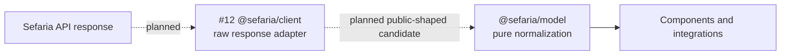

# `@sefaria/model`

`@sefaria/model` owns the stable, normalized data contracts shared by the
Sefaria client, components, and integrations. It performs no network requests,
reference parsing, caching, or rendering.

## Data boundary



Solid arrows are implemented. Dotted arrows belong to the planned client in #12.

Generated OpenAPI types stay inside `@sefaria/client`. Model normalizers accept
`unknown`, copy known public fields, reject invalid values with a path-aware
`ModelError`, and omit unknown fields from the result.

## Normalize text data

`TextResponse.segments` contains renderable text. Each entry represents one
concrete reference and one version. `versions` holds the corresponding
attribution metadata.

```ts
import { isModelError, normalizeTextResponse } from "@sefaria/model";

const result = normalizeTextResponse({
  ref: "Genesis 1:1",
  sections: ["1", "1"],
  toSections: ["1", "1"],
  isSpanning: false,
  versions: [
    {
      versionTitle: "Example translation",
      language: "en",
      direction: "ltr",
      license: "CC-BY",
    },
  ],
  segments: [
    {
      ref: "Genesis 1:1",
      text: "When God began to create",
      lang: "en",
      direction: "ltr",
      versionTitle: "Example translation",
    },
  ],
});

if (isModelError(result)) {
  console.error(result.code, result.path);
}
```

A segment whose title and language do not identify exactly one returned version,
or whose direction disagrees with that version, is invalid.

The model preserves candidate order. It does not flatten the nested text arrays
returned by `/api/v3/texts`; the client adapter must supply concrete segment
refs.

## Errors

Expected invalid data returns a `ModelError` rather than throwing:

```ts
interface ModelError {
  readonly type: "model-error";
  readonly code: "missing-required-field" | "invalid-field";
  readonly path: readonly (string | number)[];
}
```

`missing-required-field` means a required property is absent. `invalid-field`
means a property or container is present but has an unsupported value or shape.

## Source-card contract

`isSourceCardData` strictly validates the externally consumed source-card
contract, including rejection of additional properties. The equivalent JSON
Schema is exported as:

```ts
import sourceCardSchema from "@sefaria/model/source-card.schema.json";
```

`normalizeSourceCardData` can first prune unknown input fields into the strict
public shape. The guard and `contracts/source-card.schema.json` are tested
against the same JSON-compatible fixture matrix.

## Public API

- Types: `Segment`, `Version`, `LinkRef`, `TextResponse`, `SourceCardTextBlock`,
  `SourceCardSegment`, `SourceCardData`, `ModelError`, and `ModelResult`
- Normalizers: `normalizeSegment`, `normalizeVersion`, `normalizeLinkRef`,
  `normalizeTextResponse`, and `normalizeSourceCardData`
- Guards: `isModelError`, `isTextDirection`, and `isSourceCardData`

See the
[`@sefaria/model` specification](../../docs/specs/headless.md#sefariamodel) for
the normative contract and required cases.
