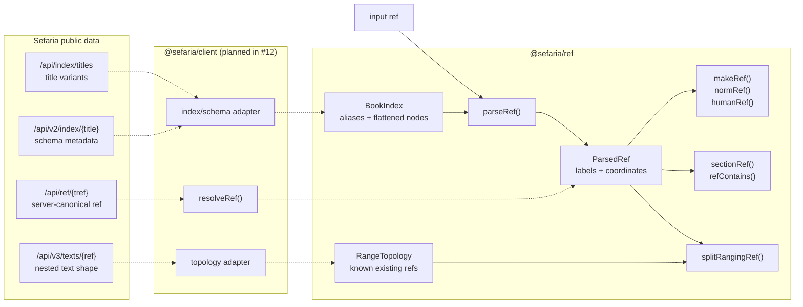

> Created/edited by GitHub Copilot with human review/feedback by avilevin.

# `@sefaria/ref`

`@sefaria/ref` provides deterministic, network-free operations for Sefaria
references. It extracts the local reference behavior used by Sefaria Web and
Mobile while replacing their process-global catalogs and text caches with
explicit immutable inputs.

Use this package when reference handling must work offline, in a test, or
outside the Sefaria front end. Use the planned `@sefaria/client.resolveRef()`
operation when canonical server resolution is required for grammar outside the
local subset.

## How the parts fit together



Solid arrows are implemented by `@sefaria/ref`. Dotted arrows show the planned
client adapters and remote resolver.

## Sefaria reference vocabulary

This package deliberately uses Sefaria's data model.

### Index

A Sefaria **Index** is the root record for a work, such as `Genesis` or
`Pesach Haggadah`. It owns the work's title variants and reference schema.

### Schema node

An Index schema is a tree of **nodes**. A node identifies an addressable part of
a work and defines how its addresses are interpreted.

A simple work has one node that is both the root and the addressable leaf:

```text
Genesis
└── Chapter → Verse
```

A complex work has a root plus addressable child nodes:

```text
Complex Work                         Index/root node
├── Part One                         Chapter → Paragraph
└── Part Two                         Paragraph
```

For a complex ref, the addressable node title can differ from the root Index
title:

```text
book:  "Complex Work, Part One"
index: "Complex Work"
```

Sefaria's API returns a schema tree. `@sefaria/ref` consumes a flattened subset
because local parsing needs fast title lookup, leaf addressing, and ancestry
rather than the complete raw schema document.

### Address type

Each node has one address type per depth:

- `integer` covers ordinary positive numeric levels such as chapter, verse,
  paragraph, or comment.
- `talmud` covers daf/amud labels such as `2a` and `2b`.

The matching `sectionNames` describe those levels for humans, such as
`["Chapter", "Verse"]`.

## `BookIndex`

`BookIndex` is the immutable local catalog supplied to reference operations.

```ts
const index: BookIndex = {
  aliases: {
    Genesis: "genesis",
    Bereshit: "genesis",
    "Rashi on Genesis": "rashi-genesis",
  },
  nodes: {
    genesis: {
      key: "genesis",
      title: "Genesis",
      indexTitle: "Genesis",
      nodePath: ["genesis"],
      addressTypes: ["integer", "integer"],
      sectionNames: ["Chapter", "Verse"],
    },
    "rashi-genesis": {
      key: "rashi-genesis",
      title: "Rashi on Genesis",
      indexTitle: "Rashi on Genesis",
      nodePath: ["rashi-genesis"],
      addressTypes: ["integer", "integer", "integer"],
      sectionNames: ["Chapter", "Verse", "Comment"],
    },
  },
};
```

The fields have these roles:

| Field          | Meaning                                                 |
| -------------- | ------------------------------------------------------- |
| `aliases`      | Accepted title or title variant to node-key mapping     |
| `key`          | Stable local identity for one flattened schema node     |
| `title`        | Canonical title used when formatting refs for that node |
| `indexTitle`   | Canonical root Index title                              |
| `nodePath`     | Root-to-node key path used for structural containment   |
| `addressTypes` | Interpretation of each address level                    |
| `sectionNames` | Human names for each address level                      |

Every loaded node's canonical `title` must appear in `aliases` and map back to
that node. An alias may point to a node whose metadata is not loaded yet;
parsing that alias returns `missing-book-metadata`.

The package validates a `BookIndex` the first time it sees that object and
caches the result by object identity. Treat the object and its nested data as
immutable after first use.

## Parse and format refs

```ts
import { humanRef, normRef, parseRef, type BookIndex } from "@sefaria/ref";

const parsed = parseRef("Bereshit 1:1", index);

if ("type" in parsed) {
  // Handle RefError or RefDataError.
  throw new Error(parsed.code);
}

parsed.book; // "Genesis"
parsed.sections; // ["1", "1"]
parsed.sectionPositions; // [1, 1]

normRef("Bereshit 1:1", index); // "Genesis.1.1"
humanRef("Genesis.1.1", index); // "Genesis 1:1"
```

`ParsedRef` keeps two representations:

| Representation        | Example       | Purpose                           |
| --------------------- | ------------- | --------------------------------- |
| Display labels        | `["2a", "1"]` | Human and URL formatting          |
| One-based coordinates | `[3, 1]`      | Ordering, ranges, and containment |

The public `dafToInt()` helper follows Sefaria Web and Mobile's zero-based
convention, so `dafToInt("2a")` returns `2`. Parsing adds one when it creates
the server-compatible coordinate `3`.

## Split ranges

Same-parent ranges can be expanded arithmetically:

```ts
splitRangingRef("Genesis 1:1-3", index);
// ["Genesis 1:1", "Genesis 1:2", "Genesis 1:3"]
```

A cross-parent terminal range needs text topology. The title and schema APIs do
not say that Genesis chapter 1 ends at verse 31.

```ts
const topology: RangeTopology = {
  nodeKey: "genesis",
  depth: 2,
  coverageStart: [1, 31],
  coverageEnd: [2, 3],
  refs: [
    { ref: "Genesis 1:31", positions: [1, 31] },
    { ref: "Genesis 2:1", positions: [2, 1] },
    { ref: "Genesis 2:2", positions: [2, 2] },
    { ref: "Genesis 2:3", positions: [2, 3] },
  ],
};

splitRangingRef("Genesis 1:31-2:3", index, topology);
// ["Genesis 1:31", "Genesis 2:1", "Genesis 2:2", "Genesis 2:3"]
```

`RangeTopology` is caller-asserted complete knowledge for its declared coverage.
Its list can be sparse: positions that do not exist are omitted. Without
complete topology, a cross-parent split returns `missing-range-topology` instead
of Sefaria Web's partial fallback.

## Errors

Operations return errors as values for expected failures.

| Error type     | Meaning                                                        | Typical caller action                                   |
| -------------- | -------------------------------------------------------------- | ------------------------------------------------------- |
| `RefError`     | The input is invalid or outside the local grammar              | Ask the user to change the ref or use remote resolution |
| `RefDataError` | Required local metadata or topology is missing or inconsistent | Load or repair the data, then retry                     |

No operation makes a network request or silently changes from local to remote
behavior.

## Local compatibility boundary

The local grammar covers canonical English titles, caller-supplied aliases,
integer and Talmud addresses, flattened primary-schema complex nodes,
abbreviated same-node ranges, and `Sheet N` syntax.

The local grammar does not cover Hebrew section numerals, alternate structures,
Year or Folio addresses, virtual or dictionary nodes, or cross-node ranges. The
planned explicit `client.resolveRef()` method is the authoritative path for
supported Sefaria grammar outside this subset.

See the normative
[`@sefaria/ref` specification](../../docs/specs/headless.md#sefariaref) for
acceptance rules and [evidence](../../docs/evidence.md#reference-handling) for
observed differences from Sefaria Web, Mobile, and Python.

## Upstream references

- [Sefaria Web local parser and formatter](https://github.com/Sefaria/Sefaria-Project/blob/c33ee503163a85a07bb0688456c4059cdaa3f7ed/static/js/sefaria/sefaria.js)
- [Sefaria Web daf helpers](https://github.com/Sefaria/Sefaria-Project/blob/c33ee503163a85a07bb0688456c4059cdaa3f7ed/static/js/sefaria/hebrew.js)
- [Sefaria Mobile reference helpers](https://github.com/Sefaria/Sefaria-Mobile/blob/925420dcf7dd00a16f8dc4c4191284792fc3f9fa/sefaria.js)
- [Sefaria Python `Ref`](https://github.com/Sefaria/Sefaria-Project/blob/c33ee503163a85a07bb0688456c4059cdaa3f7ed/sefaria/model/text.py)
- [Sefaria public API endpoint inventory](https://github.com/Sefaria/Sefaria-Project/blob/c33ee503163a85a07bb0688456c4059cdaa3f7ed/docs/decisions/documented_endpoints.md)

## Develop

From the repository root:

```powershell
pnpm exec vitest run packages/ref
pnpm --filter @sefaria/ref typecheck
pnpm --filter @sefaria/ref build
```
